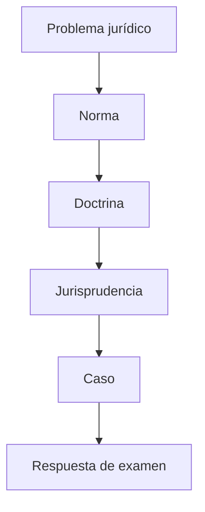

---

# Clase 1 — Las sociedades en el derecho argentino contemporáneo

## Ejes

- sociedad
- empresa
- empresario
- sucursal
- agencia
- filial
- LGS
- art. 1 LGS

---

# Objetivos de aprendizaje

- Comprender sociedad.
- Comprender empresa.
- Comprender empresario.
- Comprender sucursal.
- Comprender agencia.
- Comprender filial.

---

# Mapa conceptual

---

# Presentación y método

## Bloque

Presentación y método

## Método

Norma aplicable, doctrina, consecuencias prácticas y preguntas de examen.

---

# La cursada intensiva

## Concepto

La materia se desarrollará en modalidad intensiva. Cada encuentro exige trabajo previo y repaso posterior.

## Norma / eje jurídico

Programa del curso y régimen de evaluación.

## Lectura doctrinaria

- **Vítolo:** analizar la función económica y organizativa de la institución.
- **Nissen:** ubicar la institución dentro del sistema legal, la personalidad, la tipicidad y la tutela de terceros.
- **Favier Dubois:** conectar la institución con empresa, gobierno corporativo, realidad económica y paradigmas societarios cuando corresponda.

## Consecuencia práctica

Organizar el estudio por bloques: ley, doctrina, jurisprudencia y casos.

## Pregunta de examen

¿Cómo debe estudiarse una materia codificada pero fuertemente práctica?

---

# Objeto de la materia

## Concepto

El derecho societario estudia organizaciones jurídicas destinadas a canalizar actividad económica, distribuir poder y regular responsabilidad.

## Norma / eje jurídico

LGS, CCyC y normativa especial cuando corresponda.

## Lectura doctrinaria

- **Vítolo:** analizar la función económica y organizativa de la institución.
- **Nissen:** ubicar la institución dentro del sistema legal, la personalidad, la tipicidad y la tutela de terceros.
- **Favier Dubois:** conectar la institución con empresa, gobierno corporativo, realidad económica y paradigmas societarios cuando corresponda.

## Consecuencia práctica

Permite resolver correctamente el encuadre del caso y evitar respuestas puramente memorísticas.

## Pregunta de examen

Explique el instituto y fundamente con norma, doctrina y consecuencia práctica.

---

# Error frecuente: Objeto de la materia

## Confusión habitual

Creer que la materia es solo una lista de tipos sociales.

## Corrección

Identificar primero la naturaleza jurídica y recién después aplicar el régimen normativo.

---

# Sociedad, empresa, empresario y establecimiento

## Bloque

Sociedad, empresa, empresario y establecimiento

## Método

Norma aplicable, doctrina, consecuencias prácticas y preguntas de examen.

---

# Empresa

## Concepto

La empresa es una organización económica de factores de producción destinada a producir o intercambiar bienes o servicios.

## Norma / eje jurídico

Art. 1 LGS como punto de conexión con producción o intercambio de bienes o servicios.

## Lectura doctrinaria

- **Vítolo:** analizar la función económica y organizativa de la institución.
- **Nissen:** ubicar la institución dentro del sistema legal, la personalidad, la tipicidad y la tutela de terceros.
- **Favier Dubois:** conectar la institución con empresa, gobierno corporativo, realidad económica y paradigmas societarios cuando corresponda.

## Consecuencia práctica

La empresa no es persona jurídica; actúa jurídicamente a través del empresario o de una sociedad.

## Pregunta de examen

Diferencie empresa y sociedad.

---

# Error frecuente: Empresa

## Confusión habitual

Afirmar que la empresa tiene personalidad jurídica.

## Corrección

Identificar primero la naturaleza jurídica y recién después aplicar el régimen normativo.

---

# Empresario

## Concepto

El empresario es quien asume jurídicamente la titularidad de la actividad económica organizada.

## Norma / eje jurídico

LGS, CCyC y normativa especial cuando corresponda.

## Lectura doctrinaria

- **Vítolo:** analizar la función económica y organizativa de la institución.
- **Nissen:** ubicar la institución dentro del sistema legal, la personalidad, la tipicidad y la tutela de terceros.
- **Favier Dubois:** conectar la institución con empresa, gobierno corporativo, realidad económica y paradigmas societarios cuando corresponda.

## Consecuencia práctica

Puede ser persona humana o jurídica.

## Pregunta de examen

¿Puede existir empresa sin sociedad?

---

# Sociedad

## Concepto

La sociedad es una estructura jurídica que permite organizar aportes, actividad, órganos, responsabilidad y participación en resultados.

## Norma / eje jurídico

Art. 1 LGS.

## Lectura doctrinaria

- **Vítolo:** analizar la función económica y organizativa de la institución.
- **Nissen:** ubicar la institución dentro del sistema legal, la personalidad, la tipicidad y la tutela de terceros.
- **Favier Dubois:** conectar la institución con empresa, gobierno corporativo, realidad económica y paradigmas societarios cuando corresponda.

## Consecuencia práctica

Permite separar patrimonios, ordenar la administración y facilitar inversiones.

## Pregunta de examen

¿La sociedad es un contrato, una organización o ambas cosas?

---

# Establecimiento

## Concepto

Unidad técnica o material donde se desarrolla actividad empresaria.

## Norma / eje jurídico

LGS, CCyC y normativa especial cuando corresponda.

## Lectura doctrinaria

- **Vítolo:** analizar la función económica y organizativa de la institución.
- **Nissen:** ubicar la institución dentro del sistema legal, la personalidad, la tipicidad y la tutela de terceros.
- **Favier Dubois:** conectar la institución con empresa, gobierno corporativo, realidad económica y paradigmas societarios cuando corresponda.

## Consecuencia práctica

No equivale a sociedad ni a empresa.

## Pregunta de examen

Explique el instituto y fundamente con norma, doctrina y consecuencia práctica.

---

# Error frecuente: Establecimiento

## Confusión habitual

Confundir domicilio, sede, establecimiento y sociedad.

## Corrección

Identificar primero la naturaleza jurídica y recién después aplicar el régimen normativo.

---

# Fondo de comercio

## Concepto

Conjunto de bienes materiales e inmateriales afectados a una explotación económica.

## Norma / eje jurídico

LGS, CCyC y normativa especial cuando corresponda.

## Lectura doctrinaria

- **Vítolo:** analizar la función económica y organizativa de la institución.
- **Nissen:** ubicar la institución dentro del sistema legal, la personalidad, la tipicidad y la tutela de terceros.
- **Favier Dubois:** conectar la institución con empresa, gobierno corporativo, realidad económica y paradigmas societarios cuando corresponda.

## Consecuencia práctica

Su transmisión no implica necesariamente transmisión de la sociedad.

## Pregunta de examen

Explique el instituto y fundamente con norma, doctrina y consecuencia práctica.

---

# Descentralización: sucursal, agencia y filial

## Bloque

Descentralización: sucursal, agencia y filial

## Método

Norma aplicable, doctrina, consecuencias prácticas y preguntas de examen.

---

# Sucursal

## Concepto

Extensión de la misma persona jurídica en otro lugar o ámbito de actuación.

## Norma / eje jurídico

LGS, CCyC y normativa especial cuando corresponda.

## Lectura doctrinaria

- **Vítolo:** analizar la función económica y organizativa de la institución.
- **Nissen:** ubicar la institución dentro del sistema legal, la personalidad, la tipicidad y la tutela de terceros.
- **Favier Dubois:** conectar la institución con empresa, gobierno corporativo, realidad económica y paradigmas societarios cuando corresponda.

## Consecuencia práctica

No crea nuevo sujeto. La responsabilidad sigue en cabeza de la sociedad principal.

## Pregunta de examen

Distinga sucursal y filial.

---

# Agencia

## Concepto

Estructura de promoción, representación o intermediación, con alcance variable según la relación jurídica.

## Norma / eje jurídico

LGS, CCyC y normativa especial cuando corresponda.

## Lectura doctrinaria

- **Vítolo:** analizar la función económica y organizativa de la institución.
- **Nissen:** ubicar la institución dentro del sistema legal, la personalidad, la tipicidad y la tutela de terceros.
- **Favier Dubois:** conectar la institución con empresa, gobierno corporativo, realidad económica y paradigmas societarios cuando corresponda.

## Consecuencia práctica

Debe analizarse si hay representación, mandato, dependencia o mera intermediación.

## Pregunta de examen

Explique el instituto y fundamente con norma, doctrina y consecuencia práctica.

---

# Filial

## Concepto

Sociedad jurídicamente distinta, aunque vinculada o controlada por otra.

## Norma / eje jurídico

LGS, CCyC y normativa especial cuando corresponda.

## Lectura doctrinaria

- **Vítolo:** analizar la función económica y organizativa de la institución.
- **Nissen:** ubicar la institución dentro del sistema legal, la personalidad, la tipicidad y la tutela de terceros.
- **Favier Dubois:** conectar la institución con empresa, gobierno corporativo, realidad económica y paradigmas societarios cuando corresponda.

## Consecuencia práctica

Tiene personalidad y patrimonio propios.

## Pregunta de examen

Explique el instituto y fundamente con norma, doctrina y consecuencia práctica.

---

# Holding

## Concepto

Sociedad que concentra participaciones en otras sociedades y permite organizar control.

## Norma / eje jurídico

LGS, CCyC y normativa especial cuando corresponda.

## Lectura doctrinaria

- **Vítolo:** analizar la función económica y organizativa de la institución.
- **Nissen:** ubicar la institución dentro del sistema legal, la personalidad, la tipicidad y la tutela de terceros.
- **Favier Dubois:** conectar la institución con empresa, gobierno corporativo, realidad económica y paradigmas societarios cuando corresponda.

## Consecuencia práctica

Prepara el análisis de grupos y control societario.

## Pregunta de examen

Explique el instituto y fundamente con norma, doctrina y consecuencia práctica.

---

# Sucursal vs filial

## Concepto

La sucursal es la misma persona jurídica; la filial es otra sociedad.

## Norma / eje jurídico

LGS, CCyC y normativa especial cuando corresponda.

## Lectura doctrinaria

- **Vítolo:** analizar la función económica y organizativa de la institución.
- **Nissen:** ubicar la institución dentro del sistema legal, la personalidad, la tipicidad y la tutela de terceros.
- **Favier Dubois:** conectar la institución con empresa, gobierno corporativo, realidad económica y paradigmas societarios cuando corresponda.

## Consecuencia práctica

Permite resolver correctamente el encuadre del caso y evitar respuestas puramente memorísticas.

## Pregunta de examen

Explique el instituto y fundamente con norma, doctrina y consecuencia práctica.

---

# Caso: Sucursal vs filial

## Supuesto

Una sociedad extranjera abre una oficina en Buenos Aires y además constituye una SA local controlada al 99%. ¿Qué diferencias hay entre ambas estructuras?

## Consignas

1. Identifique norma aplicable.
2. Determine hechos relevantes.
3. Proponga solución fundada.
4. Redacte respuesta de examen.

---

# Régimen legal

## Bloque

Régimen legal

## Método

Norma aplicable, doctrina, consecuencias prácticas y preguntas de examen.

---

# Ley 19.550

## Concepto

La LGS regula reglas generales y tipos sociales, combinando autonomía privada con tutela de terceros.

## Norma / eje jurídico

Ley General de Sociedades 19.550.

## Lectura doctrinaria

- **Vítolo:** analizar la función económica y organizativa de la institución.
- **Nissen:** ubicar la institución dentro del sistema legal, la personalidad, la tipicidad y la tutela de terceros.
- **Favier Dubois:** conectar la institución con empresa, gobierno corporativo, realidad económica y paradigmas societarios cuando corresponda.

## Consecuencia práctica

Permite resolver correctamente el encuadre del caso y evitar respuestas puramente memorísticas.

## Pregunta de examen

Explique el instituto y fundamente con norma, doctrina y consecuencia práctica.

---

# Principios orientadores

## Concepto

Personalidad, tipicidad, organización, capital, publicidad, responsabilidad, fiscalización y conservación de la empresa.

## Norma / eje jurídico

LGS, CCyC y normativa especial cuando corresponda.

## Lectura doctrinaria

- **Vítolo:** analizar la función económica y organizativa de la institución.
- **Nissen:** ubicar la institución dentro del sistema legal, la personalidad, la tipicidad y la tutela de terceros.
- **Favier Dubois:** conectar la institución con empresa, gobierno corporativo, realidad económica y paradigmas societarios cuando corresponda.

## Consecuencia práctica

Permite resolver correctamente el encuadre del caso y evitar respuestas puramente memorísticas.

## Pregunta de examen

Enumere principios estructurales de la LGS.

---

# Ley 26.994

## Concepto

La reforma vinculada al CCyC introdujo cambios decisivos: unipersonalidad, Sección IV, capacidad, personas jurídicas y contratos asociativos.

## Norma / eje jurídico

LGS, CCyC y normativa especial cuando corresponda.

## Lectura doctrinaria

- **Vítolo:** analizar la función económica y organizativa de la institución.
- **Nissen:** ubicar la institución dentro del sistema legal, la personalidad, la tipicidad y la tutela de terceros.
- **Favier Dubois:** conectar la institución con empresa, gobierno corporativo, realidad económica y paradigmas societarios cuando corresponda.

## Consecuencia práctica

Obliga a leer la LGS junto con el CCyC.

## Pregunta de examen

Explique el instituto y fundamente con norma, doctrina y consecuencia práctica.

---

# Aplicación supletoria del CCyC

## Concepto

El CCyC aporta reglas generales sobre personas jurídicas, contratos, actos jurídicos, abuso, responsabilidad y contabilidad.

## Norma / eje jurídico

LGS, CCyC y normativa especial cuando corresponda.

## Lectura doctrinaria

- **Vítolo:** analizar la función económica y organizativa de la institución.
- **Nissen:** ubicar la institución dentro del sistema legal, la personalidad, la tipicidad y la tutela de terceros.
- **Favier Dubois:** conectar la institución con empresa, gobierno corporativo, realidad económica y paradigmas societarios cuando corresponda.

## Consecuencia práctica

Permite resolver correctamente el encuadre del caso y evitar respuestas puramente memorísticas.

## Pregunta de examen

¿Por qué la LGS no puede estudiarse aislada del CCyC?

---

# Art. 1 LGS y SAU

## Bloque

Art. 1 LGS y SAU

## Método

Norma aplicable, doctrina, consecuencias prácticas y preguntas de examen.

---

# Art. 1 LGS

## Concepto

Habrá sociedad si una o más personas, en forma organizada conforme a uno de los tipos previstos, se obligan a realizar aportes para aplicarlos a producción o intercambio de bienes o servicios, participando en beneficios y pérdidas.

## Norma / eje jurídico

Art. 1 LGS.

## Lectura doctrinaria

- **Vítolo:** analizar la función económica y organizativa de la institución.
- **Nissen:** ubicar la institución dentro del sistema legal, la personalidad, la tipicidad y la tutela de terceros.
- **Favier Dubois:** conectar la institución con empresa, gobierno corporativo, realidad económica y paradigmas societarios cuando corresponda.

## Consecuencia práctica

Permite resolver correctamente el encuadre del caso y evitar respuestas puramente memorísticas.

## Pregunta de examen

Desarrolle los elementos del art. 1 LGS.

---

# Una o más personas

## Concepto

La fórmula permite incorporar la sociedad unipersonal dentro del concepto legal.

## Norma / eje jurídico

LGS, CCyC y normativa especial cuando corresponda.

## Lectura doctrinaria

- **Vítolo:** analizar la función económica y organizativa de la institución.
- **Nissen:** ubicar la institución dentro del sistema legal, la personalidad, la tipicidad y la tutela de terceros.
- **Favier Dubois:** conectar la institución con empresa, gobierno corporativo, realidad económica y paradigmas societarios cuando corresponda.

## Consecuencia práctica

Rompe la identificación clásica entre sociedad y pluralidad inicial absoluta.

## Pregunta de examen

Explique el instituto y fundamente con norma, doctrina y consecuencia práctica.

---

# Forma organizada

## Concepto

La sociedad supone organización jurídica: reglas, aportes, administración, representación y finalidad.

## Norma / eje jurídico

LGS, CCyC y normativa especial cuando corresponda.

## Lectura doctrinaria

- **Vítolo:** analizar la función económica y organizativa de la institución.
- **Nissen:** ubicar la institución dentro del sistema legal, la personalidad, la tipicidad y la tutela de terceros.
- **Favier Dubois:** conectar la institución con empresa, gobierno corporativo, realidad económica y paradigmas societarios cuando corresponda.

## Consecuencia práctica

Permite resolver correctamente el encuadre del caso y evitar respuestas puramente memorísticas.

## Pregunta de examen

Explique el instituto y fundamente con norma, doctrina y consecuencia práctica.

---

# Error frecuente: Forma organizada

## Confusión habitual

Reducir la sociedad a un acuerdo informal de colaboración.

## Corrección

Identificar primero la naturaleza jurídica y recién después aplicar el régimen normativo.

---

# Aportes

## Concepto

Los aportes forman el sustrato patrimonial inicial y determinan derechos y obligaciones de los socios.

## Norma / eje jurídico

LGS, CCyC y normativa especial cuando corresponda.

## Lectura doctrinaria

- **Vítolo:** analizar la función económica y organizativa de la institución.
- **Nissen:** ubicar la institución dentro del sistema legal, la personalidad, la tipicidad y la tutela de terceros.
- **Favier Dubois:** conectar la institución con empresa, gobierno corporativo, realidad económica y paradigmas societarios cuando corresponda.

## Consecuencia práctica

Permite resolver correctamente el encuadre del caso y evitar respuestas puramente memorísticas.

## Pregunta de examen

¿Qué función cumplen los aportes?

---

# Beneficios y pérdidas

## Concepto

La participación en resultados diferencia sociedad de otras figuras asociativas o de colaboración.

## Norma / eje jurídico

LGS, CCyC y normativa especial cuando corresponda.

## Lectura doctrinaria

- **Vítolo:** analizar la función económica y organizativa de la institución.
- **Nissen:** ubicar la institución dentro del sistema legal, la personalidad, la tipicidad y la tutela de terceros.
- **Favier Dubois:** conectar la institución con empresa, gobierno corporativo, realidad económica y paradigmas societarios cuando corresponda.

## Consecuencia práctica

Permite resolver correctamente el encuadre del caso y evitar respuestas puramente memorísticas.

## Pregunta de examen

Distinga utilidad, beneficio y dividendo.

---

# SAU

## Concepto

La sociedad anónima unipersonal permite sociedad con un solo socio inicial, pero bajo forma de SA y reglas especiales.

## Norma / eje jurídico

LGS, CCyC y normativa especial cuando corresponda.

## Lectura doctrinaria

- **Vítolo:** analizar la función económica y organizativa de la institución.
- **Nissen:** ubicar la institución dentro del sistema legal, la personalidad, la tipicidad y la tutela de terceros.
- **Favier Dubois:** conectar la institución con empresa, gobierno corporativo, realidad económica y paradigmas societarios cuando corresponda.

## Consecuencia práctica

Plantea tensión entre el concepto clásico de sociedad y la organización patrimonial moderna.

## Pregunta de examen

Explique el instituto y fundamente con norma, doctrina y consecuencia práctica.

---

# Comparación con otras figuras

## Bloque

Comparación con otras figuras

## Método

Norma aplicable, doctrina, consecuencias prácticas y preguntas de examen.

---

# Asociación civil

## Concepto

Persona jurídica orientada a finalidad común no necesariamente lucrativa.

## Norma / eje jurídico

LGS, CCyC y normativa especial cuando corresponda.

## Lectura doctrinaria

- **Vítolo:** analizar la función económica y organizativa de la institución.
- **Nissen:** ubicar la institución dentro del sistema legal, la personalidad, la tipicidad y la tutela de terceros.
- **Favier Dubois:** conectar la institución con empresa, gobierno corporativo, realidad económica y paradigmas societarios cuando corresponda.

## Consecuencia práctica

Permite resolver correctamente el encuadre del caso y evitar respuestas puramente memorísticas.

## Pregunta de examen

Diferencie asociación civil y sociedad.

---

# Fundación

## Concepto

Patrimonio afectado a un fin de bien común, sin socios.

## Norma / eje jurídico

LGS, CCyC y normativa especial cuando corresponda.

## Lectura doctrinaria

- **Vítolo:** analizar la función económica y organizativa de la institución.
- **Nissen:** ubicar la institución dentro del sistema legal, la personalidad, la tipicidad y la tutela de terceros.
- **Favier Dubois:** conectar la institución con empresa, gobierno corporativo, realidad económica y paradigmas societarios cuando corresponda.

## Consecuencia práctica

Permite resolver correctamente el encuadre del caso y evitar respuestas puramente memorísticas.

## Pregunta de examen

¿Por qué la fundación no es sociedad?

---

# Fideicomiso

## Concepto

Negocio jurídico de transmisión fiduciaria de bienes para un fin determinado.

## Norma / eje jurídico

LGS, CCyC y normativa especial cuando corresponda.

## Lectura doctrinaria

- **Vítolo:** analizar la función económica y organizativa de la institución.
- **Nissen:** ubicar la institución dentro del sistema legal, la personalidad, la tipicidad y la tutela de terceros.
- **Favier Dubois:** conectar la institución con empresa, gobierno corporativo, realidad económica y paradigmas societarios cuando corresponda.

## Consecuencia práctica

Permite resolver correctamente el encuadre del caso y evitar respuestas puramente memorísticas.

## Pregunta de examen

Compare fideicomiso y sociedad.

---

# Contratos asociativos

## Concepto

Figuras de colaboración sin personalidad jurídica societaria.

## Norma / eje jurídico

LGS, CCyC y normativa especial cuando corresponda.

## Lectura doctrinaria

- **Vítolo:** analizar la función económica y organizativa de la institución.
- **Nissen:** ubicar la institución dentro del sistema legal, la personalidad, la tipicidad y la tutela de terceros.
- **Favier Dubois:** conectar la institución con empresa, gobierno corporativo, realidad económica y paradigmas societarios cuando corresponda.

## Consecuencia práctica

Permite resolver correctamente el encuadre del caso y evitar respuestas puramente memorísticas.

## Pregunta de examen

Distinga sociedad y contrato asociativo.

---

# Cooperativa

## Concepto

Entidad de economía social con régimen especial y principios propios.

## Norma / eje jurídico

LGS, CCyC y normativa especial cuando corresponda.

## Lectura doctrinaria

- **Vítolo:** analizar la función económica y organizativa de la institución.
- **Nissen:** ubicar la institución dentro del sistema legal, la personalidad, la tipicidad y la tutela de terceros.
- **Favier Dubois:** conectar la institución con empresa, gobierno corporativo, realidad económica y paradigmas societarios cuando corresponda.

## Consecuencia práctica

Permite resolver correctamente el encuadre del caso y evitar respuestas puramente memorísticas.

## Pregunta de examen

Compare cooperativa y sociedad comercial.

---

# Pregunta de examen 1: sociedad

## Consigna

Desarrolle **sociedad**.

## Pauta mínima

- Norma aplicable.
- Concepto.
- Posición doctrinaria.
- Consecuencia práctica.
- Ejemplo o caso.

## Advertencia

No responder con definiciones aisladas. Construir una respuesta argumental.

---

# Pregunta de examen 2: empresa

## Consigna

Desarrolle **empresa**.

## Pauta mínima

- Norma aplicable.
- Concepto.
- Posición doctrinaria.
- Consecuencia práctica.
- Ejemplo o caso.

## Advertencia

No responder con definiciones aisladas. Construir una respuesta argumental.

---

# Pregunta de examen 3: empresario

## Consigna

Desarrolle **empresario**.

## Pauta mínima

- Norma aplicable.
- Concepto.
- Posición doctrinaria.
- Consecuencia práctica.
- Ejemplo o caso.

## Advertencia

No responder con definiciones aisladas. Construir una respuesta argumental.

---

# Pregunta de examen 4: sucursal

## Consigna

Desarrolle **sucursal**.

## Pauta mínima

- Norma aplicable.
- Concepto.
- Posición doctrinaria.
- Consecuencia práctica.
- Ejemplo o caso.

## Advertencia

No responder con definiciones aisladas. Construir una respuesta argumental.

---

# Pregunta de examen 5: agencia

## Consigna

Desarrolle **agencia**.

## Pauta mínima

- Norma aplicable.
- Concepto.
- Posición doctrinaria.
- Consecuencia práctica.
- Ejemplo o caso.

## Advertencia

No responder con definiciones aisladas. Construir una respuesta argumental.

---

# Pregunta de examen 6: filial

## Consigna

Desarrolle **filial**.

## Pauta mínima

- Norma aplicable.
- Concepto.
- Posición doctrinaria.
- Consecuencia práctica.
- Ejemplo o caso.

## Advertencia

No responder con definiciones aisladas. Construir una respuesta argumental.

---

# Pregunta de examen 7: LGS

## Consigna

Desarrolle **LGS**.

## Pauta mínima

- Norma aplicable.
- Concepto.
- Posición doctrinaria.
- Consecuencia práctica.
- Ejemplo o caso.

## Advertencia

No responder con definiciones aisladas. Construir una respuesta argumental.

---

# Pregunta de examen 8: art. 1 LGS

## Consigna

Desarrolle **art. 1 LGS**.

## Pauta mínima

- Norma aplicable.
- Concepto.
- Posición doctrinaria.
- Consecuencia práctica.
- Ejemplo o caso.

## Advertencia

No responder con definiciones aisladas. Construir una respuesta argumental.

---

# Pregunta de examen 9: SAU

## Consigna

Desarrolle **SAU**.

## Pauta mínima

- Norma aplicable.
- Concepto.
- Posición doctrinaria.
- Consecuencia práctica.
- Ejemplo o caso.

## Advertencia

No responder con definiciones aisladas. Construir una respuesta argumental.

---

# Pregunta de examen 10: comparación con otras figuras

## Consigna

Desarrolle **comparación con otras figuras**.

## Pauta mínima

- Norma aplicable.
- Concepto.
- Posición doctrinaria.
- Consecuencia práctica.
- Ejemplo o caso.

## Advertencia

No responder con definiciones aisladas. Construir una respuesta argumental.

---

# Pregunta de examen 11: sociedad

## Consigna

Desarrolle **sociedad**.

## Pauta mínima

- Norma aplicable.
- Concepto.
- Posición doctrinaria.
- Consecuencia práctica.
- Ejemplo o caso.

## Advertencia

No responder con definiciones aisladas. Construir una respuesta argumental.

---

# Pregunta de examen 12: empresa

## Consigna

Desarrolle **empresa**.

## Pauta mínima

- Norma aplicable.
- Concepto.
- Posición doctrinaria.
- Consecuencia práctica.
- Ejemplo o caso.

## Advertencia

No responder con definiciones aisladas. Construir una respuesta argumental.

---

# Pregunta de examen 13: empresario

## Consigna

Desarrolle **empresario**.

## Pauta mínima

- Norma aplicable.
- Concepto.
- Posición doctrinaria.
- Consecuencia práctica.
- Ejemplo o caso.

## Advertencia

No responder con definiciones aisladas. Construir una respuesta argumental.

---

# Pregunta de examen 14: sucursal

## Consigna

Desarrolle **sucursal**.

## Pauta mínima

- Norma aplicable.
- Concepto.
- Posición doctrinaria.
- Consecuencia práctica.
- Ejemplo o caso.

## Advertencia

No responder con definiciones aisladas. Construir una respuesta argumental.

---

# Pregunta de examen 15: agencia

## Consigna

Desarrolle **agencia**.

## Pauta mínima

- Norma aplicable.
- Concepto.
- Posición doctrinaria.
- Consecuencia práctica.
- Ejemplo o caso.

## Advertencia

No responder con definiciones aisladas. Construir una respuesta argumental.

---

# Pregunta de examen 16: filial

## Consigna

Desarrolle **filial**.

## Pauta mínima

- Norma aplicable.
- Concepto.
- Posición doctrinaria.
- Consecuencia práctica.
- Ejemplo o caso.

## Advertencia

No responder con definiciones aisladas. Construir una respuesta argumental.

---

# Pregunta de examen 17: LGS

## Consigna

Desarrolle **LGS**.

## Pauta mínima

- Norma aplicable.
- Concepto.
- Posición doctrinaria.
- Consecuencia práctica.
- Ejemplo o caso.

## Advertencia

No responder con definiciones aisladas. Construir una respuesta argumental.

---

# Pregunta de examen 18: art. 1 LGS

## Consigna

Desarrolle **art. 1 LGS**.

## Pauta mínima

- Norma aplicable.
- Concepto.
- Posición doctrinaria.
- Consecuencia práctica.
- Ejemplo o caso.

## Advertencia

No responder con definiciones aisladas. Construir una respuesta argumental.

---

# Pregunta de examen 19: SAU

## Consigna

Desarrolle **SAU**.

## Pauta mínima

- Norma aplicable.
- Concepto.
- Posición doctrinaria.
- Consecuencia práctica.
- Ejemplo o caso.

## Advertencia

No responder con definiciones aisladas. Construir una respuesta argumental.

---

# Pregunta de examen 20: comparación con otras figuras

## Consigna

Desarrolle **comparación con otras figuras**.

## Pauta mínima

- Norma aplicable.
- Concepto.
- Posición doctrinaria.
- Consecuencia práctica.
- Ejemplo o caso.

## Advertencia

No responder con definiciones aisladas. Construir una respuesta argumental.

---

# Pregunta de examen 21: sociedad

## Consigna

Desarrolle **sociedad**.

## Pauta mínima

- Norma aplicable.
- Concepto.
- Posición doctrinaria.
- Consecuencia práctica.
- Ejemplo o caso.

## Advertencia

No responder con definiciones aisladas. Construir una respuesta argumental.

---

# Pregunta de examen 22: empresa

## Consigna

Desarrolle **empresa**.

## Pauta mínima

- Norma aplicable.
- Concepto.
- Posición doctrinaria.
- Consecuencia práctica.
- Ejemplo o caso.

## Advertencia

No responder con definiciones aisladas. Construir una respuesta argumental.

---

# Pregunta de examen 23: empresario

## Consigna

Desarrolle **empresario**.

## Pauta mínima

- Norma aplicable.
- Concepto.
- Posición doctrinaria.
- Consecuencia práctica.
- Ejemplo o caso.

## Advertencia

No responder con definiciones aisladas. Construir una respuesta argumental.

---

# Pregunta de examen 24: sucursal

## Consigna

Desarrolle **sucursal**.

## Pauta mínima

- Norma aplicable.
- Concepto.
- Posición doctrinaria.
- Consecuencia práctica.
- Ejemplo o caso.

## Advertencia

No responder con definiciones aisladas. Construir una respuesta argumental.

---

# Pregunta de examen 25: agencia

## Consigna

Desarrolle **agencia**.

## Pauta mínima

- Norma aplicable.
- Concepto.
- Posición doctrinaria.
- Consecuencia práctica.
- Ejemplo o caso.

## Advertencia

No responder con definiciones aisladas. Construir una respuesta argumental.

---

# Pregunta de examen 26: filial

## Consigna

Desarrolle **filial**.

## Pauta mínima

- Norma aplicable.
- Concepto.
- Posición doctrinaria.
- Consecuencia práctica.
- Ejemplo o caso.

## Advertencia

No responder con definiciones aisladas. Construir una respuesta argumental.

---

# Pregunta de examen 27: LGS

## Consigna

Desarrolle **LGS**.

## Pauta mínima

- Norma aplicable.
- Concepto.
- Posición doctrinaria.
- Consecuencia práctica.
- Ejemplo o caso.

## Advertencia

No responder con definiciones aisladas. Construir una respuesta argumental.

---

# Pregunta de examen 28: art. 1 LGS

## Consigna

Desarrolle **art. 1 LGS**.

## Pauta mínima

- Norma aplicable.
- Concepto.
- Posición doctrinaria.
- Consecuencia práctica.
- Ejemplo o caso.

## Advertencia

No responder con definiciones aisladas. Construir una respuesta argumental.

---

# Pregunta de examen 29: SAU

## Consigna

Desarrolle **SAU**.

## Pauta mínima

- Norma aplicable.
- Concepto.
- Posición doctrinaria.
- Consecuencia práctica.
- Ejemplo o caso.

## Advertencia

No responder con definiciones aisladas. Construir una respuesta argumental.

---

# Pregunta de examen 30: comparación con otras figuras

## Consigna

Desarrolle **comparación con otras figuras**.

## Pauta mínima

- Norma aplicable.
- Concepto.
- Posición doctrinaria.
- Consecuencia práctica.
- Ejemplo o caso.

## Advertencia

No responder con definiciones aisladas. Construir una respuesta argumental.

---

# Pregunta de examen 31: sociedad

## Consigna

Desarrolle **sociedad**.

## Pauta mínima

- Norma aplicable.
- Concepto.
- Posición doctrinaria.
- Consecuencia práctica.
- Ejemplo o caso.

## Advertencia

No responder con definiciones aisladas. Construir una respuesta argumental.

---

# Pregunta de examen 32: empresa

## Consigna

Desarrolle **empresa**.

## Pauta mínima

- Norma aplicable.
- Concepto.
- Posición doctrinaria.
- Consecuencia práctica.
- Ejemplo o caso.

## Advertencia

No responder con definiciones aisladas. Construir una respuesta argumental.

---

# Pregunta de examen 33: empresario

## Consigna

Desarrolle **empresario**.

## Pauta mínima

- Norma aplicable.
- Concepto.
- Posición doctrinaria.
- Consecuencia práctica.
- Ejemplo o caso.

## Advertencia

No responder con definiciones aisladas. Construir una respuesta argumental.

---

# Pregunta de examen 34: sucursal

## Consigna

Desarrolle **sucursal**.

## Pauta mínima

- Norma aplicable.
- Concepto.
- Posición doctrinaria.
- Consecuencia práctica.
- Ejemplo o caso.

## Advertencia

No responder con definiciones aisladas. Construir una respuesta argumental.

---

# Pregunta de examen 35: agencia

## Consigna

Desarrolle **agencia**.

## Pauta mínima

- Norma aplicable.
- Concepto.
- Posición doctrinaria.
- Consecuencia práctica.
- Ejemplo o caso.

## Advertencia

No responder con definiciones aisladas. Construir una respuesta argumental.

---

# Pregunta de examen 36: filial

## Consigna

Desarrolle **filial**.

## Pauta mínima

- Norma aplicable.
- Concepto.
- Posición doctrinaria.
- Consecuencia práctica.
- Ejemplo o caso.

## Advertencia

No responder con definiciones aisladas. Construir una respuesta argumental.

---

# Pregunta de examen 37: LGS

## Consigna

Desarrolle **LGS**.

## Pauta mínima

- Norma aplicable.
- Concepto.
- Posición doctrinaria.
- Consecuencia práctica.
- Ejemplo o caso.

## Advertencia

No responder con definiciones aisladas. Construir una respuesta argumental.

---

# Pregunta de examen 38: art. 1 LGS

## Consigna

Desarrolle **art. 1 LGS**.

## Pauta mínima

- Norma aplicable.
- Concepto.
- Posición doctrinaria.
- Consecuencia práctica.
- Ejemplo o caso.

## Advertencia

No responder con definiciones aisladas. Construir una respuesta argumental.

---

# Pregunta de examen 39: SAU

## Consigna

Desarrolle **SAU**.

## Pauta mínima

- Norma aplicable.
- Concepto.
- Posición doctrinaria.
- Consecuencia práctica.
- Ejemplo o caso.

## Advertencia

No responder con definiciones aisladas. Construir una respuesta argumental.

---

# Pregunta de examen 40: comparación con otras figuras

## Consigna

Desarrolle **comparación con otras figuras**.

## Pauta mínima

- Norma aplicable.
- Concepto.
- Posición doctrinaria.
- Consecuencia práctica.
- Ejemplo o caso.

## Advertencia

No responder con definiciones aisladas. Construir una respuesta argumental.

---

# Pregunta de examen 41: sociedad

## Consigna

Desarrolle **sociedad**.

## Pauta mínima

- Norma aplicable.
- Concepto.
- Posición doctrinaria.
- Consecuencia práctica.
- Ejemplo o caso.

## Advertencia

No responder con definiciones aisladas. Construir una respuesta argumental.

---

# Pregunta de examen 42: empresa

## Consigna

Desarrolle **empresa**.

## Pauta mínima

- Norma aplicable.
- Concepto.
- Posición doctrinaria.
- Consecuencia práctica.
- Ejemplo o caso.

## Advertencia

No responder con definiciones aisladas. Construir una respuesta argumental.

---

# Pregunta de examen 43: empresario

## Consigna

Desarrolle **empresario**.

## Pauta mínima

- Norma aplicable.
- Concepto.
- Posición doctrinaria.
- Consecuencia práctica.
- Ejemplo o caso.

## Advertencia

No responder con definiciones aisladas. Construir una respuesta argumental.

---

# Pregunta de examen 44: sucursal

## Consigna

Desarrolle **sucursal**.

## Pauta mínima

- Norma aplicable.
- Concepto.
- Posición doctrinaria.
- Consecuencia práctica.
- Ejemplo o caso.

## Advertencia

No responder con definiciones aisladas. Construir una respuesta argumental.

---

# Pregunta de examen 45: agencia

## Consigna

Desarrolle **agencia**.

## Pauta mínima

- Norma aplicable.
- Concepto.
- Posición doctrinaria.
- Consecuencia práctica.
- Ejemplo o caso.

## Advertencia

No responder con definiciones aisladas. Construir una respuesta argumental.

---

# Pregunta de examen 46: filial

## Consigna

Desarrolle **filial**.

## Pauta mínima

- Norma aplicable.
- Concepto.
- Posición doctrinaria.
- Consecuencia práctica.
- Ejemplo o caso.

## Advertencia

No responder con definiciones aisladas. Construir una respuesta argumental.

---

# Pregunta de examen 47: LGS

## Consigna

Desarrolle **LGS**.

## Pauta mínima

- Norma aplicable.
- Concepto.
- Posición doctrinaria.
- Consecuencia práctica.
- Ejemplo o caso.

## Advertencia

No responder con definiciones aisladas. Construir una respuesta argumental.

---

# Pregunta de examen 48: art. 1 LGS

## Consigna

Desarrolle **art. 1 LGS**.

## Pauta mínima

- Norma aplicable.
- Concepto.
- Posición doctrinaria.
- Consecuencia práctica.
- Ejemplo o caso.

## Advertencia

No responder con definiciones aisladas. Construir una respuesta argumental.

---

# Pregunta de examen 49: SAU

## Consigna

Desarrolle **SAU**.

## Pauta mínima

- Norma aplicable.
- Concepto.
- Posición doctrinaria.
- Consecuencia práctica.
- Ejemplo o caso.

## Advertencia

No responder con definiciones aisladas. Construir una respuesta argumental.

---

# Pregunta de examen 50: comparación con otras figuras

## Consigna

Desarrolle **comparación con otras figuras**.

## Pauta mínima

- Norma aplicable.
- Concepto.
- Posición doctrinaria.
- Consecuencia práctica.
- Ejemplo o caso.

## Advertencia

No responder con definiciones aisladas. Construir una respuesta argumental.

---

# Pregunta de examen 51: sociedad

## Consigna

Desarrolle **sociedad**.

## Pauta mínima

- Norma aplicable.
- Concepto.
- Posición doctrinaria.
- Consecuencia práctica.
- Ejemplo o caso.

## Advertencia

No responder con definiciones aisladas. Construir una respuesta argumental.

---

# Pregunta de examen 52: empresa

## Consigna

Desarrolle **empresa**.

## Pauta mínima

- Norma aplicable.
- Concepto.
- Posición doctrinaria.
- Consecuencia práctica.
- Ejemplo o caso.

## Advertencia

No responder con definiciones aisladas. Construir una respuesta argumental.

---

# Pregunta de examen 53: empresario

## Consigna

Desarrolle **empresario**.

## Pauta mínima

- Norma aplicable.
- Concepto.
- Posición doctrinaria.
- Consecuencia práctica.
- Ejemplo o caso.

## Advertencia

No responder con definiciones aisladas. Construir una respuesta argumental.

---

# Pregunta de examen 54: sucursal

## Consigna

Desarrolle **sucursal**.

## Pauta mínima

- Norma aplicable.
- Concepto.
- Posición doctrinaria.
- Consecuencia práctica.
- Ejemplo o caso.

## Advertencia

No responder con definiciones aisladas. Construir una respuesta argumental.

---

# Pregunta de examen 55: agencia

## Consigna

Desarrolle **agencia**.

## Pauta mínima

- Norma aplicable.
- Concepto.
- Posición doctrinaria.
- Consecuencia práctica.
- Ejemplo o caso.

## Advertencia

No responder con definiciones aisladas. Construir una respuesta argumental.

---

# Pregunta de examen 56: filial

## Consigna

Desarrolle **filial**.

## Pauta mínima

- Norma aplicable.
- Concepto.
- Posición doctrinaria.
- Consecuencia práctica.
- Ejemplo o caso.

## Advertencia

No responder con definiciones aisladas. Construir una respuesta argumental.

---

# Pregunta de examen 57: LGS

## Consigna

Desarrolle **LGS**.

## Pauta mínima

- Norma aplicable.
- Concepto.
- Posición doctrinaria.
- Consecuencia práctica.
- Ejemplo o caso.

## Advertencia

No responder con definiciones aisladas. Construir una respuesta argumental.

---

# Pregunta de examen 58: art. 1 LGS

## Consigna

Desarrolle **art. 1 LGS**.

## Pauta mínima

- Norma aplicable.
- Concepto.
- Posición doctrinaria.
- Consecuencia práctica.
- Ejemplo o caso.

## Advertencia

No responder con definiciones aisladas. Construir una respuesta argumental.

---

# Pregunta de examen 59: SAU

## Consigna

Desarrolle **SAU**.

## Pauta mínima

- Norma aplicable.
- Concepto.
- Posición doctrinaria.
- Consecuencia práctica.
- Ejemplo o caso.

## Advertencia

No responder con definiciones aisladas. Construir una respuesta argumental.

---

# Pregunta de examen 60: comparación con otras figuras

## Consigna

Desarrolle **comparación con otras figuras**.

## Pauta mínima

- Norma aplicable.
- Concepto.
- Posición doctrinaria.
- Consecuencia práctica.
- Ejemplo o caso.

## Advertencia

No responder con definiciones aisladas. Construir una respuesta argumental.

---

# Pregunta de examen 61: sociedad

## Consigna

Desarrolle **sociedad**.

## Pauta mínima

- Norma aplicable.
- Concepto.
- Posición doctrinaria.
- Consecuencia práctica.
- Ejemplo o caso.

## Advertencia

No responder con definiciones aisladas. Construir una respuesta argumental.

---

# Pregunta de examen 62: empresa

## Consigna

Desarrolle **empresa**.

## Pauta mínima

- Norma aplicable.
- Concepto.
- Posición doctrinaria.
- Consecuencia práctica.
- Ejemplo o caso.

## Advertencia

No responder con definiciones aisladas. Construir una respuesta argumental.

---

# Pregunta de examen 63: empresario

## Consigna

Desarrolle **empresario**.

## Pauta mínima

- Norma aplicable.
- Concepto.
- Posición doctrinaria.
- Consecuencia práctica.
- Ejemplo o caso.

## Advertencia

No responder con definiciones aisladas. Construir una respuesta argumental.

---

# Pregunta de examen 64: sucursal

## Consigna

Desarrolle **sucursal**.

## Pauta mínima

- Norma aplicable.
- Concepto.
- Posición doctrinaria.
- Consecuencia práctica.
- Ejemplo o caso.

## Advertencia

No responder con definiciones aisladas. Construir una respuesta argumental.

---

# Pregunta de examen 65: agencia

## Consigna

Desarrolle **agencia**.

## Pauta mínima

- Norma aplicable.
- Concepto.
- Posición doctrinaria.
- Consecuencia práctica.
- Ejemplo o caso.

## Advertencia

No responder con definiciones aisladas. Construir una respuesta argumental.

---

# Pregunta de examen 66: filial

## Consigna

Desarrolle **filial**.

## Pauta mínima

- Norma aplicable.
- Concepto.
- Posición doctrinaria.
- Consecuencia práctica.
- Ejemplo o caso.

## Advertencia

No responder con definiciones aisladas. Construir una respuesta argumental.

---

# Pregunta de examen 67: LGS

## Consigna

Desarrolle **LGS**.

## Pauta mínima

- Norma aplicable.
- Concepto.
- Posición doctrinaria.
- Consecuencia práctica.
- Ejemplo o caso.

## Advertencia

No responder con definiciones aisladas. Construir una respuesta argumental.

---

# Pregunta de examen 68: art. 1 LGS

## Consigna

Desarrolle **art. 1 LGS**.

## Pauta mínima

- Norma aplicable.
- Concepto.
- Posición doctrinaria.
- Consecuencia práctica.
- Ejemplo o caso.

## Advertencia

No responder con definiciones aisladas. Construir una respuesta argumental.

---

# Pregunta de examen 69: SAU

## Consigna

Desarrolle **SAU**.

## Pauta mínima

- Norma aplicable.
- Concepto.
- Posición doctrinaria.
- Consecuencia práctica.
- Ejemplo o caso.

## Advertencia

No responder con definiciones aisladas. Construir una respuesta argumental.

---

# Pregunta de examen 70: comparación con otras figuras

## Consigna

Desarrolle **comparación con otras figuras**.

## Pauta mínima

- Norma aplicable.
- Concepto.
- Posición doctrinaria.
- Consecuencia práctica.
- Ejemplo o caso.

## Advertencia

No responder con definiciones aisladas. Construir una respuesta argumental.

---

# Pregunta de examen 71: sociedad

## Consigna

Desarrolle **sociedad**.

## Pauta mínima

- Norma aplicable.
- Concepto.
- Posición doctrinaria.
- Consecuencia práctica.
- Ejemplo o caso.

## Advertencia

No responder con definiciones aisladas. Construir una respuesta argumental.

---

# Pregunta de examen 72: empresa

## Consigna

Desarrolle **empresa**.

## Pauta mínima

- Norma aplicable.
- Concepto.
- Posición doctrinaria.
- Consecuencia práctica.
- Ejemplo o caso.

## Advertencia

No responder con definiciones aisladas. Construir una respuesta argumental.

---

# Pregunta de examen 73: empresario

## Consigna

Desarrolle **empresario**.

## Pauta mínima

- Norma aplicable.
- Concepto.
- Posición doctrinaria.
- Consecuencia práctica.
- Ejemplo o caso.

## Advertencia

No responder con definiciones aisladas. Construir una respuesta argumental.

---

# Pregunta de examen 74: sucursal

## Consigna

Desarrolle **sucursal**.

## Pauta mínima

- Norma aplicable.
- Concepto.
- Posición doctrinaria.
- Consecuencia práctica.
- Ejemplo o caso.

## Advertencia

No responder con definiciones aisladas. Construir una respuesta argumental.

---

# Pregunta de examen 75: agencia

## Consigna

Desarrolle **agencia**.

## Pauta mínima

- Norma aplicable.
- Concepto.
- Posición doctrinaria.
- Consecuencia práctica.
- Ejemplo o caso.

## Advertencia

No responder con definiciones aisladas. Construir una respuesta argumental.

---

# Pregunta de examen 76: filial

## Consigna

Desarrolle **filial**.

## Pauta mínima

- Norma aplicable.
- Concepto.
- Posición doctrinaria.
- Consecuencia práctica.
- Ejemplo o caso.

## Advertencia

No responder con definiciones aisladas. Construir una respuesta argumental.

---

# Pregunta de examen 77: LGS

## Consigna

Desarrolle **LGS**.

## Pauta mínima

- Norma aplicable.
- Concepto.
- Posición doctrinaria.
- Consecuencia práctica.
- Ejemplo o caso.

## Advertencia

No responder con definiciones aisladas. Construir una respuesta argumental.

---

# Pregunta de examen 78: art. 1 LGS

## Consigna

Desarrolle **art. 1 LGS**.

## Pauta mínima

- Norma aplicable.
- Concepto.
- Posición doctrinaria.
- Consecuencia práctica.
- Ejemplo o caso.

## Advertencia

No responder con definiciones aisladas. Construir una respuesta argumental.

---

# Pregunta de examen 79: SAU

## Consigna

Desarrolle **SAU**.

## Pauta mínima

- Norma aplicable.
- Concepto.
- Posición doctrinaria.
- Consecuencia práctica.
- Ejemplo o caso.

## Advertencia

No responder con definiciones aisladas. Construir una respuesta argumental.

---

# Pregunta de examen 80: comparación con otras figuras

## Consigna

Desarrolle **comparación con otras figuras**.

## Pauta mínima

- Norma aplicable.
- Concepto.
- Posición doctrinaria.
- Consecuencia práctica.
- Ejemplo o caso.

## Advertencia

No responder con definiciones aisladas. Construir una respuesta argumental.

---

# Pregunta de examen 81: sociedad

## Consigna

Desarrolle **sociedad**.

## Pauta mínima

- Norma aplicable.
- Concepto.
- Posición doctrinaria.
- Consecuencia práctica.
- Ejemplo o caso.

## Advertencia

No responder con definiciones aisladas. Construir una respuesta argumental.

---

# Pregunta de examen 82: empresa

## Consigna

Desarrolle **empresa**.

## Pauta mínima

- Norma aplicable.
- Concepto.
- Posición doctrinaria.
- Consecuencia práctica.
- Ejemplo o caso.

## Advertencia

No responder con definiciones aisladas. Construir una respuesta argumental.

---

# Pregunta de examen 83: empresario

## Consigna

Desarrolle **empresario**.

## Pauta mínima

- Norma aplicable.
- Concepto.
- Posición doctrinaria.
- Consecuencia práctica.
- Ejemplo o caso.

## Advertencia

No responder con definiciones aisladas. Construir una respuesta argumental.

---

# Pregunta de examen 84: sucursal

## Consigna

Desarrolle **sucursal**.

## Pauta mínima

- Norma aplicable.
- Concepto.
- Posición doctrinaria.
- Consecuencia práctica.
- Ejemplo o caso.

## Advertencia

No responder con definiciones aisladas. Construir una respuesta argumental.

---

# Pregunta de examen 85: agencia

## Consigna

Desarrolle **agencia**.

## Pauta mínima

- Norma aplicable.
- Concepto.
- Posición doctrinaria.
- Consecuencia práctica.
- Ejemplo o caso.

## Advertencia

No responder con definiciones aisladas. Construir una respuesta argumental.

---

# Pregunta de examen 86: filial

## Consigna

Desarrolle **filial**.

## Pauta mínima

- Norma aplicable.
- Concepto.
- Posición doctrinaria.
- Consecuencia práctica.
- Ejemplo o caso.

## Advertencia

No responder con definiciones aisladas. Construir una respuesta argumental.

---

# Pregunta de examen 87: LGS

## Consigna

Desarrolle **LGS**.

## Pauta mínima

- Norma aplicable.
- Concepto.
- Posición doctrinaria.
- Consecuencia práctica.
- Ejemplo o caso.

## Advertencia

No responder con definiciones aisladas. Construir una respuesta argumental.

---

# Pregunta de examen 88: art. 1 LGS

## Consigna

Desarrolle **art. 1 LGS**.

## Pauta mínima

- Norma aplicable.
- Concepto.
- Posición doctrinaria.
- Consecuencia práctica.
- Ejemplo o caso.

## Advertencia

No responder con definiciones aisladas. Construir una respuesta argumental.

---

# Pregunta de examen 89: SAU

## Consigna

Desarrolle **SAU**.

## Pauta mínima

- Norma aplicable.
- Concepto.
- Posición doctrinaria.
- Consecuencia práctica.
- Ejemplo o caso.

## Advertencia

No responder con definiciones aisladas. Construir una respuesta argumental.

---

# Pregunta de examen 90: comparación con otras figuras

## Consigna

Desarrolle **comparación con otras figuras**.

## Pauta mínima

- Norma aplicable.
- Concepto.
- Posición doctrinaria.
- Consecuencia práctica.
- Ejemplo o caso.

## Advertencia

No responder con definiciones aisladas. Construir una respuesta argumental.

---

# Pregunta de examen 91: sociedad

## Consigna

Desarrolle **sociedad**.

## Pauta mínima

- Norma aplicable.
- Concepto.
- Posición doctrinaria.
- Consecuencia práctica.
- Ejemplo o caso.

## Advertencia

No responder con definiciones aisladas. Construir una respuesta argumental.

---

# Pregunta de examen 92: empresa

## Consigna

Desarrolle **empresa**.

## Pauta mínima

- Norma aplicable.
- Concepto.
- Posición doctrinaria.
- Consecuencia práctica.
- Ejemplo o caso.

## Advertencia

No responder con definiciones aisladas. Construir una respuesta argumental.

---

# Pregunta de examen 93: empresario

## Consigna

Desarrolle **empresario**.

## Pauta mínima

- Norma aplicable.
- Concepto.
- Posición doctrinaria.
- Consecuencia práctica.
- Ejemplo o caso.

## Advertencia

No responder con definiciones aisladas. Construir una respuesta argumental.

---

# Pregunta de examen 94: sucursal

## Consigna

Desarrolle **sucursal**.

## Pauta mínima

- Norma aplicable.
- Concepto.
- Posición doctrinaria.
- Consecuencia práctica.
- Ejemplo o caso.

## Advertencia

No responder con definiciones aisladas. Construir una respuesta argumental.

---

# Pregunta de examen 95: agencia

## Consigna

Desarrolle **agencia**.

## Pauta mínima

- Norma aplicable.
- Concepto.
- Posición doctrinaria.
- Consecuencia práctica.
- Ejemplo o caso.

## Advertencia

No responder con definiciones aisladas. Construir una respuesta argumental.

---

# Pregunta de examen 96: filial

## Consigna

Desarrolle **filial**.

## Pauta mínima

- Norma aplicable.
- Concepto.
- Posición doctrinaria.
- Consecuencia práctica.
- Ejemplo o caso.

## Advertencia

No responder con definiciones aisladas. Construir una respuesta argumental.

---

# Pregunta de examen 97: LGS

## Consigna

Desarrolle **LGS**.

## Pauta mínima

- Norma aplicable.
- Concepto.
- Posición doctrinaria.
- Consecuencia práctica.
- Ejemplo o caso.

## Advertencia

No responder con definiciones aisladas. Construir una respuesta argumental.

---

# Pregunta de examen 98: art. 1 LGS

## Consigna

Desarrolle **art. 1 LGS**.

## Pauta mínima

- Norma aplicable.
- Concepto.
- Posición doctrinaria.
- Consecuencia práctica.
- Ejemplo o caso.

## Advertencia

No responder con definiciones aisladas. Construir una respuesta argumental.

---

# Pregunta de examen 99: SAU

## Consigna

Desarrolle **SAU**.

## Pauta mínima

- Norma aplicable.
- Concepto.
- Posición doctrinaria.
- Consecuencia práctica.
- Ejemplo o caso.

## Advertencia

No responder con definiciones aisladas. Construir una respuesta argumental.

---

# Pregunta de examen 100: comparación con otras figuras

## Consigna

Desarrolle **comparación con otras figuras**.

## Pauta mínima

- Norma aplicable.
- Concepto.
- Posición doctrinaria.
- Consecuencia práctica.
- Ejemplo o caso.

## Advertencia

No responder con definiciones aisladas. Construir una respuesta argumental.

---

# Pregunta de examen 101: sociedad

## Consigna

Desarrolle **sociedad**.

## Pauta mínima

- Norma aplicable.
- Concepto.
- Posición doctrinaria.
- Consecuencia práctica.
- Ejemplo o caso.

## Advertencia

No responder con definiciones aisladas. Construir una respuesta argumental.

---

# Pregunta de examen 102: empresa

## Consigna

Desarrolle **empresa**.

## Pauta mínima

- Norma aplicable.
- Concepto.
- Posición doctrinaria.
- Consecuencia práctica.
- Ejemplo o caso.

## Advertencia

No responder con definiciones aisladas. Construir una respuesta argumental.

---

# Pregunta de examen 103: empresario

## Consigna

Desarrolle **empresario**.

## Pauta mínima

- Norma aplicable.
- Concepto.
- Posición doctrinaria.
- Consecuencia práctica.
- Ejemplo o caso.

## Advertencia

No responder con definiciones aisladas. Construir una respuesta argumental.

---

# Pregunta de examen 104: sucursal

## Consigna

Desarrolle **sucursal**.

## Pauta mínima

- Norma aplicable.
- Concepto.
- Posición doctrinaria.
- Consecuencia práctica.
- Ejemplo o caso.

## Advertencia

No responder con definiciones aisladas. Construir una respuesta argumental.

---

# Pregunta de examen 105: agencia

## Consigna

Desarrolle **agencia**.

## Pauta mínima

- Norma aplicable.
- Concepto.
- Posición doctrinaria.
- Consecuencia práctica.
- Ejemplo o caso.

## Advertencia

No responder con definiciones aisladas. Construir una respuesta argumental.

---

# Pregunta de examen 106: filial

## Consigna

Desarrolle **filial**.

## Pauta mínima

- Norma aplicable.
- Concepto.
- Posición doctrinaria.
- Consecuencia práctica.
- Ejemplo o caso.

## Advertencia

No responder con definiciones aisladas. Construir una respuesta argumental.

---

# Pregunta de examen 107: LGS

## Consigna

Desarrolle **LGS**.

## Pauta mínima

- Norma aplicable.
- Concepto.
- Posición doctrinaria.
- Consecuencia práctica.
- Ejemplo o caso.

## Advertencia

No responder con definiciones aisladas. Construir una respuesta argumental.

---

# Pregunta de examen 108: art. 1 LGS

## Consigna

Desarrolle **art. 1 LGS**.

## Pauta mínima

- Norma aplicable.
- Concepto.
- Posición doctrinaria.
- Consecuencia práctica.
- Ejemplo o caso.

## Advertencia

No responder con definiciones aisladas. Construir una respuesta argumental.

---

# Cierre

## Ideas centrales

- La ley se estudia a partir de problemas jurídicos.
- La doctrina permite argumentar.
- La jurisprudencia muestra el funcionamiento real del sistema.
- Los casos deben resolverse por etapas.

## Próxima clase

Continuaremos con el siguiente bloque del programa.
