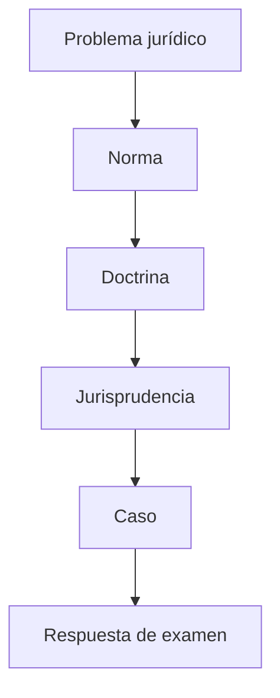

---

# Clase 2 — Personalidad jurídica, tipicidad, clasificación y nacionalidad

<!--
## Ejes

- personalidad jurídica
- art. 2 LGS
- CCyC
- art. 54 LGS
- art. 144 CCyC
- tipicidad
- clasificación
- nacionalidad

---

# Objetivos de aprendizaje

- Comprender personalidad jurídica.
- Comprender art. 2 lgs.
- Comprender ccyc.
- Comprender art. 54 lgs.
- Comprender art. 144 ccyc.
- Comprender tipicidad.

---

# Mapa conceptual

---

# Personalidad jurídica

## Bloque

Personalidad jurídica

## Método

Norma aplicable, doctrina, consecuencias prácticas y preguntas de examen.

---

# Función de la personalidad

## Concepto

La personalidad jurídica permite imputar derechos, obligaciones y patrimonio a la sociedad como sujeto distinto de sus integrantes.

## Norma / eje jurídico

Art. 2 LGS y reglas del CCyC sobre personas jurídicas.

## Lectura doctrinaria

- **Vítolo:** analizar la función económica y organizativa de la institución.
- **Nissen:** ubicar la institución dentro del sistema legal, la personalidad, la tipicidad y la tutela de terceros.
- **Favier Dubois:** conectar la institución con empresa, gobierno corporativo, realidad económica y paradigmas societarios cuando corresponda.

## Consecuencia práctica

Permite resolver correctamente el encuadre del caso y evitar respuestas puramente memorísticas.

## Pregunta de examen

¿Qué significa que la sociedad sea sujeto de derecho?

---

# Autonomía patrimonial

## Concepto

La sociedad tiene patrimonio diferenciado del patrimonio de los socios.

## Norma / eje jurídico

LGS, CCyC y normativa especial cuando corresponda.

## Lectura doctrinaria

- **Vítolo:** analizar la función económica y organizativa de la institución.
- **Nissen:** ubicar la institución dentro del sistema legal, la personalidad, la tipicidad y la tutela de terceros.
- **Favier Dubois:** conectar la institución con empresa, gobierno corporativo, realidad económica y paradigmas societarios cuando corresponda.

## Consecuencia práctica

Permite separar riesgo, crédito, deudas y responsabilidad.

## Pregunta de examen

Explique el instituto y fundamente con norma, doctrina y consecuencia práctica.

---

# Atributos

## Concepto

Nombre, domicilio, patrimonio, capacidad, órganos y representación hacen operativa la personalidad.

## Norma / eje jurídico

LGS, CCyC y normativa especial cuando corresponda.

## Lectura doctrinaria

- **Vítolo:** analizar la función económica y organizativa de la institución.
- **Nissen:** ubicar la institución dentro del sistema legal, la personalidad, la tipicidad y la tutela de terceros.
- **Favier Dubois:** conectar la institución con empresa, gobierno corporativo, realidad económica y paradigmas societarios cuando corresponda.

## Consecuencia práctica

Permite resolver correctamente el encuadre del caso y evitar respuestas puramente memorísticas.

## Pregunta de examen

Explique el instituto y fundamente con norma, doctrina y consecuencia práctica.

---

# Alcances

## Concepto

La personalidad tiene alcance legal: no es absoluta ni puede invocarse abusivamente.

## Norma / eje jurídico

LGS, CCyC y normativa especial cuando corresponda.

## Lectura doctrinaria

- **Vítolo:** analizar la función económica y organizativa de la institución.
- **Nissen:** ubicar la institución dentro del sistema legal, la personalidad, la tipicidad y la tutela de terceros.
- **Favier Dubois:** conectar la institución con empresa, gobierno corporativo, realidad económica y paradigmas societarios cuando corresponda.

## Consecuencia práctica

Permite resolver correctamente el encuadre del caso y evitar respuestas puramente memorísticas.

## Pregunta de examen

Explique la relatividad de la personalidad jurídica.

---

# Desestimación e inoponibilidad

## Bloque

Desestimación e inoponibilidad

## Método

Norma aplicable, doctrina, consecuencias prácticas y preguntas de examen.

---

# Art. 54 LGS

## Concepto

La personalidad puede ser inoponible cuando la actuación encubre fines extrasocietarios, viola la ley, el orden público, la buena fe o frustra derechos de terceros.

## Norma / eje jurídico

Art. 54, tercer párrafo, LGS.

## Lectura doctrinaria

- **Vítolo:** analizar la función económica y organizativa de la institución.
- **Nissen:** ubicar la institución dentro del sistema legal, la personalidad, la tipicidad y la tutela de terceros.
- **Favier Dubois:** conectar la institución con empresa, gobierno corporativo, realidad económica y paradigmas societarios cuando corresponda.

## Consecuencia práctica

Permite resolver correctamente el encuadre del caso y evitar respuestas puramente memorísticas.

## Pregunta de examen

¿Cuándo procede la inoponibilidad?

---

# Art. 144 CCyC

## Concepto

El CCyC prevé la inoponibilidad frente al uso abusivo de la persona jurídica.

## Norma / eje jurídico

Art. 144 CCyC.

## Lectura doctrinaria

- **Vítolo:** analizar la función económica y organizativa de la institución.
- **Nissen:** ubicar la institución dentro del sistema legal, la personalidad, la tipicidad y la tutela de terceros.
- **Favier Dubois:** conectar la institución con empresa, gobierno corporativo, realidad económica y paradigmas societarios cuando corresponda.

## Consecuencia práctica

Permite resolver correctamente el encuadre del caso y evitar respuestas puramente memorísticas.

## Pregunta de examen

Explique el instituto y fundamente con norma, doctrina y consecuencia práctica.

---

# No es nulidad

## Concepto

La inoponibilidad no elimina necesariamente la sociedad; impide oponer la personalidad en un caso concreto.

## Norma / eje jurídico

LGS, CCyC y normativa especial cuando corresponda.

## Lectura doctrinaria

- **Vítolo:** analizar la función económica y organizativa de la institución.
- **Nissen:** ubicar la institución dentro del sistema legal, la personalidad, la tipicidad y la tutela de terceros.
- **Favier Dubois:** conectar la institución con empresa, gobierno corporativo, realidad económica y paradigmas societarios cuando corresponda.

## Consecuencia práctica

Permite resolver correctamente el encuadre del caso y evitar respuestas puramente memorísticas.

## Pregunta de examen

Explique el instituto y fundamente con norma, doctrina y consecuencia práctica.

---

# No basta la insolvencia

## Concepto

La insolvencia puede ser indicio, pero no reemplaza la prueba del abuso o desvío.

## Norma / eje jurídico

LGS, CCyC y normativa especial cuando corresponda.

## Lectura doctrinaria

- **Vítolo:** analizar la función económica y organizativa de la institución.
- **Nissen:** ubicar la institución dentro del sistema legal, la personalidad, la tipicidad y la tutela de terceros.
- **Favier Dubois:** conectar la institución con empresa, gobierno corporativo, realidad económica y paradigmas societarios cuando corresponda.

## Consecuencia práctica

Permite resolver correctamente el encuadre del caso y evitar respuestas puramente memorísticas.

## Pregunta de examen

Explique el instituto y fundamente con norma, doctrina y consecuencia práctica.

---

# Error frecuente: No basta la insolvencia

## Confusión habitual

Creer que toda sociedad insolvente habilita correr el velo.

## Corrección

Identificar primero la naturaleza jurídica y recién después aplicar el régimen normativo.

---

# Sociedades pantalla

## Concepto

La estructura societaria puede ser legítima o abusiva según su función real y los efectos producidos.

## Norma / eje jurídico

LGS, CCyC y normativa especial cuando corresponda.

## Lectura doctrinaria

- **Vítolo:** analizar la función económica y organizativa de la institución.
- **Nissen:** ubicar la institución dentro del sistema legal, la personalidad, la tipicidad y la tutela de terceros.
- **Favier Dubois:** conectar la institución con empresa, gobierno corporativo, realidad económica y paradigmas societarios cuando corresponda.

## Consecuencia práctica

Permite resolver correctamente el encuadre del caso y evitar respuestas puramente memorísticas.

## Pregunta de examen

Explique el instituto y fundamente con norma, doctrina y consecuencia práctica.

---

# Jurisprudencia

## Bloque

Jurisprudencia

## Método

Norma aplicable, doctrina, consecuencias prácticas y preguntas de examen.

---

# Parke Davis

## Concepto

Caso clásico para analizar personalidad, realidad económica y grupo empresario.

## Norma / eje jurídico

LGS, CCyC y normativa especial cuando corresponda.

## Lectura doctrinaria

- **Vítolo:** analizar la función económica y organizativa de la institución.
- **Nissen:** ubicar la institución dentro del sistema legal, la personalidad, la tipicidad y la tutela de terceros.
- **Favier Dubois:** conectar la institución con empresa, gobierno corporativo, realidad económica y paradigmas societarios cuando corresponda.

## Consecuencia práctica

Permite resolver correctamente el encuadre del caso y evitar respuestas puramente memorísticas.

## Pregunta de examen

Explique el instituto y fundamente con norma, doctrina y consecuencia práctica.

---

# Caso: Parke Davis

## Supuesto

Reconstruir estructura de control, hechos, pretensión fiscal o patrimonial, problema jurídico y regla del fallo.

## Consignas

1. Identifique norma aplicable.
2. Determine hechos relevantes.
3. Proponga solución fundada.
4. Redacte respuesta de examen.

---

# Swift-Deltec

## Concepto

Precedente relevante sobre grupos, unidad económica y límites de la personalidad formal.

## Norma / eje jurídico

LGS, CCyC y normativa especial cuando corresponda.

## Lectura doctrinaria

- **Vítolo:** analizar la función económica y organizativa de la institución.
- **Nissen:** ubicar la institución dentro del sistema legal, la personalidad, la tipicidad y la tutela de terceros.
- **Favier Dubois:** conectar la institución con empresa, gobierno corporativo, realidad económica y paradigmas societarios cuando corresponda.

## Consecuencia práctica

Permite resolver correctamente el encuadre del caso y evitar respuestas puramente memorísticas.

## Pregunta de examen

Explique el instituto y fundamente con norma, doctrina y consecuencia práctica.

---

# Caso: Swift-Deltec

## Supuesto

Dibujar grupo, controlante, sociedades operativas y terceros afectados.

## Consignas

1. Identifique norma aplicable.
2. Determine hechos relevantes.
3. Proponga solución fundada.
4. Redacte respuesta de examen.

---

# Palomeque

## Concepto

Fallo útil para marcar límites a la desestimación: no todo incumplimiento autoriza art. 54.

## Norma / eje jurídico

LGS, CCyC y normativa especial cuando corresponda.

## Lectura doctrinaria

- **Vítolo:** analizar la función económica y organizativa de la institución.
- **Nissen:** ubicar la institución dentro del sistema legal, la personalidad, la tipicidad y la tutela de terceros.
- **Favier Dubois:** conectar la institución con empresa, gobierno corporativo, realidad económica y paradigmas societarios cuando corresponda.

## Consecuencia práctica

Permite resolver correctamente el encuadre del caso y evitar respuestas puramente memorísticas.

## Pregunta de examen

Explique el instituto y fundamente con norma, doctrina y consecuencia práctica.

---

# Caso: Palomeque

## Supuesto

Analizar por qué el tribunal no admite una extensión automática.

## Consignas

1. Identifique norma aplicable.
2. Determine hechos relevantes.
3. Proponga solución fundada.
4. Redacte respuesta de examen.

---

# Carballo

## Concepto

Caso para discutir responsabilidad, control societario y aplicación concreta de la inoponibilidad.

## Norma / eje jurídico

LGS, CCyC y normativa especial cuando corresponda.

## Lectura doctrinaria

- **Vítolo:** analizar la función económica y organizativa de la institución.
- **Nissen:** ubicar la institución dentro del sistema legal, la personalidad, la tipicidad y la tutela de terceros.
- **Favier Dubois:** conectar la institución con empresa, gobierno corporativo, realidad económica y paradigmas societarios cuando corresponda.

## Consecuencia práctica

Permite resolver correctamente el encuadre del caso y evitar respuestas puramente memorísticas.

## Pregunta de examen

Explique el instituto y fundamente con norma, doctrina y consecuencia práctica.

---

# Tipicidad

## Bloque

Tipicidad

## Método

Norma aplicable, doctrina, consecuencias prácticas y preguntas de examen.

---

# Concepto de tipicidad

## Concepto

La tipicidad ordena los modelos societarios admitidos y permite anticipar régimen de responsabilidad, órganos, capital y fiscalización.

## Norma / eje jurídico

LGS, CCyC y normativa especial cuando corresponda.

## Lectura doctrinaria

- **Vítolo:** analizar la función económica y organizativa de la institución.
- **Nissen:** ubicar la institución dentro del sistema legal, la personalidad, la tipicidad y la tutela de terceros.
- **Favier Dubois:** conectar la institución con empresa, gobierno corporativo, realidad económica y paradigmas societarios cuando corresponda.

## Consecuencia práctica

Permite resolver correctamente el encuadre del caso y evitar respuestas puramente memorísticas.

## Pregunta de examen

¿Para qué sirve la tipicidad?

---

# Rasgos tipificantes

## Concepto

Responsabilidad, capital, participaciones, órganos, administración, representación y fiscalización.

## Norma / eje jurídico

LGS, CCyC y normativa especial cuando corresponda.

## Lectura doctrinaria

- **Vítolo:** analizar la función económica y organizativa de la institución.
- **Nissen:** ubicar la institución dentro del sistema legal, la personalidad, la tipicidad y la tutela de terceros.
- **Favier Dubois:** conectar la institución con empresa, gobierno corporativo, realidad económica y paradigmas societarios cuando corresponda.

## Consecuencia práctica

Permite resolver correctamente el encuadre del caso y evitar respuestas puramente memorísticas.

## Pregunta de examen

Explique el instituto y fundamente con norma, doctrina y consecuencia práctica.

---

# Nuevo alcance

## Concepto

La reforma flexibilizó los efectos de la atipicidad, pero no eliminó la función ordenadora de los tipos.

## Norma / eje jurídico

LGS, CCyC y normativa especial cuando corresponda.

## Lectura doctrinaria

- **Vítolo:** analizar la función económica y organizativa de la institución.
- **Nissen:** ubicar la institución dentro del sistema legal, la personalidad, la tipicidad y la tutela de terceros.
- **Favier Dubois:** conectar la institución con empresa, gobierno corporativo, realidad económica y paradigmas societarios cuando corresponda.

## Consecuencia práctica

Permite resolver correctamente el encuadre del caso y evitar respuestas puramente memorísticas.

## Pregunta de examen

Explique el instituto y fundamente con norma, doctrina y consecuencia práctica.

---

# Clasificación y nacionalidad

## Bloque

Clasificación y nacionalidad

## Método

Norma aplicable, doctrina, consecuencias prácticas y preguntas de examen.

---

# Clasificación por responsabilidad

## Concepto

Permite distinguir sociedades de responsabilidad limitada, ilimitada o mixta.

## Norma / eje jurídico

LGS, CCyC y normativa especial cuando corresponda.

## Lectura doctrinaria

- **Vítolo:** analizar la función económica y organizativa de la institución.
- **Nissen:** ubicar la institución dentro del sistema legal, la personalidad, la tipicidad y la tutela de terceros.
- **Favier Dubois:** conectar la institución con empresa, gobierno corporativo, realidad económica y paradigmas societarios cuando corresponda.

## Consecuencia práctica

Permite resolver correctamente el encuadre del caso y evitar respuestas puramente memorísticas.

## Pregunta de examen

Explique el instituto y fundamente con norma, doctrina y consecuencia práctica.

---

# Clasificación por capital

## Concepto

Partes de interés, cuotas y acciones.

## Norma / eje jurídico

LGS, CCyC y normativa especial cuando corresponda.

## Lectura doctrinaria

- **Vítolo:** analizar la función económica y organizativa de la institución.
- **Nissen:** ubicar la institución dentro del sistema legal, la personalidad, la tipicidad y la tutela de terceros.
- **Favier Dubois:** conectar la institución con empresa, gobierno corporativo, realidad económica y paradigmas societarios cuando corresponda.

## Consecuencia práctica

Permite resolver correctamente el encuadre del caso y evitar respuestas puramente memorísticas.

## Pregunta de examen

Explique el instituto y fundamente con norma, doctrina y consecuencia práctica.

---

# Clasificación por organización

## Concepto

Personalistas, mixtas y capitalistas.

## Norma / eje jurídico

LGS, CCyC y normativa especial cuando corresponda.

## Lectura doctrinaria

- **Vítolo:** analizar la función económica y organizativa de la institución.
- **Nissen:** ubicar la institución dentro del sistema legal, la personalidad, la tipicidad y la tutela de terceros.
- **Favier Dubois:** conectar la institución con empresa, gobierno corporativo, realidad económica y paradigmas societarios cuando corresponda.

## Consecuencia práctica

Permite resolver correctamente el encuadre del caso y evitar respuestas puramente memorísticas.

## Pregunta de examen

Explique el instituto y fundamente con norma, doctrina y consecuencia práctica.

---

# Nacionalidad de sociedades

## Concepto

Problema referido a ley aplicable, domicilio, sede real, control y actuación en el extranjero.

## Norma / eje jurídico

LGS, CCyC y normativa especial cuando corresponda.

## Lectura doctrinaria

- **Vítolo:** analizar la función económica y organizativa de la institución.
- **Nissen:** ubicar la institución dentro del sistema legal, la personalidad, la tipicidad y la tutela de terceros.
- **Favier Dubois:** conectar la institución con empresa, gobierno corporativo, realidad económica y paradigmas societarios cuando corresponda.

## Consecuencia práctica

Permite resolver correctamente el encuadre del caso y evitar respuestas puramente memorísticas.

## Pregunta de examen

Explique criterios de nacionalidad societaria.

---

# Pregunta de examen 1: personalidad jurídica

## Consigna

Desarrolle **personalidad jurídica**.

## Pauta mínima

- Norma aplicable.
- Concepto.
- Posición doctrinaria.
- Consecuencia práctica.
- Ejemplo o caso.

## Advertencia

No responder con definiciones aisladas. Construir una respuesta argumental.

---

# Pregunta de examen 2: art. 2 LGS

## Consigna

Desarrolle **art. 2 LGS**.

## Pauta mínima

- Norma aplicable.
- Concepto.
- Posición doctrinaria.
- Consecuencia práctica.
- Ejemplo o caso.

## Advertencia

No responder con definiciones aisladas. Construir una respuesta argumental.

---

# Pregunta de examen 3: CCyC

## Consigna

Desarrolle **CCyC**.

## Pauta mínima

- Norma aplicable.
- Concepto.
- Posición doctrinaria.
- Consecuencia práctica.
- Ejemplo o caso.

## Advertencia

No responder con definiciones aisladas. Construir una respuesta argumental.

---

# Pregunta de examen 4: art. 54 LGS

## Consigna

Desarrolle **art. 54 LGS**.

## Pauta mínima

- Norma aplicable.
- Concepto.
- Posición doctrinaria.
- Consecuencia práctica.
- Ejemplo o caso.

## Advertencia

No responder con definiciones aisladas. Construir una respuesta argumental.

---

# Pregunta de examen 5: art. 144 CCyC

## Consigna

Desarrolle **art. 144 CCyC**.

## Pauta mínima

- Norma aplicable.
- Concepto.
- Posición doctrinaria.
- Consecuencia práctica.
- Ejemplo o caso.

## Advertencia

No responder con definiciones aisladas. Construir una respuesta argumental.

---

# Pregunta de examen 6: tipicidad

## Consigna

Desarrolle **tipicidad**.

## Pauta mínima

- Norma aplicable.
- Concepto.
- Posición doctrinaria.
- Consecuencia práctica.
- Ejemplo o caso.

## Advertencia

No responder con definiciones aisladas. Construir una respuesta argumental.

---

# Pregunta de examen 7: clasificación

## Consigna

Desarrolle **clasificación**.

## Pauta mínima

- Norma aplicable.
- Concepto.
- Posición doctrinaria.
- Consecuencia práctica.
- Ejemplo o caso.

## Advertencia

No responder con definiciones aisladas. Construir una respuesta argumental.

---

# Pregunta de examen 8: nacionalidad

## Consigna

Desarrolle **nacionalidad**.

## Pauta mínima

- Norma aplicable.
- Concepto.
- Posición doctrinaria.
- Consecuencia práctica.
- Ejemplo o caso.

## Advertencia

No responder con definiciones aisladas. Construir una respuesta argumental.

---

# Pregunta de examen 9: Parke Davis

## Consigna

Desarrolle **Parke Davis**.

## Pauta mínima

- Norma aplicable.
- Concepto.
- Posición doctrinaria.
- Consecuencia práctica.
- Ejemplo o caso.

## Advertencia

No responder con definiciones aisladas. Construir una respuesta argumental.

---

# Pregunta de examen 10: Swift

## Consigna

Desarrolle **Swift**.

## Pauta mínima

- Norma aplicable.
- Concepto.
- Posición doctrinaria.
- Consecuencia práctica.
- Ejemplo o caso.

## Advertencia

No responder con definiciones aisladas. Construir una respuesta argumental.

---

# Pregunta de examen 11: Palomeque

## Consigna

Desarrolle **Palomeque**.

## Pauta mínima

- Norma aplicable.
- Concepto.
- Posición doctrinaria.
- Consecuencia práctica.
- Ejemplo o caso.

## Advertencia

No responder con definiciones aisladas. Construir una respuesta argumental.

---

# Pregunta de examen 12: Carballo

## Consigna

Desarrolle **Carballo**.

## Pauta mínima

- Norma aplicable.
- Concepto.
- Posición doctrinaria.
- Consecuencia práctica.
- Ejemplo o caso.

## Advertencia

No responder con definiciones aisladas. Construir una respuesta argumental.

---

# Pregunta de examen 13: personalidad jurídica

## Consigna

Desarrolle **personalidad jurídica**.

## Pauta mínima

- Norma aplicable.
- Concepto.
- Posición doctrinaria.
- Consecuencia práctica.
- Ejemplo o caso.

## Advertencia

No responder con definiciones aisladas. Construir una respuesta argumental.

---

# Pregunta de examen 14: art. 2 LGS

## Consigna

Desarrolle **art. 2 LGS**.

## Pauta mínima

- Norma aplicable.
- Concepto.
- Posición doctrinaria.
- Consecuencia práctica.
- Ejemplo o caso.

## Advertencia

No responder con definiciones aisladas. Construir una respuesta argumental.

---

# Pregunta de examen 15: CCyC

## Consigna

Desarrolle **CCyC**.

## Pauta mínima

- Norma aplicable.
- Concepto.
- Posición doctrinaria.
- Consecuencia práctica.
- Ejemplo o caso.

## Advertencia

No responder con definiciones aisladas. Construir una respuesta argumental.

---

# Pregunta de examen 16: art. 54 LGS

## Consigna

Desarrolle **art. 54 LGS**.

## Pauta mínima

- Norma aplicable.
- Concepto.
- Posición doctrinaria.
- Consecuencia práctica.
- Ejemplo o caso.

## Advertencia

No responder con definiciones aisladas. Construir una respuesta argumental.

---

# Pregunta de examen 17: art. 144 CCyC

## Consigna

Desarrolle **art. 144 CCyC**.

## Pauta mínima

- Norma aplicable.
- Concepto.
- Posición doctrinaria.
- Consecuencia práctica.
- Ejemplo o caso.

## Advertencia

No responder con definiciones aisladas. Construir una respuesta argumental.

---

# Pregunta de examen 18: tipicidad

## Consigna

Desarrolle **tipicidad**.

## Pauta mínima

- Norma aplicable.
- Concepto.
- Posición doctrinaria.
- Consecuencia práctica.
- Ejemplo o caso.

## Advertencia

No responder con definiciones aisladas. Construir una respuesta argumental.

---

# Pregunta de examen 19: clasificación

## Consigna

Desarrolle **clasificación**.

## Pauta mínima

- Norma aplicable.
- Concepto.
- Posición doctrinaria.
- Consecuencia práctica.
- Ejemplo o caso.

## Advertencia

No responder con definiciones aisladas. Construir una respuesta argumental.

---

# Pregunta de examen 20: nacionalidad

## Consigna

Desarrolle **nacionalidad**.

## Pauta mínima

- Norma aplicable.
- Concepto.
- Posición doctrinaria.
- Consecuencia práctica.
- Ejemplo o caso.

## Advertencia

No responder con definiciones aisladas. Construir una respuesta argumental.

---

# Pregunta de examen 21: Parke Davis

## Consigna

Desarrolle **Parke Davis**.

## Pauta mínima

- Norma aplicable.
- Concepto.
- Posición doctrinaria.
- Consecuencia práctica.
- Ejemplo o caso.

## Advertencia

No responder con definiciones aisladas. Construir una respuesta argumental.

---

# Pregunta de examen 22: Swift

## Consigna

Desarrolle **Swift**.

## Pauta mínima

- Norma aplicable.
- Concepto.
- Posición doctrinaria.
- Consecuencia práctica.
- Ejemplo o caso.

## Advertencia

No responder con definiciones aisladas. Construir una respuesta argumental.

---

# Pregunta de examen 23: Palomeque

## Consigna

Desarrolle **Palomeque**.

## Pauta mínima

- Norma aplicable.
- Concepto.
- Posición doctrinaria.
- Consecuencia práctica.
- Ejemplo o caso.

## Advertencia

No responder con definiciones aisladas. Construir una respuesta argumental.

---

# Pregunta de examen 24: Carballo

## Consigna

Desarrolle **Carballo**.

## Pauta mínima

- Norma aplicable.
- Concepto.
- Posición doctrinaria.
- Consecuencia práctica.
- Ejemplo o caso.

## Advertencia

No responder con definiciones aisladas. Construir una respuesta argumental.

---

# Pregunta de examen 25: personalidad jurídica

## Consigna

Desarrolle **personalidad jurídica**.

## Pauta mínima

- Norma aplicable.
- Concepto.
- Posición doctrinaria.
- Consecuencia práctica.
- Ejemplo o caso.

## Advertencia

No responder con definiciones aisladas. Construir una respuesta argumental.

---

# Pregunta de examen 26: art. 2 LGS

## Consigna

Desarrolle **art. 2 LGS**.

## Pauta mínima

- Norma aplicable.
- Concepto.
- Posición doctrinaria.
- Consecuencia práctica.
- Ejemplo o caso.

## Advertencia

No responder con definiciones aisladas. Construir una respuesta argumental.

---

# Pregunta de examen 27: CCyC

## Consigna

Desarrolle **CCyC**.

## Pauta mínima

- Norma aplicable.
- Concepto.
- Posición doctrinaria.
- Consecuencia práctica.
- Ejemplo o caso.

## Advertencia

No responder con definiciones aisladas. Construir una respuesta argumental.

---

# Pregunta de examen 28: art. 54 LGS

## Consigna

Desarrolle **art. 54 LGS**.

## Pauta mínima

- Norma aplicable.
- Concepto.
- Posición doctrinaria.
- Consecuencia práctica.
- Ejemplo o caso.

## Advertencia

No responder con definiciones aisladas. Construir una respuesta argumental.

---

# Pregunta de examen 29: art. 144 CCyC

## Consigna

Desarrolle **art. 144 CCyC**.

## Pauta mínima

- Norma aplicable.
- Concepto.
- Posición doctrinaria.
- Consecuencia práctica.
- Ejemplo o caso.

## Advertencia

No responder con definiciones aisladas. Construir una respuesta argumental.

---

# Pregunta de examen 30: tipicidad

## Consigna

Desarrolle **tipicidad**.

## Pauta mínima

- Norma aplicable.
- Concepto.
- Posición doctrinaria.
- Consecuencia práctica.
- Ejemplo o caso.

## Advertencia

No responder con definiciones aisladas. Construir una respuesta argumental.

---

# Pregunta de examen 31: clasificación

## Consigna

Desarrolle **clasificación**.

## Pauta mínima

- Norma aplicable.
- Concepto.
- Posición doctrinaria.
- Consecuencia práctica.
- Ejemplo o caso.

## Advertencia

No responder con definiciones aisladas. Construir una respuesta argumental.

---

# Pregunta de examen 32: nacionalidad

## Consigna

Desarrolle **nacionalidad**.

## Pauta mínima

- Norma aplicable.
- Concepto.
- Posición doctrinaria.
- Consecuencia práctica.
- Ejemplo o caso.

## Advertencia

No responder con definiciones aisladas. Construir una respuesta argumental.

---

# Pregunta de examen 33: Parke Davis

## Consigna

Desarrolle **Parke Davis**.

## Pauta mínima

- Norma aplicable.
- Concepto.
- Posición doctrinaria.
- Consecuencia práctica.
- Ejemplo o caso.

## Advertencia

No responder con definiciones aisladas. Construir una respuesta argumental.

---

# Pregunta de examen 34: Swift

## Consigna

Desarrolle **Swift**.

## Pauta mínima

- Norma aplicable.
- Concepto.
- Posición doctrinaria.
- Consecuencia práctica.
- Ejemplo o caso.

## Advertencia

No responder con definiciones aisladas. Construir una respuesta argumental.

---

# Pregunta de examen 35: Palomeque

## Consigna

Desarrolle **Palomeque**.

## Pauta mínima

- Norma aplicable.
- Concepto.
- Posición doctrinaria.
- Consecuencia práctica.
- Ejemplo o caso.

## Advertencia

No responder con definiciones aisladas. Construir una respuesta argumental.

---

# Pregunta de examen 36: Carballo

## Consigna

Desarrolle **Carballo**.

## Pauta mínima

- Norma aplicable.
- Concepto.
- Posición doctrinaria.
- Consecuencia práctica.
- Ejemplo o caso.

## Advertencia

No responder con definiciones aisladas. Construir una respuesta argumental.

---

# Pregunta de examen 37: personalidad jurídica

## Consigna

Desarrolle **personalidad jurídica**.

## Pauta mínima

- Norma aplicable.
- Concepto.
- Posición doctrinaria.
- Consecuencia práctica.
- Ejemplo o caso.

## Advertencia

No responder con definiciones aisladas. Construir una respuesta argumental.

---

# Pregunta de examen 38: art. 2 LGS

## Consigna

Desarrolle **art. 2 LGS**.

## Pauta mínima

- Norma aplicable.
- Concepto.
- Posición doctrinaria.
- Consecuencia práctica.
- Ejemplo o caso.

## Advertencia

No responder con definiciones aisladas. Construir una respuesta argumental.

---

# Pregunta de examen 39: CCyC

## Consigna

Desarrolle **CCyC**.

## Pauta mínima

- Norma aplicable.
- Concepto.
- Posición doctrinaria.
- Consecuencia práctica.
- Ejemplo o caso.

## Advertencia

No responder con definiciones aisladas. Construir una respuesta argumental.

---

# Pregunta de examen 40: art. 54 LGS

## Consigna

Desarrolle **art. 54 LGS**.

## Pauta mínima

- Norma aplicable.
- Concepto.
- Posición doctrinaria.
- Consecuencia práctica.
- Ejemplo o caso.

## Advertencia

No responder con definiciones aisladas. Construir una respuesta argumental.

---

# Pregunta de examen 41: art. 144 CCyC

## Consigna

Desarrolle **art. 144 CCyC**.

## Pauta mínima

- Norma aplicable.
- Concepto.
- Posición doctrinaria.
- Consecuencia práctica.
- Ejemplo o caso.

## Advertencia

No responder con definiciones aisladas. Construir una respuesta argumental.

---

# Pregunta de examen 42: tipicidad

## Consigna

Desarrolle **tipicidad**.

## Pauta mínima

- Norma aplicable.
- Concepto.
- Posición doctrinaria.
- Consecuencia práctica.
- Ejemplo o caso.

## Advertencia

No responder con definiciones aisladas. Construir una respuesta argumental.

---

# Pregunta de examen 43: clasificación

## Consigna

Desarrolle **clasificación**.

## Pauta mínima

- Norma aplicable.
- Concepto.
- Posición doctrinaria.
- Consecuencia práctica.
- Ejemplo o caso.

## Advertencia

No responder con definiciones aisladas. Construir una respuesta argumental.

---

# Pregunta de examen 44: nacionalidad

## Consigna

Desarrolle **nacionalidad**.

## Pauta mínima

- Norma aplicable.
- Concepto.
- Posición doctrinaria.
- Consecuencia práctica.
- Ejemplo o caso.

## Advertencia

No responder con definiciones aisladas. Construir una respuesta argumental.

---

# Pregunta de examen 45: Parke Davis

## Consigna

Desarrolle **Parke Davis**.

## Pauta mínima

- Norma aplicable.
- Concepto.
- Posición doctrinaria.
- Consecuencia práctica.
- Ejemplo o caso.

## Advertencia

No responder con definiciones aisladas. Construir una respuesta argumental.

---

# Pregunta de examen 46: Swift

## Consigna

Desarrolle **Swift**.

## Pauta mínima

- Norma aplicable.
- Concepto.
- Posición doctrinaria.
- Consecuencia práctica.
- Ejemplo o caso.

## Advertencia

No responder con definiciones aisladas. Construir una respuesta argumental.

---

# Pregunta de examen 47: Palomeque

## Consigna

Desarrolle **Palomeque**.

## Pauta mínima

- Norma aplicable.
- Concepto.
- Posición doctrinaria.
- Consecuencia práctica.
- Ejemplo o caso.

## Advertencia

No responder con definiciones aisladas. Construir una respuesta argumental.

---

# Pregunta de examen 48: Carballo

## Consigna

Desarrolle **Carballo**.

## Pauta mínima

- Norma aplicable.
- Concepto.
- Posición doctrinaria.
- Consecuencia práctica.
- Ejemplo o caso.

## Advertencia

No responder con definiciones aisladas. Construir una respuesta argumental.

---

# Pregunta de examen 49: personalidad jurídica

## Consigna

Desarrolle **personalidad jurídica**.

## Pauta mínima

- Norma aplicable.
- Concepto.
- Posición doctrinaria.
- Consecuencia práctica.
- Ejemplo o caso.

## Advertencia

No responder con definiciones aisladas. Construir una respuesta argumental.

---

# Pregunta de examen 50: art. 2 LGS

## Consigna

Desarrolle **art. 2 LGS**.

## Pauta mínima

- Norma aplicable.
- Concepto.
- Posición doctrinaria.
- Consecuencia práctica.
- Ejemplo o caso.

## Advertencia

No responder con definiciones aisladas. Construir una respuesta argumental.

---

# Pregunta de examen 51: CCyC

## Consigna

Desarrolle **CCyC**.

## Pauta mínima

- Norma aplicable.
- Concepto.
- Posición doctrinaria.
- Consecuencia práctica.
- Ejemplo o caso.

## Advertencia

No responder con definiciones aisladas. Construir una respuesta argumental.

---

# Pregunta de examen 52: art. 54 LGS

## Consigna

Desarrolle **art. 54 LGS**.

## Pauta mínima

- Norma aplicable.
- Concepto.
- Posición doctrinaria.
- Consecuencia práctica.
- Ejemplo o caso.

## Advertencia

No responder con definiciones aisladas. Construir una respuesta argumental.

---

# Pregunta de examen 53: art. 144 CCyC

## Consigna

Desarrolle **art. 144 CCyC**.

## Pauta mínima

- Norma aplicable.
- Concepto.
- Posición doctrinaria.
- Consecuencia práctica.
- Ejemplo o caso.

## Advertencia

No responder con definiciones aisladas. Construir una respuesta argumental.

---

# Pregunta de examen 54: tipicidad

## Consigna

Desarrolle **tipicidad**.

## Pauta mínima

- Norma aplicable.
- Concepto.
- Posición doctrinaria.
- Consecuencia práctica.
- Ejemplo o caso.

## Advertencia

No responder con definiciones aisladas. Construir una respuesta argumental.

---

# Pregunta de examen 55: clasificación

## Consigna

Desarrolle **clasificación**.

## Pauta mínima

- Norma aplicable.
- Concepto.
- Posición doctrinaria.
- Consecuencia práctica.
- Ejemplo o caso.

## Advertencia

No responder con definiciones aisladas. Construir una respuesta argumental.

---

# Pregunta de examen 56: nacionalidad

## Consigna

Desarrolle **nacionalidad**.

## Pauta mínima

- Norma aplicable.
- Concepto.
- Posición doctrinaria.
- Consecuencia práctica.
- Ejemplo o caso.

## Advertencia

No responder con definiciones aisladas. Construir una respuesta argumental.

---

# Pregunta de examen 57: Parke Davis

## Consigna

Desarrolle **Parke Davis**.

## Pauta mínima

- Norma aplicable.
- Concepto.
- Posición doctrinaria.
- Consecuencia práctica.
- Ejemplo o caso.

## Advertencia

No responder con definiciones aisladas. Construir una respuesta argumental.

---

# Pregunta de examen 58: Swift

## Consigna

Desarrolle **Swift**.

## Pauta mínima

- Norma aplicable.
- Concepto.
- Posición doctrinaria.
- Consecuencia práctica.
- Ejemplo o caso.

## Advertencia

No responder con definiciones aisladas. Construir una respuesta argumental.

---

# Pregunta de examen 59: Palomeque

## Consigna

Desarrolle **Palomeque**.

## Pauta mínima

- Norma aplicable.
- Concepto.
- Posición doctrinaria.
- Consecuencia práctica.
- Ejemplo o caso.

## Advertencia

No responder con definiciones aisladas. Construir una respuesta argumental.

---

# Pregunta de examen 60: Carballo

## Consigna

Desarrolle **Carballo**.

## Pauta mínima

- Norma aplicable.
- Concepto.
- Posición doctrinaria.
- Consecuencia práctica.
- Ejemplo o caso.

## Advertencia

No responder con definiciones aisladas. Construir una respuesta argumental.

---

# Pregunta de examen 61: personalidad jurídica

## Consigna

Desarrolle **personalidad jurídica**.

## Pauta mínima

- Norma aplicable.
- Concepto.
- Posición doctrinaria.
- Consecuencia práctica.
- Ejemplo o caso.

## Advertencia

No responder con definiciones aisladas. Construir una respuesta argumental.

---

# Pregunta de examen 62: art. 2 LGS

## Consigna

Desarrolle **art. 2 LGS**.

## Pauta mínima

- Norma aplicable.
- Concepto.
- Posición doctrinaria.
- Consecuencia práctica.
- Ejemplo o caso.

## Advertencia

No responder con definiciones aisladas. Construir una respuesta argumental.

---

# Pregunta de examen 63: CCyC

## Consigna

Desarrolle **CCyC**.

## Pauta mínima

- Norma aplicable.
- Concepto.
- Posición doctrinaria.
- Consecuencia práctica.
- Ejemplo o caso.

## Advertencia

No responder con definiciones aisladas. Construir una respuesta argumental.

---

# Pregunta de examen 64: art. 54 LGS

## Consigna

Desarrolle **art. 54 LGS**.

## Pauta mínima

- Norma aplicable.
- Concepto.
- Posición doctrinaria.
- Consecuencia práctica.
- Ejemplo o caso.

## Advertencia

No responder con definiciones aisladas. Construir una respuesta argumental.

---

# Pregunta de examen 65: art. 144 CCyC

## Consigna

Desarrolle **art. 144 CCyC**.

## Pauta mínima

- Norma aplicable.
- Concepto.
- Posición doctrinaria.
- Consecuencia práctica.
- Ejemplo o caso.

## Advertencia

No responder con definiciones aisladas. Construir una respuesta argumental.

---

# Pregunta de examen 66: tipicidad

## Consigna

Desarrolle **tipicidad**.

## Pauta mínima

- Norma aplicable.
- Concepto.
- Posición doctrinaria.
- Consecuencia práctica.
- Ejemplo o caso.

## Advertencia

No responder con definiciones aisladas. Construir una respuesta argumental.

---

# Pregunta de examen 67: clasificación

## Consigna

Desarrolle **clasificación**.

## Pauta mínima

- Norma aplicable.
- Concepto.
- Posición doctrinaria.
- Consecuencia práctica.
- Ejemplo o caso.

## Advertencia

No responder con definiciones aisladas. Construir una respuesta argumental.

---

# Pregunta de examen 68: nacionalidad

## Consigna

Desarrolle **nacionalidad**.

## Pauta mínima

- Norma aplicable.
- Concepto.
- Posición doctrinaria.
- Consecuencia práctica.
- Ejemplo o caso.

## Advertencia

No responder con definiciones aisladas. Construir una respuesta argumental.

---

# Pregunta de examen 69: Parke Davis

## Consigna

Desarrolle **Parke Davis**.

## Pauta mínima

- Norma aplicable.
- Concepto.
- Posición doctrinaria.
- Consecuencia práctica.
- Ejemplo o caso.

## Advertencia

No responder con definiciones aisladas. Construir una respuesta argumental.

---

# Pregunta de examen 70: Swift

## Consigna

Desarrolle **Swift**.

## Pauta mínima

- Norma aplicable.
- Concepto.
- Posición doctrinaria.
- Consecuencia práctica.
- Ejemplo o caso.

## Advertencia

No responder con definiciones aisladas. Construir una respuesta argumental.

---

# Pregunta de examen 71: Palomeque

## Consigna

Desarrolle **Palomeque**.

## Pauta mínima

- Norma aplicable.
- Concepto.
- Posición doctrinaria.
- Consecuencia práctica.
- Ejemplo o caso.

## Advertencia

No responder con definiciones aisladas. Construir una respuesta argumental.

---

# Pregunta de examen 72: Carballo

## Consigna

Desarrolle **Carballo**.

## Pauta mínima

- Norma aplicable.
- Concepto.
- Posición doctrinaria.
- Consecuencia práctica.
- Ejemplo o caso.

## Advertencia

No responder con definiciones aisladas. Construir una respuesta argumental.

---

# Pregunta de examen 73: personalidad jurídica

## Consigna

Desarrolle **personalidad jurídica**.

## Pauta mínima

- Norma aplicable.
- Concepto.
- Posición doctrinaria.
- Consecuencia práctica.
- Ejemplo o caso.

## Advertencia

No responder con definiciones aisladas. Construir una respuesta argumental.

---

# Pregunta de examen 74: art. 2 LGS

## Consigna

Desarrolle **art. 2 LGS**.

## Pauta mínima

- Norma aplicable.
- Concepto.
- Posición doctrinaria.
- Consecuencia práctica.
- Ejemplo o caso.

## Advertencia

No responder con definiciones aisladas. Construir una respuesta argumental.

---

# Pregunta de examen 75: CCyC

## Consigna

Desarrolle **CCyC**.

## Pauta mínima

- Norma aplicable.
- Concepto.
- Posición doctrinaria.
- Consecuencia práctica.
- Ejemplo o caso.

## Advertencia

No responder con definiciones aisladas. Construir una respuesta argumental.

---

# Pregunta de examen 76: art. 54 LGS

## Consigna

Desarrolle **art. 54 LGS**.

## Pauta mínima

- Norma aplicable.
- Concepto.
- Posición doctrinaria.
- Consecuencia práctica.
- Ejemplo o caso.

## Advertencia

No responder con definiciones aisladas. Construir una respuesta argumental.

---

# Pregunta de examen 77: art. 144 CCyC

## Consigna

Desarrolle **art. 144 CCyC**.

## Pauta mínima

- Norma aplicable.
- Concepto.
- Posición doctrinaria.
- Consecuencia práctica.
- Ejemplo o caso.

## Advertencia

No responder con definiciones aisladas. Construir una respuesta argumental.

---

# Pregunta de examen 78: tipicidad

## Consigna

Desarrolle **tipicidad**.

## Pauta mínima

- Norma aplicable.
- Concepto.
- Posición doctrinaria.
- Consecuencia práctica.
- Ejemplo o caso.

## Advertencia

No responder con definiciones aisladas. Construir una respuesta argumental.

---

# Pregunta de examen 79: clasificación

## Consigna

Desarrolle **clasificación**.

## Pauta mínima

- Norma aplicable.
- Concepto.
- Posición doctrinaria.
- Consecuencia práctica.
- Ejemplo o caso.

## Advertencia

No responder con definiciones aisladas. Construir una respuesta argumental.

---

# Pregunta de examen 80: nacionalidad

## Consigna

Desarrolle **nacionalidad**.

## Pauta mínima

- Norma aplicable.
- Concepto.
- Posición doctrinaria.
- Consecuencia práctica.
- Ejemplo o caso.

## Advertencia

No responder con definiciones aisladas. Construir una respuesta argumental.

---

# Pregunta de examen 81: Parke Davis

## Consigna

Desarrolle **Parke Davis**.

## Pauta mínima

- Norma aplicable.
- Concepto.
- Posición doctrinaria.
- Consecuencia práctica.
- Ejemplo o caso.

## Advertencia

No responder con definiciones aisladas. Construir una respuesta argumental.

---

# Pregunta de examen 82: Swift

## Consigna

Desarrolle **Swift**.

## Pauta mínima

- Norma aplicable.
- Concepto.
- Posición doctrinaria.
- Consecuencia práctica.
- Ejemplo o caso.

## Advertencia

No responder con definiciones aisladas. Construir una respuesta argumental.

---

# Pregunta de examen 83: Palomeque

## Consigna

Desarrolle **Palomeque**.

## Pauta mínima

- Norma aplicable.
- Concepto.
- Posición doctrinaria.
- Consecuencia práctica.
- Ejemplo o caso.

## Advertencia

No responder con definiciones aisladas. Construir una respuesta argumental.

---

# Pregunta de examen 84: Carballo

## Consigna

Desarrolle **Carballo**.

## Pauta mínima

- Norma aplicable.
- Concepto.
- Posición doctrinaria.
- Consecuencia práctica.
- Ejemplo o caso.

## Advertencia

No responder con definiciones aisladas. Construir una respuesta argumental.

---

# Pregunta de examen 85: personalidad jurídica

## Consigna

Desarrolle **personalidad jurídica**.

## Pauta mínima

- Norma aplicable.
- Concepto.
- Posición doctrinaria.
- Consecuencia práctica.
- Ejemplo o caso.

## Advertencia

No responder con definiciones aisladas. Construir una respuesta argumental.

---

# Pregunta de examen 86: art. 2 LGS

## Consigna

Desarrolle **art. 2 LGS**.

## Pauta mínima

- Norma aplicable.
- Concepto.
- Posición doctrinaria.
- Consecuencia práctica.
- Ejemplo o caso.

## Advertencia

No responder con definiciones aisladas. Construir una respuesta argumental.

---

# Pregunta de examen 87: CCyC

## Consigna

Desarrolle **CCyC**.

## Pauta mínima

- Norma aplicable.
- Concepto.
- Posición doctrinaria.
- Consecuencia práctica.
- Ejemplo o caso.

## Advertencia

No responder con definiciones aisladas. Construir una respuesta argumental.

---

# Pregunta de examen 88: art. 54 LGS

## Consigna

Desarrolle **art. 54 LGS**.

## Pauta mínima

- Norma aplicable.
- Concepto.
- Posición doctrinaria.
- Consecuencia práctica.
- Ejemplo o caso.

## Advertencia

No responder con definiciones aisladas. Construir una respuesta argumental.

---

# Pregunta de examen 89: art. 144 CCyC

## Consigna

Desarrolle **art. 144 CCyC**.

## Pauta mínima

- Norma aplicable.
- Concepto.
- Posición doctrinaria.
- Consecuencia práctica.
- Ejemplo o caso.

## Advertencia

No responder con definiciones aisladas. Construir una respuesta argumental.

---

# Pregunta de examen 90: tipicidad

## Consigna

Desarrolle **tipicidad**.

## Pauta mínima

- Norma aplicable.
- Concepto.
- Posición doctrinaria.
- Consecuencia práctica.
- Ejemplo o caso.

## Advertencia

No responder con definiciones aisladas. Construir una respuesta argumental.

---

# Pregunta de examen 91: clasificación

## Consigna

Desarrolle **clasificación**.

## Pauta mínima

- Norma aplicable.
- Concepto.
- Posición doctrinaria.
- Consecuencia práctica.
- Ejemplo o caso.

## Advertencia

No responder con definiciones aisladas. Construir una respuesta argumental.

---

# Pregunta de examen 92: nacionalidad

## Consigna

Desarrolle **nacionalidad**.

## Pauta mínima

- Norma aplicable.
- Concepto.
- Posición doctrinaria.
- Consecuencia práctica.
- Ejemplo o caso.

## Advertencia

No responder con definiciones aisladas. Construir una respuesta argumental.

---

# Pregunta de examen 93: Parke Davis

## Consigna

Desarrolle **Parke Davis**.

## Pauta mínima

- Norma aplicable.
- Concepto.
- Posición doctrinaria.
- Consecuencia práctica.
- Ejemplo o caso.

## Advertencia

No responder con definiciones aisladas. Construir una respuesta argumental.

---

# Pregunta de examen 94: Swift

## Consigna

Desarrolle **Swift**.

## Pauta mínima

- Norma aplicable.
- Concepto.
- Posición doctrinaria.
- Consecuencia práctica.
- Ejemplo o caso.

## Advertencia

No responder con definiciones aisladas. Construir una respuesta argumental.

---

# Pregunta de examen 95: Palomeque

## Consigna

Desarrolle **Palomeque**.

## Pauta mínima

- Norma aplicable.
- Concepto.
- Posición doctrinaria.
- Consecuencia práctica.
- Ejemplo o caso.

## Advertencia

No responder con definiciones aisladas. Construir una respuesta argumental.

---

# Pregunta de examen 96: Carballo

## Consigna

Desarrolle **Carballo**.

## Pauta mínima

- Norma aplicable.
- Concepto.
- Posición doctrinaria.
- Consecuencia práctica.
- Ejemplo o caso.

## Advertencia

No responder con definiciones aisladas. Construir una respuesta argumental.

---

# Pregunta de examen 97: personalidad jurídica

## Consigna

Desarrolle **personalidad jurídica**.

## Pauta mínima

- Norma aplicable.
- Concepto.
- Posición doctrinaria.
- Consecuencia práctica.
- Ejemplo o caso.

## Advertencia

No responder con definiciones aisladas. Construir una respuesta argumental.

---

# Pregunta de examen 98: art. 2 LGS

## Consigna

Desarrolle **art. 2 LGS**.

## Pauta mínima

- Norma aplicable.
- Concepto.
- Posición doctrinaria.
- Consecuencia práctica.
- Ejemplo o caso.

## Advertencia

No responder con definiciones aisladas. Construir una respuesta argumental.

---

# Pregunta de examen 99: CCyC

## Consigna

Desarrolle **CCyC**.

## Pauta mínima

- Norma aplicable.
- Concepto.
- Posición doctrinaria.
- Consecuencia práctica.
- Ejemplo o caso.

## Advertencia

No responder con definiciones aisladas. Construir una respuesta argumental.

---

# Pregunta de examen 100: art. 54 LGS

## Consigna

Desarrolle **art. 54 LGS**.

## Pauta mínima

- Norma aplicable.
- Concepto.
- Posición doctrinaria.
- Consecuencia práctica.
- Ejemplo o caso.

## Advertencia

No responder con definiciones aisladas. Construir una respuesta argumental.

---

# Pregunta de examen 101: art. 144 CCyC

## Consigna

Desarrolle **art. 144 CCyC**.

## Pauta mínima

- Norma aplicable.
- Concepto.
- Posición doctrinaria.
- Consecuencia práctica.
- Ejemplo o caso.

## Advertencia

No responder con definiciones aisladas. Construir una respuesta argumental.

---

# Pregunta de examen 102: tipicidad

## Consigna

Desarrolle **tipicidad**.

## Pauta mínima

- Norma aplicable.
- Concepto.
- Posición doctrinaria.
- Consecuencia práctica.
- Ejemplo o caso.

## Advertencia

No responder con definiciones aisladas. Construir una respuesta argumental.

---

# Pregunta de examen 103: clasificación

## Consigna

Desarrolle **clasificación**.

## Pauta mínima

- Norma aplicable.
- Concepto.
- Posición doctrinaria.
- Consecuencia práctica.
- Ejemplo o caso.

## Advertencia

No responder con definiciones aisladas. Construir una respuesta argumental.

---

# Pregunta de examen 104: nacionalidad

## Consigna

Desarrolle **nacionalidad**.

## Pauta mínima

- Norma aplicable.
- Concepto.
- Posición doctrinaria.
- Consecuencia práctica.
- Ejemplo o caso.

## Advertencia

No responder con definiciones aisladas. Construir una respuesta argumental.

---

# Pregunta de examen 105: Parke Davis

## Consigna

Desarrolle **Parke Davis**.

## Pauta mínima

- Norma aplicable.
- Concepto.
- Posición doctrinaria.
- Consecuencia práctica.
- Ejemplo o caso.

## Advertencia

No responder con definiciones aisladas. Construir una respuesta argumental.

---

# Pregunta de examen 106: Swift

## Consigna

Desarrolle **Swift**.

## Pauta mínima

- Norma aplicable.
- Concepto.
- Posición doctrinaria.
- Consecuencia práctica.
- Ejemplo o caso.

## Advertencia

No responder con definiciones aisladas. Construir una respuesta argumental.

---

# Pregunta de examen 107: Palomeque

## Consigna

Desarrolle **Palomeque**.

## Pauta mínima

- Norma aplicable.
- Concepto.
- Posición doctrinaria.
- Consecuencia práctica.
- Ejemplo o caso.

## Advertencia

No responder con definiciones aisladas. Construir una respuesta argumental.

---

# Pregunta de examen 108: Carballo

## Consigna

Desarrolle **Carballo**.

## Pauta mínima

- Norma aplicable.
- Concepto.
- Posición doctrinaria.
- Consecuencia práctica.
- Ejemplo o caso.

## Advertencia

No responder con definiciones aisladas. Construir una respuesta argumental.

---

# Pregunta de examen 109: personalidad jurídica

## Consigna

Desarrolle **personalidad jurídica**.

## Pauta mínima

- Norma aplicable.
- Concepto.
- Posición doctrinaria.
- Consecuencia práctica.
- Ejemplo o caso.

## Advertencia

No responder con definiciones aisladas. Construir una respuesta argumental.

---

# Pregunta de examen 110: art. 2 LGS

## Consigna

Desarrolle **art. 2 LGS**.

## Pauta mínima

- Norma aplicable.
- Concepto.
- Posición doctrinaria.
- Consecuencia práctica.
- Ejemplo o caso.

## Advertencia

No responder con definiciones aisladas. Construir una respuesta argumental.

---

# Pregunta de examen 111: CCyC

## Consigna

Desarrolle **CCyC**.

## Pauta mínima

- Norma aplicable.
- Concepto.
- Posición doctrinaria.
- Consecuencia práctica.
- Ejemplo o caso.

## Advertencia

No responder con definiciones aisladas. Construir una respuesta argumental.

---

# Pregunta de examen 112: art. 54 LGS

## Consigna

Desarrolle **art. 54 LGS**.

## Pauta mínima

- Norma aplicable.
- Concepto.
- Posición doctrinaria.
- Consecuencia práctica.
- Ejemplo o caso.

## Advertencia

No responder con definiciones aisladas. Construir una respuesta argumental.

---

# Pregunta de examen 113: art. 144 CCyC

## Consigna

Desarrolle **art. 144 CCyC**.

## Pauta mínima

- Norma aplicable.
- Concepto.
- Posición doctrinaria.
- Consecuencia práctica.
- Ejemplo o caso.

## Advertencia

No responder con definiciones aisladas. Construir una respuesta argumental.

---

# Pregunta de examen 114: tipicidad

## Consigna

Desarrolle **tipicidad**.

## Pauta mínima

- Norma aplicable.
- Concepto.
- Posición doctrinaria.
- Consecuencia práctica.
- Ejemplo o caso.

## Advertencia

No responder con definiciones aisladas. Construir una respuesta argumental.

---

# Pregunta de examen 115: clasificación

## Consigna

Desarrolle **clasificación**.

## Pauta mínima

- Norma aplicable.
- Concepto.
- Posición doctrinaria.
- Consecuencia práctica.
- Ejemplo o caso.

## Advertencia

No responder con definiciones aisladas. Construir una respuesta argumental.

---

# Pregunta de examen 116: nacionalidad

## Consigna

Desarrolle **nacionalidad**.

## Pauta mínima

- Norma aplicable.
- Concepto.
- Posición doctrinaria.
- Consecuencia práctica.
- Ejemplo o caso.

## Advertencia

No responder con definiciones aisladas. Construir una respuesta argumental.

---

# Pregunta de examen 117: Parke Davis

## Consigna

Desarrolle **Parke Davis**.

## Pauta mínima

- Norma aplicable.
- Concepto.
- Posición doctrinaria.
- Consecuencia práctica.
- Ejemplo o caso.

## Advertencia

No responder con definiciones aisladas. Construir una respuesta argumental.

---

# Cierre

## Ideas centrales

- La ley se estudia a partir de problemas jurídicos.
- La doctrina permite argumentar.
- La jurisprudencia muestra el funcionamiento real del sistema.
- Los casos deben resolverse por etapas.

## Próxima clase

Continuaremos con el siguiente bloque del programa.
-->