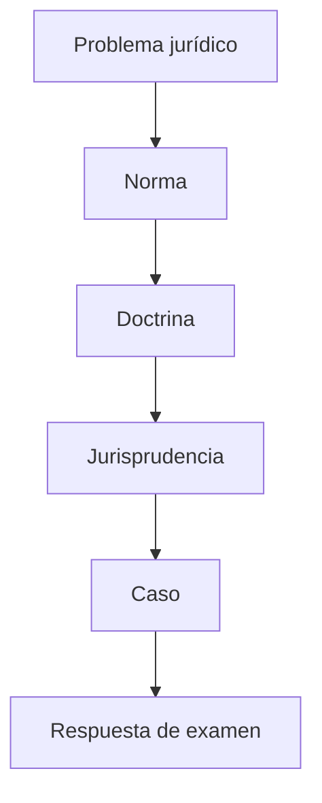

---

# Clase 3 — Constitución, iter societatis y sociedades informales

<!--
## Ejes

- contrato
- acto unilateral
- pluralidad
- capacidad
- objeto
- causa
- aportes
- utilidades

---

# Objetivos de aprendizaje

- Comprender contrato.
- Comprender acto unilateral.
- Comprender pluralidad.
- Comprender capacidad.
- Comprender objeto.
- Comprender causa.

---

# Mapa conceptual

---

# Elementos de la sociedad

## Bloque

Elementos de la sociedad

## Método

Norma aplicable, doctrina, consecuencias prácticas y preguntas de examen.

---

# Contrato y acto unilateral

## Concepto

La sociedad puede nacer de un contrato de organización o, en los supuestos admitidos, de un acto unilateral constitutivo.

## Norma / eje jurídico

LGS, CCyC y normativa especial cuando corresponda.

## Lectura doctrinaria

- **Vítolo:** analizar la función económica y organizativa de la institución.
- **Nissen:** ubicar la institución dentro del sistema legal, la personalidad, la tipicidad y la tutela de terceros.
- **Favier Dubois:** conectar la institución con empresa, gobierno corporativo, realidad económica y paradigmas societarios cuando corresponda.

## Consecuencia práctica

Permite resolver correctamente el encuadre del caso y evitar respuestas puramente memorísticas.

## Pregunta de examen

¿Cómo impacta la SAU en la naturaleza jurídica?

---

# Pluralidad y unipersonalidad

## Concepto

La pluralidad clásica convive con hipótesis de unipersonalidad inicial y sobreviniente.

## Norma / eje jurídico

LGS, CCyC y normativa especial cuando corresponda.

## Lectura doctrinaria

- **Vítolo:** analizar la función económica y organizativa de la institución.
- **Nissen:** ubicar la institución dentro del sistema legal, la personalidad, la tipicidad y la tutela de terceros.
- **Favier Dubois:** conectar la institución con empresa, gobierno corporativo, realidad económica y paradigmas societarios cuando corresponda.

## Consecuencia práctica

Permite resolver correctamente el encuadre del caso y evitar respuestas puramente memorísticas.

## Pregunta de examen

Explique el instituto y fundamente con norma, doctrina y consecuencia práctica.

---

# Capacidad

## Concepto

Deben analizarse reglas generales y especiales sobre cónyuges, sociedades socias e incapaces.

## Norma / eje jurídico

LGS, CCyC y normativa especial cuando corresponda.

## Lectura doctrinaria

- **Vítolo:** analizar la función económica y organizativa de la institución.
- **Nissen:** ubicar la institución dentro del sistema legal, la personalidad, la tipicidad y la tutela de terceros.
- **Favier Dubois:** conectar la institución con empresa, gobierno corporativo, realidad económica y paradigmas societarios cuando corresponda.

## Consecuencia práctica

Permite resolver correctamente el encuadre del caso y evitar respuestas puramente memorísticas.

## Pregunta de examen

Explique el instituto y fundamente con norma, doctrina y consecuencia práctica.

---

# Consentimiento

## Concepto

Debe orientarse a integrar una organización y asumir derechos y obligaciones societarias.

## Norma / eje jurídico

LGS, CCyC y normativa especial cuando corresponda.

## Lectura doctrinaria

- **Vítolo:** analizar la función económica y organizativa de la institución.
- **Nissen:** ubicar la institución dentro del sistema legal, la personalidad, la tipicidad y la tutela de terceros.
- **Favier Dubois:** conectar la institución con empresa, gobierno corporativo, realidad económica y paradigmas societarios cuando corresponda.

## Consecuencia práctica

Permite resolver correctamente el encuadre del caso y evitar respuestas puramente memorísticas.

## Pregunta de examen

Explique el instituto y fundamente con norma, doctrina y consecuencia práctica.

---

# Objeto

## Concepto

Delimita actividad, competencia de administradores y control de licitud.

## Norma / eje jurídico

LGS, CCyC y normativa especial cuando corresponda.

## Lectura doctrinaria

- **Vítolo:** analizar la función económica y organizativa de la institución.
- **Nissen:** ubicar la institución dentro del sistema legal, la personalidad, la tipicidad y la tutela de terceros.
- **Favier Dubois:** conectar la institución con empresa, gobierno corporativo, realidad económica y paradigmas societarios cuando corresponda.

## Consecuencia práctica

Permite resolver correctamente el encuadre del caso y evitar respuestas puramente memorísticas.

## Pregunta de examen

Explique el instituto y fundamente con norma, doctrina y consecuencia práctica.

---

# Causa

## Concepto

Finalidad económico-jurídica de organizar una actividad común con participación en resultados.

## Norma / eje jurídico

LGS, CCyC y normativa especial cuando corresponda.

## Lectura doctrinaria

- **Vítolo:** analizar la función económica y organizativa de la institución.
- **Nissen:** ubicar la institución dentro del sistema legal, la personalidad, la tipicidad y la tutela de terceros.
- **Favier Dubois:** conectar la institución con empresa, gobierno corporativo, realidad económica y paradigmas societarios cuando corresponda.

## Consecuencia práctica

Permite resolver correctamente el encuadre del caso y evitar respuestas puramente memorísticas.

## Pregunta de examen

Explique el instituto y fundamente con norma, doctrina y consecuencia práctica.

---

# Forma

## Concepto

Varía según tipo social e incide en registración, prueba y oponibilidad.

## Norma / eje jurídico

LGS, CCyC y normativa especial cuando corresponda.

## Lectura doctrinaria

- **Vítolo:** analizar la función económica y organizativa de la institución.
- **Nissen:** ubicar la institución dentro del sistema legal, la personalidad, la tipicidad y la tutela de terceros.
- **Favier Dubois:** conectar la institución con empresa, gobierno corporativo, realidad económica y paradigmas societarios cuando corresponda.

## Consecuencia práctica

Permite resolver correctamente el encuadre del caso y evitar respuestas puramente memorísticas.

## Pregunta de examen

Explique el instituto y fundamente con norma, doctrina y consecuencia práctica.

---

# Aportes

## Concepto

Constituyen la base patrimonial inicial y determinan participación.

## Norma / eje jurídico

LGS, CCyC y normativa especial cuando corresponda.

## Lectura doctrinaria

- **Vítolo:** analizar la función económica y organizativa de la institución.
- **Nissen:** ubicar la institución dentro del sistema legal, la personalidad, la tipicidad y la tutela de terceros.
- **Favier Dubois:** conectar la institución con empresa, gobierno corporativo, realidad económica y paradigmas societarios cuando corresponda.

## Consecuencia práctica

Permite resolver correctamente el encuadre del caso y evitar respuestas puramente memorísticas.

## Pregunta de examen

Explique el instituto y fundamente con norma, doctrina y consecuencia práctica.

---

# Utilidades y pérdidas

## Concepto

Elemento específico que diferencia sociedad de otras figuras.

## Norma / eje jurídico

LGS, CCyC y normativa especial cuando corresponda.

## Lectura doctrinaria

- **Vítolo:** analizar la función económica y organizativa de la institución.
- **Nissen:** ubicar la institución dentro del sistema legal, la personalidad, la tipicidad y la tutela de terceros.
- **Favier Dubois:** conectar la institución con empresa, gobierno corporativo, realidad económica y paradigmas societarios cuando corresponda.

## Consecuencia práctica

Permite resolver correctamente el encuadre del caso y evitar respuestas puramente memorísticas.

## Pregunta de examen

Explique el instituto y fundamente con norma, doctrina y consecuencia práctica.

---

# Affectio societatis

## Concepto

Categoría doctrinaria discutida que permite explicar colaboración, integración y proyecto común.

## Norma / eje jurídico

LGS, CCyC y normativa especial cuando corresponda.

## Lectura doctrinaria

- **Vítolo:** analizar la función económica y organizativa de la institución.
- **Nissen:** ubicar la institución dentro del sistema legal, la personalidad, la tipicidad y la tutela de terceros.
- **Favier Dubois:** conectar la institución con empresa, gobierno corporativo, realidad económica y paradigmas societarios cuando corresponda.

## Consecuencia práctica

Permite resolver correctamente el encuadre del caso y evitar respuestas puramente memorísticas.

## Pregunta de examen

¿Sigue siendo esencial la affectio societatis?

---

# Iter societatis

## Bloque

Iter societatis

## Método

Norma aplicable, doctrina, consecuencias prácticas y preguntas de examen.

---

# Etapas

## Concepto

Tratativas, acto constitutivo, período fundacional, inscripción, funcionamiento y modificaciones.

## Norma / eje jurídico

LGS, CCyC y normativa especial cuando corresponda.

## Lectura doctrinaria

- **Vítolo:** analizar la función económica y organizativa de la institución.
- **Nissen:** ubicar la institución dentro del sistema legal, la personalidad, la tipicidad y la tutela de terceros.
- **Favier Dubois:** conectar la institución con empresa, gobierno corporativo, realidad económica y paradigmas societarios cuando corresponda.

## Consecuencia práctica

Permite resolver correctamente el encuadre del caso y evitar respuestas puramente memorísticas.

## Pregunta de examen

Explique el instituto y fundamente con norma, doctrina y consecuencia práctica.

---

# Acto constitutivo

## Concepto

Documento que organiza socios, aportes, objeto, capital, administración y reglas internas.

## Norma / eje jurídico

LGS, CCyC y normativa especial cuando corresponda.

## Lectura doctrinaria

- **Vítolo:** analizar la función económica y organizativa de la institución.
- **Nissen:** ubicar la institución dentro del sistema legal, la personalidad, la tipicidad y la tutela de terceros.
- **Favier Dubois:** conectar la institución con empresa, gobierno corporativo, realidad económica y paradigmas societarios cuando corresponda.

## Consecuencia práctica

Permite resolver correctamente el encuadre del caso y evitar respuestas puramente memorísticas.

## Pregunta de examen

Explique el instituto y fundamente con norma, doctrina y consecuencia práctica.

---

# Cláusulas tipificantes

## Concepto

Configuran el tipo elegido y no pueden suprimirse sin afectar su régimen.

## Norma / eje jurídico

LGS, CCyC y normativa especial cuando corresponda.

## Lectura doctrinaria

- **Vítolo:** analizar la función económica y organizativa de la institución.
- **Nissen:** ubicar la institución dentro del sistema legal, la personalidad, la tipicidad y la tutela de terceros.
- **Favier Dubois:** conectar la institución con empresa, gobierno corporativo, realidad económica y paradigmas societarios cuando corresponda.

## Consecuencia práctica

Permite resolver correctamente el encuadre del caso y evitar respuestas puramente memorísticas.

## Pregunta de examen

Explique el instituto y fundamente con norma, doctrina y consecuencia práctica.

---

# Cláusulas no tipificantes

## Concepto

Expresan autonomía privada dentro de límites legales.

## Norma / eje jurídico

LGS, CCyC y normativa especial cuando corresponda.

## Lectura doctrinaria

- **Vítolo:** analizar la función económica y organizativa de la institución.
- **Nissen:** ubicar la institución dentro del sistema legal, la personalidad, la tipicidad y la tutela de terceros.
- **Favier Dubois:** conectar la institución con empresa, gobierno corporativo, realidad económica y paradigmas societarios cuando corresponda.

## Consecuencia práctica

Permite resolver correctamente el encuadre del caso y evitar respuestas puramente memorísticas.

## Pregunta de examen

Explique el instituto y fundamente con norma, doctrina y consecuencia práctica.

---

# Sociedad en formación

## Concepto

Período entre constitución e inscripción; plantea problemas de responsabilidad por actos realizados.

## Norma / eje jurídico

LGS, CCyC y normativa especial cuando corresponda.

## Lectura doctrinaria

- **Vítolo:** analizar la función económica y organizativa de la institución.
- **Nissen:** ubicar la institución dentro del sistema legal, la personalidad, la tipicidad y la tutela de terceros.
- **Favier Dubois:** conectar la institución con empresa, gobierno corporativo, realidad económica y paradigmas societarios cuando corresponda.

## Consecuencia práctica

Permite resolver correctamente el encuadre del caso y evitar respuestas puramente memorísticas.

## Pregunta de examen

Explique el instituto y fundamente con norma, doctrina y consecuencia práctica.

---

# Registro Público

## Concepto

Función de publicidad, control de legalidad, oponibilidad y ordenación del tráfico.

## Norma / eje jurídico

LGS, CCyC y normativa especial cuando corresponda.

## Lectura doctrinaria

- **Vítolo:** analizar la función económica y organizativa de la institución.
- **Nissen:** ubicar la institución dentro del sistema legal, la personalidad, la tipicidad y la tutela de terceros.
- **Favier Dubois:** conectar la institución con empresa, gobierno corporativo, realidad económica y paradigmas societarios cuando corresponda.

## Consecuencia práctica

Permite resolver correctamente el encuadre del caso y evitar respuestas puramente memorísticas.

## Pregunta de examen

Explique el instituto y fundamente con norma, doctrina y consecuencia práctica.

---

# Sociedades informales y Sección IV

## Bloque

Sociedades informales y Sección IV

## Método

Norma aplicable, doctrina, consecuencias prácticas y preguntas de examen.

---

# Sociedades informales

## Concepto

Supuestos sin inscripción, con defectos de forma o carencia de tipicidad plena.

## Norma / eje jurídico

LGS, CCyC y normativa especial cuando corresponda.

## Lectura doctrinaria

- **Vítolo:** analizar la función económica y organizativa de la institución.
- **Nissen:** ubicar la institución dentro del sistema legal, la personalidad, la tipicidad y la tutela de terceros.
- **Favier Dubois:** conectar la institución con empresa, gobierno corporativo, realidad económica y paradigmas societarios cuando corresponda.

## Consecuencia práctica

Permite resolver correctamente el encuadre del caso y evitar respuestas puramente memorísticas.

## Pregunta de examen

Explique el instituto y fundamente con norma, doctrina y consecuencia práctica.

---

# Sección IV

## Concepto

Régimen que reconoce existencia y reglas propias para sociedades no regularmente constituidas.

## Norma / eje jurídico

LGS, CCyC y normativa especial cuando corresponda.

## Lectura doctrinaria

- **Vítolo:** analizar la función económica y organizativa de la institución.
- **Nissen:** ubicar la institución dentro del sistema legal, la personalidad, la tipicidad y la tutela de terceros.
- **Favier Dubois:** conectar la institución con empresa, gobierno corporativo, realidad económica y paradigmas societarios cuando corresponda.

## Consecuencia práctica

Permite resolver correctamente el encuadre del caso y evitar respuestas puramente memorísticas.

## Pregunta de examen

Explique el instituto y fundamente con norma, doctrina y consecuencia práctica.

---

# Prueba

## Concepto

La existencia puede acreditarse por distintos medios según el caso.

## Norma / eje jurídico

LGS, CCyC y normativa especial cuando corresponda.

## Lectura doctrinaria

- **Vítolo:** analizar la función económica y organizativa de la institución.
- **Nissen:** ubicar la institución dentro del sistema legal, la personalidad, la tipicidad y la tutela de terceros.
- **Favier Dubois:** conectar la institución con empresa, gobierno corporativo, realidad económica y paradigmas societarios cuando corresponda.

## Consecuencia práctica

Permite resolver correctamente el encuadre del caso y evitar respuestas puramente memorísticas.

## Pregunta de examen

Explique el instituto y fundamente con norma, doctrina y consecuencia práctica.

---

# Oponibilidad

## Concepto

El contrato puede ser oponible entre socios y, bajo condiciones, frente a terceros.

## Norma / eje jurídico

LGS, CCyC y normativa especial cuando corresponda.

## Lectura doctrinaria

- **Vítolo:** analizar la función económica y organizativa de la institución.
- **Nissen:** ubicar la institución dentro del sistema legal, la personalidad, la tipicidad y la tutela de terceros.
- **Favier Dubois:** conectar la institución con empresa, gobierno corporativo, realidad económica y paradigmas societarios cuando corresponda.

## Consecuencia práctica

Permite resolver correctamente el encuadre del caso y evitar respuestas puramente memorísticas.

## Pregunta de examen

Explique el instituto y fundamente con norma, doctrina y consecuencia práctica.

---

# Representación y gobierno

## Concepto

Se reconstruyen por contrato, conducta y reglas legales aplicables.

## Norma / eje jurídico

LGS, CCyC y normativa especial cuando corresponda.

## Lectura doctrinaria

- **Vítolo:** analizar la función económica y organizativa de la institución.
- **Nissen:** ubicar la institución dentro del sistema legal, la personalidad, la tipicidad y la tutela de terceros.
- **Favier Dubois:** conectar la institución con empresa, gobierno corporativo, realidad económica y paradigmas societarios cuando corresponda.

## Consecuencia práctica

Permite resolver correctamente el encuadre del caso y evitar respuestas puramente memorísticas.

## Pregunta de examen

Explique el instituto y fundamente con norma, doctrina y consecuencia práctica.

---

# Responsabilidad

## Concepto

Regla de responsabilidad mancomunada y por partes iguales, salvo supuestos distintos.

## Norma / eje jurídico

LGS, CCyC y normativa especial cuando corresponda.

## Lectura doctrinaria

- **Vítolo:** analizar la función económica y organizativa de la institución.
- **Nissen:** ubicar la institución dentro del sistema legal, la personalidad, la tipicidad y la tutela de terceros.
- **Favier Dubois:** conectar la institución con empresa, gobierno corporativo, realidad económica y paradigmas societarios cuando corresponda.

## Consecuencia práctica

Permite resolver correctamente el encuadre del caso y evitar respuestas puramente memorísticas.

## Pregunta de examen

Explique el instituto y fundamente con norma, doctrina y consecuencia práctica.

---

# Bienes registrables

## Concepto

Requieren recaudos de identificación de sociedad, socios y proporciones.

## Norma / eje jurídico

LGS, CCyC y normativa especial cuando corresponda.

## Lectura doctrinaria

- **Vítolo:** analizar la función económica y organizativa de la institución.
- **Nissen:** ubicar la institución dentro del sistema legal, la personalidad, la tipicidad y la tutela de terceros.
- **Favier Dubois:** conectar la institución con empresa, gobierno corporativo, realidad económica y paradigmas societarios cuando corresponda.

## Consecuencia práctica

Permite resolver correctamente el encuadre del caso y evitar respuestas puramente memorísticas.

## Pregunta de examen

Explique el instituto y fundamente con norma, doctrina y consecuencia práctica.

---

# Subsanación

## Concepto

Permite corregir defectos y adoptar un tipo social con continuidad.

## Norma / eje jurídico

LGS, CCyC y normativa especial cuando corresponda.

## Lectura doctrinaria

- **Vítolo:** analizar la función económica y organizativa de la institución.
- **Nissen:** ubicar la institución dentro del sistema legal, la personalidad, la tipicidad y la tutela de terceros.
- **Favier Dubois:** conectar la institución con empresa, gobierno corporativo, realidad económica y paradigmas societarios cuando corresponda.

## Consecuencia práctica

Permite resolver correctamente el encuadre del caso y evitar respuestas puramente memorísticas.

## Pregunta de examen

Explique el instituto y fundamente con norma, doctrina y consecuencia práctica.

---

# Disolución y liquidación

## Concepto

Debe articularse con conservación de la organización y tutela de terceros.

## Norma / eje jurídico

LGS, CCyC y normativa especial cuando corresponda.

## Lectura doctrinaria

- **Vítolo:** analizar la función económica y organizativa de la institución.
- **Nissen:** ubicar la institución dentro del sistema legal, la personalidad, la tipicidad y la tutela de terceros.
- **Favier Dubois:** conectar la institución con empresa, gobierno corporativo, realidad económica y paradigmas societarios cuando corresponda.

## Consecuencia práctica

Permite resolver correctamente el encuadre del caso y evitar respuestas puramente memorísticas.

## Pregunta de examen

Explique el instituto y fundamente con norma, doctrina y consecuencia práctica.

---

# Casos

## Bloque

Casos

## Método

Norma aplicable, doctrina, consecuencias prácticas y preguntas de examen.

---

# Caso: sociedad verbal

## Concepto

Dos personas explotan un comercio sin contrato escrito. Debe analizarse prueba, aportes, utilidades, representación y régimen aplicable.

## Norma / eje jurídico

LGS, CCyC y normativa especial cuando corresponda.

## Lectura doctrinaria

- **Vítolo:** analizar la función económica y organizativa de la institución.
- **Nissen:** ubicar la institución dentro del sistema legal, la personalidad, la tipicidad y la tutela de terceros.
- **Favier Dubois:** conectar la institución con empresa, gobierno corporativo, realidad económica y paradigmas societarios cuando corresponda.

## Consecuencia práctica

Permite resolver correctamente el encuadre del caso y evitar respuestas puramente memorísticas.

## Pregunta de examen

Explique el instituto y fundamente con norma, doctrina y consecuencia práctica.

---

# Caso: inmueble registrable

## Concepto

Tres profesionales adquieren un inmueble para actividad común sin sociedad inscripta. Analizar Sección IV y bienes registrables.

## Norma / eje jurídico

LGS, CCyC y normativa especial cuando corresponda.

## Lectura doctrinaria

- **Vítolo:** analizar la función económica y organizativa de la institución.
- **Nissen:** ubicar la institución dentro del sistema legal, la personalidad, la tipicidad y la tutela de terceros.
- **Favier Dubois:** conectar la institución con empresa, gobierno corporativo, realidad económica y paradigmas societarios cuando corresponda.

## Consecuencia práctica

Permite resolver correctamente el encuadre del caso y evitar respuestas puramente memorísticas.

## Pregunta de examen

Explique el instituto y fundamente con norma, doctrina y consecuencia práctica.

---

# Caso: aporte incumplido

## Concepto

Un socio promete aportar maquinaria y no cumple. Analizar exigibilidad, mora y consecuencias.

## Norma / eje jurídico

LGS, CCyC y normativa especial cuando corresponda.

## Lectura doctrinaria

- **Vítolo:** analizar la función económica y organizativa de la institución.
- **Nissen:** ubicar la institución dentro del sistema legal, la personalidad, la tipicidad y la tutela de terceros.
- **Favier Dubois:** conectar la institución con empresa, gobierno corporativo, realidad económica y paradigmas societarios cuando corresponda.

## Consecuencia práctica

Permite resolver correctamente el encuadre del caso y evitar respuestas puramente memorísticas.

## Pregunta de examen

Explique el instituto y fundamente con norma, doctrina y consecuencia práctica.

---

# Pregunta de examen 1: contrato

## Consigna

Desarrolle **contrato**.

## Pauta mínima

- Norma aplicable.
- Concepto.
- Posición doctrinaria.
- Consecuencia práctica.
- Ejemplo o caso.

## Advertencia

No responder con definiciones aisladas. Construir una respuesta argumental.

---

# Pregunta de examen 2: acto unilateral

## Consigna

Desarrolle **acto unilateral**.

## Pauta mínima

- Norma aplicable.
- Concepto.
- Posición doctrinaria.
- Consecuencia práctica.
- Ejemplo o caso.

## Advertencia

No responder con definiciones aisladas. Construir una respuesta argumental.

---

# Pregunta de examen 3: pluralidad

## Consigna

Desarrolle **pluralidad**.

## Pauta mínima

- Norma aplicable.
- Concepto.
- Posición doctrinaria.
- Consecuencia práctica.
- Ejemplo o caso.

## Advertencia

No responder con definiciones aisladas. Construir una respuesta argumental.

---

# Pregunta de examen 4: capacidad

## Consigna

Desarrolle **capacidad**.

## Pauta mínima

- Norma aplicable.
- Concepto.
- Posición doctrinaria.
- Consecuencia práctica.
- Ejemplo o caso.

## Advertencia

No responder con definiciones aisladas. Construir una respuesta argumental.

---

# Pregunta de examen 5: objeto

## Consigna

Desarrolle **objeto**.

## Pauta mínima

- Norma aplicable.
- Concepto.
- Posición doctrinaria.
- Consecuencia práctica.
- Ejemplo o caso.

## Advertencia

No responder con definiciones aisladas. Construir una respuesta argumental.

---

# Pregunta de examen 6: causa

## Consigna

Desarrolle **causa**.

## Pauta mínima

- Norma aplicable.
- Concepto.
- Posición doctrinaria.
- Consecuencia práctica.
- Ejemplo o caso.

## Advertencia

No responder con definiciones aisladas. Construir una respuesta argumental.

---

# Pregunta de examen 7: aportes

## Consigna

Desarrolle **aportes**.

## Pauta mínima

- Norma aplicable.
- Concepto.
- Posición doctrinaria.
- Consecuencia práctica.
- Ejemplo o caso.

## Advertencia

No responder con definiciones aisladas. Construir una respuesta argumental.

---

# Pregunta de examen 8: utilidades

## Consigna

Desarrolle **utilidades**.

## Pauta mínima

- Norma aplicable.
- Concepto.
- Posición doctrinaria.
- Consecuencia práctica.
- Ejemplo o caso.

## Advertencia

No responder con definiciones aisladas. Construir una respuesta argumental.

---

# Pregunta de examen 9: affectio societatis

## Consigna

Desarrolle **affectio societatis**.

## Pauta mínima

- Norma aplicable.
- Concepto.
- Posición doctrinaria.
- Consecuencia práctica.
- Ejemplo o caso.

## Advertencia

No responder con definiciones aisladas. Construir una respuesta argumental.

---

# Pregunta de examen 10: iter societatis

## Consigna

Desarrolle **iter societatis**.

## Pauta mínima

- Norma aplicable.
- Concepto.
- Posición doctrinaria.
- Consecuencia práctica.
- Ejemplo o caso.

## Advertencia

No responder con definiciones aisladas. Construir una respuesta argumental.

---

# Pregunta de examen 11: Registro Público

## Consigna

Desarrolle **Registro Público**.

## Pauta mínima

- Norma aplicable.
- Concepto.
- Posición doctrinaria.
- Consecuencia práctica.
- Ejemplo o caso.

## Advertencia

No responder con definiciones aisladas. Construir una respuesta argumental.

---

# Pregunta de examen 12: Sección IV

## Consigna

Desarrolle **Sección IV**.

## Pauta mínima

- Norma aplicable.
- Concepto.
- Posición doctrinaria.
- Consecuencia práctica.
- Ejemplo o caso.

## Advertencia

No responder con definiciones aisladas. Construir una respuesta argumental.

---

# Pregunta de examen 13: subsanación

## Consigna

Desarrolle **subsanación**.

## Pauta mínima

- Norma aplicable.
- Concepto.
- Posición doctrinaria.
- Consecuencia práctica.
- Ejemplo o caso.

## Advertencia

No responder con definiciones aisladas. Construir una respuesta argumental.

---

# Pregunta de examen 14: contrato

## Consigna

Desarrolle **contrato**.

## Pauta mínima

- Norma aplicable.
- Concepto.
- Posición doctrinaria.
- Consecuencia práctica.
- Ejemplo o caso.

## Advertencia

No responder con definiciones aisladas. Construir una respuesta argumental.

---

# Pregunta de examen 15: acto unilateral

## Consigna

Desarrolle **acto unilateral**.

## Pauta mínima

- Norma aplicable.
- Concepto.
- Posición doctrinaria.
- Consecuencia práctica.
- Ejemplo o caso.

## Advertencia

No responder con definiciones aisladas. Construir una respuesta argumental.

---

# Pregunta de examen 16: pluralidad

## Consigna

Desarrolle **pluralidad**.

## Pauta mínima

- Norma aplicable.
- Concepto.
- Posición doctrinaria.
- Consecuencia práctica.
- Ejemplo o caso.

## Advertencia

No responder con definiciones aisladas. Construir una respuesta argumental.

---

# Pregunta de examen 17: capacidad

## Consigna

Desarrolle **capacidad**.

## Pauta mínima

- Norma aplicable.
- Concepto.
- Posición doctrinaria.
- Consecuencia práctica.
- Ejemplo o caso.

## Advertencia

No responder con definiciones aisladas. Construir una respuesta argumental.

---

# Pregunta de examen 18: objeto

## Consigna

Desarrolle **objeto**.

## Pauta mínima

- Norma aplicable.
- Concepto.
- Posición doctrinaria.
- Consecuencia práctica.
- Ejemplo o caso.

## Advertencia

No responder con definiciones aisladas. Construir una respuesta argumental.

---

# Pregunta de examen 19: causa

## Consigna

Desarrolle **causa**.

## Pauta mínima

- Norma aplicable.
- Concepto.
- Posición doctrinaria.
- Consecuencia práctica.
- Ejemplo o caso.

## Advertencia

No responder con definiciones aisladas. Construir una respuesta argumental.

---

# Pregunta de examen 20: aportes

## Consigna

Desarrolle **aportes**.

## Pauta mínima

- Norma aplicable.
- Concepto.
- Posición doctrinaria.
- Consecuencia práctica.
- Ejemplo o caso.

## Advertencia

No responder con definiciones aisladas. Construir una respuesta argumental.

---

# Pregunta de examen 21: utilidades

## Consigna

Desarrolle **utilidades**.

## Pauta mínima

- Norma aplicable.
- Concepto.
- Posición doctrinaria.
- Consecuencia práctica.
- Ejemplo o caso.

## Advertencia

No responder con definiciones aisladas. Construir una respuesta argumental.

---

# Pregunta de examen 22: affectio societatis

## Consigna

Desarrolle **affectio societatis**.

## Pauta mínima

- Norma aplicable.
- Concepto.
- Posición doctrinaria.
- Consecuencia práctica.
- Ejemplo o caso.

## Advertencia

No responder con definiciones aisladas. Construir una respuesta argumental.

---

# Pregunta de examen 23: iter societatis

## Consigna

Desarrolle **iter societatis**.

## Pauta mínima

- Norma aplicable.
- Concepto.
- Posición doctrinaria.
- Consecuencia práctica.
- Ejemplo o caso.

## Advertencia

No responder con definiciones aisladas. Construir una respuesta argumental.

---

# Pregunta de examen 24: Registro Público

## Consigna

Desarrolle **Registro Público**.

## Pauta mínima

- Norma aplicable.
- Concepto.
- Posición doctrinaria.
- Consecuencia práctica.
- Ejemplo o caso.

## Advertencia

No responder con definiciones aisladas. Construir una respuesta argumental.

---

# Pregunta de examen 25: Sección IV

## Consigna

Desarrolle **Sección IV**.

## Pauta mínima

- Norma aplicable.
- Concepto.
- Posición doctrinaria.
- Consecuencia práctica.
- Ejemplo o caso.

## Advertencia

No responder con definiciones aisladas. Construir una respuesta argumental.

---

# Pregunta de examen 26: subsanación

## Consigna

Desarrolle **subsanación**.

## Pauta mínima

- Norma aplicable.
- Concepto.
- Posición doctrinaria.
- Consecuencia práctica.
- Ejemplo o caso.

## Advertencia

No responder con definiciones aisladas. Construir una respuesta argumental.

---

# Pregunta de examen 27: contrato

## Consigna

Desarrolle **contrato**.

## Pauta mínima

- Norma aplicable.
- Concepto.
- Posición doctrinaria.
- Consecuencia práctica.
- Ejemplo o caso.

## Advertencia

No responder con definiciones aisladas. Construir una respuesta argumental.

---

# Pregunta de examen 28: acto unilateral

## Consigna

Desarrolle **acto unilateral**.

## Pauta mínima

- Norma aplicable.
- Concepto.
- Posición doctrinaria.
- Consecuencia práctica.
- Ejemplo o caso.

## Advertencia

No responder con definiciones aisladas. Construir una respuesta argumental.

---

# Pregunta de examen 29: pluralidad

## Consigna

Desarrolle **pluralidad**.

## Pauta mínima

- Norma aplicable.
- Concepto.
- Posición doctrinaria.
- Consecuencia práctica.
- Ejemplo o caso.

## Advertencia

No responder con definiciones aisladas. Construir una respuesta argumental.

---

# Pregunta de examen 30: capacidad

## Consigna

Desarrolle **capacidad**.

## Pauta mínima

- Norma aplicable.
- Concepto.
- Posición doctrinaria.
- Consecuencia práctica.
- Ejemplo o caso.

## Advertencia

No responder con definiciones aisladas. Construir una respuesta argumental.

---

# Pregunta de examen 31: objeto

## Consigna

Desarrolle **objeto**.

## Pauta mínima

- Norma aplicable.
- Concepto.
- Posición doctrinaria.
- Consecuencia práctica.
- Ejemplo o caso.

## Advertencia

No responder con definiciones aisladas. Construir una respuesta argumental.

---

# Pregunta de examen 32: causa

## Consigna

Desarrolle **causa**.

## Pauta mínima

- Norma aplicable.
- Concepto.
- Posición doctrinaria.
- Consecuencia práctica.
- Ejemplo o caso.

## Advertencia

No responder con definiciones aisladas. Construir una respuesta argumental.

---

# Pregunta de examen 33: aportes

## Consigna

Desarrolle **aportes**.

## Pauta mínima

- Norma aplicable.
- Concepto.
- Posición doctrinaria.
- Consecuencia práctica.
- Ejemplo o caso.

## Advertencia

No responder con definiciones aisladas. Construir una respuesta argumental.

---

# Pregunta de examen 34: utilidades

## Consigna

Desarrolle **utilidades**.

## Pauta mínima

- Norma aplicable.
- Concepto.
- Posición doctrinaria.
- Consecuencia práctica.
- Ejemplo o caso.

## Advertencia

No responder con definiciones aisladas. Construir una respuesta argumental.

---

# Pregunta de examen 35: affectio societatis

## Consigna

Desarrolle **affectio societatis**.

## Pauta mínima

- Norma aplicable.
- Concepto.
- Posición doctrinaria.
- Consecuencia práctica.
- Ejemplo o caso.

## Advertencia

No responder con definiciones aisladas. Construir una respuesta argumental.

---

# Pregunta de examen 36: iter societatis

## Consigna

Desarrolle **iter societatis**.

## Pauta mínima

- Norma aplicable.
- Concepto.
- Posición doctrinaria.
- Consecuencia práctica.
- Ejemplo o caso.

## Advertencia

No responder con definiciones aisladas. Construir una respuesta argumental.

---

# Pregunta de examen 37: Registro Público

## Consigna

Desarrolle **Registro Público**.

## Pauta mínima

- Norma aplicable.
- Concepto.
- Posición doctrinaria.
- Consecuencia práctica.
- Ejemplo o caso.

## Advertencia

No responder con definiciones aisladas. Construir una respuesta argumental.

---

# Pregunta de examen 38: Sección IV

## Consigna

Desarrolle **Sección IV**.

## Pauta mínima

- Norma aplicable.
- Concepto.
- Posición doctrinaria.
- Consecuencia práctica.
- Ejemplo o caso.

## Advertencia

No responder con definiciones aisladas. Construir una respuesta argumental.

---

# Pregunta de examen 39: subsanación

## Consigna

Desarrolle **subsanación**.

## Pauta mínima

- Norma aplicable.
- Concepto.
- Posición doctrinaria.
- Consecuencia práctica.
- Ejemplo o caso.

## Advertencia

No responder con definiciones aisladas. Construir una respuesta argumental.

---

# Pregunta de examen 40: contrato

## Consigna

Desarrolle **contrato**.

## Pauta mínima

- Norma aplicable.
- Concepto.
- Posición doctrinaria.
- Consecuencia práctica.
- Ejemplo o caso.

## Advertencia

No responder con definiciones aisladas. Construir una respuesta argumental.

---

# Pregunta de examen 41: acto unilateral

## Consigna

Desarrolle **acto unilateral**.

## Pauta mínima

- Norma aplicable.
- Concepto.
- Posición doctrinaria.
- Consecuencia práctica.
- Ejemplo o caso.

## Advertencia

No responder con definiciones aisladas. Construir una respuesta argumental.

---

# Pregunta de examen 42: pluralidad

## Consigna

Desarrolle **pluralidad**.

## Pauta mínima

- Norma aplicable.
- Concepto.
- Posición doctrinaria.
- Consecuencia práctica.
- Ejemplo o caso.

## Advertencia

No responder con definiciones aisladas. Construir una respuesta argumental.

---

# Pregunta de examen 43: capacidad

## Consigna

Desarrolle **capacidad**.

## Pauta mínima

- Norma aplicable.
- Concepto.
- Posición doctrinaria.
- Consecuencia práctica.
- Ejemplo o caso.

## Advertencia

No responder con definiciones aisladas. Construir una respuesta argumental.

---

# Pregunta de examen 44: objeto

## Consigna

Desarrolle **objeto**.

## Pauta mínima

- Norma aplicable.
- Concepto.
- Posición doctrinaria.
- Consecuencia práctica.
- Ejemplo o caso.

## Advertencia

No responder con definiciones aisladas. Construir una respuesta argumental.

---

# Pregunta de examen 45: causa

## Consigna

Desarrolle **causa**.

## Pauta mínima

- Norma aplicable.
- Concepto.
- Posición doctrinaria.
- Consecuencia práctica.
- Ejemplo o caso.

## Advertencia

No responder con definiciones aisladas. Construir una respuesta argumental.

---

# Pregunta de examen 46: aportes

## Consigna

Desarrolle **aportes**.

## Pauta mínima

- Norma aplicable.
- Concepto.
- Posición doctrinaria.
- Consecuencia práctica.
- Ejemplo o caso.

## Advertencia

No responder con definiciones aisladas. Construir una respuesta argumental.

---

# Pregunta de examen 47: utilidades

## Consigna

Desarrolle **utilidades**.

## Pauta mínima

- Norma aplicable.
- Concepto.
- Posición doctrinaria.
- Consecuencia práctica.
- Ejemplo o caso.

## Advertencia

No responder con definiciones aisladas. Construir una respuesta argumental.

---

# Pregunta de examen 48: affectio societatis

## Consigna

Desarrolle **affectio societatis**.

## Pauta mínima

- Norma aplicable.
- Concepto.
- Posición doctrinaria.
- Consecuencia práctica.
- Ejemplo o caso.

## Advertencia

No responder con definiciones aisladas. Construir una respuesta argumental.

---

# Pregunta de examen 49: iter societatis

## Consigna

Desarrolle **iter societatis**.

## Pauta mínima

- Norma aplicable.
- Concepto.
- Posición doctrinaria.
- Consecuencia práctica.
- Ejemplo o caso.

## Advertencia

No responder con definiciones aisladas. Construir una respuesta argumental.

---

# Pregunta de examen 50: Registro Público

## Consigna

Desarrolle **Registro Público**.

## Pauta mínima

- Norma aplicable.
- Concepto.
- Posición doctrinaria.
- Consecuencia práctica.
- Ejemplo o caso.

## Advertencia

No responder con definiciones aisladas. Construir una respuesta argumental.

---

# Pregunta de examen 51: Sección IV

## Consigna

Desarrolle **Sección IV**.

## Pauta mínima

- Norma aplicable.
- Concepto.
- Posición doctrinaria.
- Consecuencia práctica.
- Ejemplo o caso.

## Advertencia

No responder con definiciones aisladas. Construir una respuesta argumental.

---

# Pregunta de examen 52: subsanación

## Consigna

Desarrolle **subsanación**.

## Pauta mínima

- Norma aplicable.
- Concepto.
- Posición doctrinaria.
- Consecuencia práctica.
- Ejemplo o caso.

## Advertencia

No responder con definiciones aisladas. Construir una respuesta argumental.

---

# Pregunta de examen 53: contrato

## Consigna

Desarrolle **contrato**.

## Pauta mínima

- Norma aplicable.
- Concepto.
- Posición doctrinaria.
- Consecuencia práctica.
- Ejemplo o caso.

## Advertencia

No responder con definiciones aisladas. Construir una respuesta argumental.

---

# Pregunta de examen 54: acto unilateral

## Consigna

Desarrolle **acto unilateral**.

## Pauta mínima

- Norma aplicable.
- Concepto.
- Posición doctrinaria.
- Consecuencia práctica.
- Ejemplo o caso.

## Advertencia

No responder con definiciones aisladas. Construir una respuesta argumental.

---

# Pregunta de examen 55: pluralidad

## Consigna

Desarrolle **pluralidad**.

## Pauta mínima

- Norma aplicable.
- Concepto.
- Posición doctrinaria.
- Consecuencia práctica.
- Ejemplo o caso.

## Advertencia

No responder con definiciones aisladas. Construir una respuesta argumental.

---

# Pregunta de examen 56: capacidad

## Consigna

Desarrolle **capacidad**.

## Pauta mínima

- Norma aplicable.
- Concepto.
- Posición doctrinaria.
- Consecuencia práctica.
- Ejemplo o caso.

## Advertencia

No responder con definiciones aisladas. Construir una respuesta argumental.

---

# Pregunta de examen 57: objeto

## Consigna

Desarrolle **objeto**.

## Pauta mínima

- Norma aplicable.
- Concepto.
- Posición doctrinaria.
- Consecuencia práctica.
- Ejemplo o caso.

## Advertencia

No responder con definiciones aisladas. Construir una respuesta argumental.

---

# Pregunta de examen 58: causa

## Consigna

Desarrolle **causa**.

## Pauta mínima

- Norma aplicable.
- Concepto.
- Posición doctrinaria.
- Consecuencia práctica.
- Ejemplo o caso.

## Advertencia

No responder con definiciones aisladas. Construir una respuesta argumental.

---

# Pregunta de examen 59: aportes

## Consigna

Desarrolle **aportes**.

## Pauta mínima

- Norma aplicable.
- Concepto.
- Posición doctrinaria.
- Consecuencia práctica.
- Ejemplo o caso.

## Advertencia

No responder con definiciones aisladas. Construir una respuesta argumental.

---

# Pregunta de examen 60: utilidades

## Consigna

Desarrolle **utilidades**.

## Pauta mínima

- Norma aplicable.
- Concepto.
- Posición doctrinaria.
- Consecuencia práctica.
- Ejemplo o caso.

## Advertencia

No responder con definiciones aisladas. Construir una respuesta argumental.

---

# Pregunta de examen 61: affectio societatis

## Consigna

Desarrolle **affectio societatis**.

## Pauta mínima

- Norma aplicable.
- Concepto.
- Posición doctrinaria.
- Consecuencia práctica.
- Ejemplo o caso.

## Advertencia

No responder con definiciones aisladas. Construir una respuesta argumental.

---

# Pregunta de examen 62: iter societatis

## Consigna

Desarrolle **iter societatis**.

## Pauta mínima

- Norma aplicable.
- Concepto.
- Posición doctrinaria.
- Consecuencia práctica.
- Ejemplo o caso.

## Advertencia

No responder con definiciones aisladas. Construir una respuesta argumental.

---

# Pregunta de examen 63: Registro Público

## Consigna

Desarrolle **Registro Público**.

## Pauta mínima

- Norma aplicable.
- Concepto.
- Posición doctrinaria.
- Consecuencia práctica.
- Ejemplo o caso.

## Advertencia

No responder con definiciones aisladas. Construir una respuesta argumental.

---

# Pregunta de examen 64: Sección IV

## Consigna

Desarrolle **Sección IV**.

## Pauta mínima

- Norma aplicable.
- Concepto.
- Posición doctrinaria.
- Consecuencia práctica.
- Ejemplo o caso.

## Advertencia

No responder con definiciones aisladas. Construir una respuesta argumental.

---

# Pregunta de examen 65: subsanación

## Consigna

Desarrolle **subsanación**.

## Pauta mínima

- Norma aplicable.
- Concepto.
- Posición doctrinaria.
- Consecuencia práctica.
- Ejemplo o caso.

## Advertencia

No responder con definiciones aisladas. Construir una respuesta argumental.

---

# Pregunta de examen 66: contrato

## Consigna

Desarrolle **contrato**.

## Pauta mínima

- Norma aplicable.
- Concepto.
- Posición doctrinaria.
- Consecuencia práctica.
- Ejemplo o caso.

## Advertencia

No responder con definiciones aisladas. Construir una respuesta argumental.

---

# Pregunta de examen 67: acto unilateral

## Consigna

Desarrolle **acto unilateral**.

## Pauta mínima

- Norma aplicable.
- Concepto.
- Posición doctrinaria.
- Consecuencia práctica.
- Ejemplo o caso.

## Advertencia

No responder con definiciones aisladas. Construir una respuesta argumental.

---

# Pregunta de examen 68: pluralidad

## Consigna

Desarrolle **pluralidad**.

## Pauta mínima

- Norma aplicable.
- Concepto.
- Posición doctrinaria.
- Consecuencia práctica.
- Ejemplo o caso.

## Advertencia

No responder con definiciones aisladas. Construir una respuesta argumental.

---

# Pregunta de examen 69: capacidad

## Consigna

Desarrolle **capacidad**.

## Pauta mínima

- Norma aplicable.
- Concepto.
- Posición doctrinaria.
- Consecuencia práctica.
- Ejemplo o caso.

## Advertencia

No responder con definiciones aisladas. Construir una respuesta argumental.

---

# Pregunta de examen 70: objeto

## Consigna

Desarrolle **objeto**.

## Pauta mínima

- Norma aplicable.
- Concepto.
- Posición doctrinaria.
- Consecuencia práctica.
- Ejemplo o caso.

## Advertencia

No responder con definiciones aisladas. Construir una respuesta argumental.

---

# Pregunta de examen 71: causa

## Consigna

Desarrolle **causa**.

## Pauta mínima

- Norma aplicable.
- Concepto.
- Posición doctrinaria.
- Consecuencia práctica.
- Ejemplo o caso.

## Advertencia

No responder con definiciones aisladas. Construir una respuesta argumental.

---

# Pregunta de examen 72: aportes

## Consigna

Desarrolle **aportes**.

## Pauta mínima

- Norma aplicable.
- Concepto.
- Posición doctrinaria.
- Consecuencia práctica.
- Ejemplo o caso.

## Advertencia

No responder con definiciones aisladas. Construir una respuesta argumental.

---

# Pregunta de examen 73: utilidades

## Consigna

Desarrolle **utilidades**.

## Pauta mínima

- Norma aplicable.
- Concepto.
- Posición doctrinaria.
- Consecuencia práctica.
- Ejemplo o caso.

## Advertencia

No responder con definiciones aisladas. Construir una respuesta argumental.

---

# Pregunta de examen 74: affectio societatis

## Consigna

Desarrolle **affectio societatis**.

## Pauta mínima

- Norma aplicable.
- Concepto.
- Posición doctrinaria.
- Consecuencia práctica.
- Ejemplo o caso.

## Advertencia

No responder con definiciones aisladas. Construir una respuesta argumental.

---

# Pregunta de examen 75: iter societatis

## Consigna

Desarrolle **iter societatis**.

## Pauta mínima

- Norma aplicable.
- Concepto.
- Posición doctrinaria.
- Consecuencia práctica.
- Ejemplo o caso.

## Advertencia

No responder con definiciones aisladas. Construir una respuesta argumental.

---

# Pregunta de examen 76: Registro Público

## Consigna

Desarrolle **Registro Público**.

## Pauta mínima

- Norma aplicable.
- Concepto.
- Posición doctrinaria.
- Consecuencia práctica.
- Ejemplo o caso.

## Advertencia

No responder con definiciones aisladas. Construir una respuesta argumental.

---

# Pregunta de examen 77: Sección IV

## Consigna

Desarrolle **Sección IV**.

## Pauta mínima

- Norma aplicable.
- Concepto.
- Posición doctrinaria.
- Consecuencia práctica.
- Ejemplo o caso.

## Advertencia

No responder con definiciones aisladas. Construir una respuesta argumental.

---

# Pregunta de examen 78: subsanación

## Consigna

Desarrolle **subsanación**.

## Pauta mínima

- Norma aplicable.
- Concepto.
- Posición doctrinaria.
- Consecuencia práctica.
- Ejemplo o caso.

## Advertencia

No responder con definiciones aisladas. Construir una respuesta argumental.

---

# Pregunta de examen 79: contrato

## Consigna

Desarrolle **contrato**.

## Pauta mínima

- Norma aplicable.
- Concepto.
- Posición doctrinaria.
- Consecuencia práctica.
- Ejemplo o caso.

## Advertencia

No responder con definiciones aisladas. Construir una respuesta argumental.

---

# Pregunta de examen 80: acto unilateral

## Consigna

Desarrolle **acto unilateral**.

## Pauta mínima

- Norma aplicable.
- Concepto.
- Posición doctrinaria.
- Consecuencia práctica.
- Ejemplo o caso.

## Advertencia

No responder con definiciones aisladas. Construir una respuesta argumental.

---

# Pregunta de examen 81: pluralidad

## Consigna

Desarrolle **pluralidad**.

## Pauta mínima

- Norma aplicable.
- Concepto.
- Posición doctrinaria.
- Consecuencia práctica.
- Ejemplo o caso.

## Advertencia

No responder con definiciones aisladas. Construir una respuesta argumental.

---

# Pregunta de examen 82: capacidad

## Consigna

Desarrolle **capacidad**.

## Pauta mínima

- Norma aplicable.
- Concepto.
- Posición doctrinaria.
- Consecuencia práctica.
- Ejemplo o caso.

## Advertencia

No responder con definiciones aisladas. Construir una respuesta argumental.

---

# Pregunta de examen 83: objeto

## Consigna

Desarrolle **objeto**.

## Pauta mínima

- Norma aplicable.
- Concepto.
- Posición doctrinaria.
- Consecuencia práctica.
- Ejemplo o caso.

## Advertencia

No responder con definiciones aisladas. Construir una respuesta argumental.

---

# Pregunta de examen 84: causa

## Consigna

Desarrolle **causa**.

## Pauta mínima

- Norma aplicable.
- Concepto.
- Posición doctrinaria.
- Consecuencia práctica.
- Ejemplo o caso.

## Advertencia

No responder con definiciones aisladas. Construir una respuesta argumental.

---

# Pregunta de examen 85: aportes

## Consigna

Desarrolle **aportes**.

## Pauta mínima

- Norma aplicable.
- Concepto.
- Posición doctrinaria.
- Consecuencia práctica.
- Ejemplo o caso.

## Advertencia

No responder con definiciones aisladas. Construir una respuesta argumental.

---

# Pregunta de examen 86: utilidades

## Consigna

Desarrolle **utilidades**.

## Pauta mínima

- Norma aplicable.
- Concepto.
- Posición doctrinaria.
- Consecuencia práctica.
- Ejemplo o caso.

## Advertencia

No responder con definiciones aisladas. Construir una respuesta argumental.

---

# Pregunta de examen 87: affectio societatis

## Consigna

Desarrolle **affectio societatis**.

## Pauta mínima

- Norma aplicable.
- Concepto.
- Posición doctrinaria.
- Consecuencia práctica.
- Ejemplo o caso.

## Advertencia

No responder con definiciones aisladas. Construir una respuesta argumental.

---

# Pregunta de examen 88: iter societatis

## Consigna

Desarrolle **iter societatis**.

## Pauta mínima

- Norma aplicable.
- Concepto.
- Posición doctrinaria.
- Consecuencia práctica.
- Ejemplo o caso.

## Advertencia

No responder con definiciones aisladas. Construir una respuesta argumental.

---

# Pregunta de examen 89: Registro Público

## Consigna

Desarrolle **Registro Público**.

## Pauta mínima

- Norma aplicable.
- Concepto.
- Posición doctrinaria.
- Consecuencia práctica.
- Ejemplo o caso.

## Advertencia

No responder con definiciones aisladas. Construir una respuesta argumental.

---

# Pregunta de examen 90: Sección IV

## Consigna

Desarrolle **Sección IV**.

## Pauta mínima

- Norma aplicable.
- Concepto.
- Posición doctrinaria.
- Consecuencia práctica.
- Ejemplo o caso.

## Advertencia

No responder con definiciones aisladas. Construir una respuesta argumental.

---

# Pregunta de examen 91: subsanación

## Consigna

Desarrolle **subsanación**.

## Pauta mínima

- Norma aplicable.
- Concepto.
- Posición doctrinaria.
- Consecuencia práctica.
- Ejemplo o caso.

## Advertencia

No responder con definiciones aisladas. Construir una respuesta argumental.

---

# Pregunta de examen 92: contrato

## Consigna

Desarrolle **contrato**.

## Pauta mínima

- Norma aplicable.
- Concepto.
- Posición doctrinaria.
- Consecuencia práctica.
- Ejemplo o caso.

## Advertencia

No responder con definiciones aisladas. Construir una respuesta argumental.

---

# Pregunta de examen 93: acto unilateral

## Consigna

Desarrolle **acto unilateral**.

## Pauta mínima

- Norma aplicable.
- Concepto.
- Posición doctrinaria.
- Consecuencia práctica.
- Ejemplo o caso.

## Advertencia

No responder con definiciones aisladas. Construir una respuesta argumental.

---

# Pregunta de examen 94: pluralidad

## Consigna

Desarrolle **pluralidad**.

## Pauta mínima

- Norma aplicable.
- Concepto.
- Posición doctrinaria.
- Consecuencia práctica.
- Ejemplo o caso.

## Advertencia

No responder con definiciones aisladas. Construir una respuesta argumental.

---

# Pregunta de examen 95: capacidad

## Consigna

Desarrolle **capacidad**.

## Pauta mínima

- Norma aplicable.
- Concepto.
- Posición doctrinaria.
- Consecuencia práctica.
- Ejemplo o caso.

## Advertencia

No responder con definiciones aisladas. Construir una respuesta argumental.

---

# Pregunta de examen 96: objeto

## Consigna

Desarrolle **objeto**.

## Pauta mínima

- Norma aplicable.
- Concepto.
- Posición doctrinaria.
- Consecuencia práctica.
- Ejemplo o caso.

## Advertencia

No responder con definiciones aisladas. Construir una respuesta argumental.

---

# Pregunta de examen 97: causa

## Consigna

Desarrolle **causa**.

## Pauta mínima

- Norma aplicable.
- Concepto.
- Posición doctrinaria.
- Consecuencia práctica.
- Ejemplo o caso.

## Advertencia

No responder con definiciones aisladas. Construir una respuesta argumental.

---

# Pregunta de examen 98: aportes

## Consigna

Desarrolle **aportes**.

## Pauta mínima

- Norma aplicable.
- Concepto.
- Posición doctrinaria.
- Consecuencia práctica.
- Ejemplo o caso.

## Advertencia

No responder con definiciones aisladas. Construir una respuesta argumental.

---

# Pregunta de examen 99: utilidades

## Consigna

Desarrolle **utilidades**.

## Pauta mínima

- Norma aplicable.
- Concepto.
- Posición doctrinaria.
- Consecuencia práctica.
- Ejemplo o caso.

## Advertencia

No responder con definiciones aisladas. Construir una respuesta argumental.

---

# Pregunta de examen 100: affectio societatis

## Consigna

Desarrolle **affectio societatis**.

## Pauta mínima

- Norma aplicable.
- Concepto.
- Posición doctrinaria.
- Consecuencia práctica.
- Ejemplo o caso.

## Advertencia

No responder con definiciones aisladas. Construir una respuesta argumental.

---

# Pregunta de examen 101: iter societatis

## Consigna

Desarrolle **iter societatis**.

## Pauta mínima

- Norma aplicable.
- Concepto.
- Posición doctrinaria.
- Consecuencia práctica.
- Ejemplo o caso.

## Advertencia

No responder con definiciones aisladas. Construir una respuesta argumental.

---

# Pregunta de examen 102: Registro Público

## Consigna

Desarrolle **Registro Público**.

## Pauta mínima

- Norma aplicable.
- Concepto.
- Posición doctrinaria.
- Consecuencia práctica.
- Ejemplo o caso.

## Advertencia

No responder con definiciones aisladas. Construir una respuesta argumental.

---

# Pregunta de examen 103: Sección IV

## Consigna

Desarrolle **Sección IV**.

## Pauta mínima

- Norma aplicable.
- Concepto.
- Posición doctrinaria.
- Consecuencia práctica.
- Ejemplo o caso.

## Advertencia

No responder con definiciones aisladas. Construir una respuesta argumental.

---

# Pregunta de examen 104: subsanación

## Consigna

Desarrolle **subsanación**.

## Pauta mínima

- Norma aplicable.
- Concepto.
- Posición doctrinaria.
- Consecuencia práctica.
- Ejemplo o caso.

## Advertencia

No responder con definiciones aisladas. Construir una respuesta argumental.

---

# Pregunta de examen 105: contrato

## Consigna

Desarrolle **contrato**.

## Pauta mínima

- Norma aplicable.
- Concepto.
- Posición doctrinaria.
- Consecuencia práctica.
- Ejemplo o caso.

## Advertencia

No responder con definiciones aisladas. Construir una respuesta argumental.

---

# Pregunta de examen 106: acto unilateral

## Consigna

Desarrolle **acto unilateral**.

## Pauta mínima

- Norma aplicable.
- Concepto.
- Posición doctrinaria.
- Consecuencia práctica.
- Ejemplo o caso.

## Advertencia

No responder con definiciones aisladas. Construir una respuesta argumental.

---

# Pregunta de examen 107: pluralidad

## Consigna

Desarrolle **pluralidad**.

## Pauta mínima

- Norma aplicable.
- Concepto.
- Posición doctrinaria.
- Consecuencia práctica.
- Ejemplo o caso.

## Advertencia

No responder con definiciones aisladas. Construir una respuesta argumental.

---

# Pregunta de examen 108: capacidad

## Consigna

Desarrolle **capacidad**.

## Pauta mínima

- Norma aplicable.
- Concepto.
- Posición doctrinaria.
- Consecuencia práctica.
- Ejemplo o caso.

## Advertencia

No responder con definiciones aisladas. Construir una respuesta argumental.

---

# Pregunta de examen 109: objeto

## Consigna

Desarrolle **objeto**.

## Pauta mínima

- Norma aplicable.
- Concepto.
- Posición doctrinaria.
- Consecuencia práctica.
- Ejemplo o caso.

## Advertencia

No responder con definiciones aisladas. Construir una respuesta argumental.

---

# Pregunta de examen 110: causa

## Consigna

Desarrolle **causa**.

## Pauta mínima

- Norma aplicable.
- Concepto.
- Posición doctrinaria.
- Consecuencia práctica.
- Ejemplo o caso.

## Advertencia

No responder con definiciones aisladas. Construir una respuesta argumental.

---

# Pregunta de examen 111: aportes

## Consigna

Desarrolle **aportes**.

## Pauta mínima

- Norma aplicable.
- Concepto.
- Posición doctrinaria.
- Consecuencia práctica.
- Ejemplo o caso.

## Advertencia

No responder con definiciones aisladas. Construir una respuesta argumental.

---

# Pregunta de examen 112: utilidades

## Consigna

Desarrolle **utilidades**.

## Pauta mínima

- Norma aplicable.
- Concepto.
- Posición doctrinaria.
- Consecuencia práctica.
- Ejemplo o caso.

## Advertencia

No responder con definiciones aisladas. Construir una respuesta argumental.

---

# Pregunta de examen 113: affectio societatis

## Consigna

Desarrolle **affectio societatis**.

## Pauta mínima

- Norma aplicable.
- Concepto.
- Posición doctrinaria.
- Consecuencia práctica.
- Ejemplo o caso.

## Advertencia

No responder con definiciones aisladas. Construir una respuesta argumental.

---

# Pregunta de examen 114: iter societatis

## Consigna

Desarrolle **iter societatis**.

## Pauta mínima

- Norma aplicable.
- Concepto.
- Posición doctrinaria.
- Consecuencia práctica.
- Ejemplo o caso.

## Advertencia

No responder con definiciones aisladas. Construir una respuesta argumental.

---

# Cierre

## Ideas centrales

- La ley se estudia a partir de problemas jurídicos.
- La doctrina permite argumentar.
- La jurisprudencia muestra el funcionamiento real del sistema.
- Los casos deben resolverse por etapas.

## Próxima clase

Continuaremos con el siguiente bloque del programa.
-->