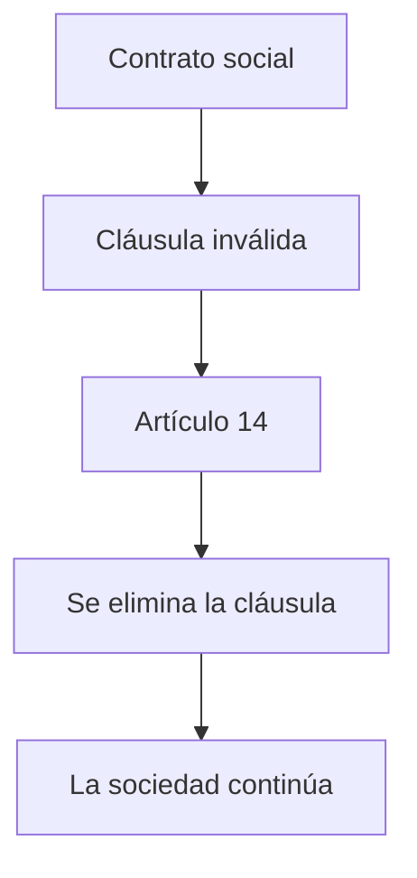

# Artículo 6 LGS
## El Registro Público y el control de legalidad

El artículo 6 de la Ley General de Sociedades dispone que el juez o funcionario a cargo del Registro Público verificará el cumplimiento de los requisitos legales y fiscales antes de ordenar la inscripción de la sociedad.

La norma asigna al Registro Público una función que excede la mera recepción de documentos: debe controlar que el acto constitutivo se ajuste al ordenamiento jurídico.

Este control constituye uno de los mecanismos más importantes de tutela preventiva del derecho societario.

---

# Texto del artículo 6

> **Artículo 6.** El juez debe comprobar el cumplimiento de todos los requisitos legales y fiscales. En su caso dispondrá la toma de razón y la previa publicación que corresponda.

## Ideas principales

- existe un control previo a la inscripción;
- dicho control comprende requisitos legales y fiscales;
- sólo superado ese examen procede la inscripción;
- la inscripción constituye el último paso del procedimiento constitutivo.

---

# ¿Cuál es la finalidad del artículo 6?

El control registral persigue diversos objetivos.

## Protección de los socios

Evita la inscripción de contratos que presenten defectos esenciales.

## Protección de terceros

Procura que quienes contraten con la sociedad puedan confiar en la regularidad del ente inscripto.

## Protección del tráfico jurídico

Favorece la seguridad y previsibilidad de las relaciones comerciales.

En definitiva, el Registro Público actúa como un mecanismo de control preventivo de legalidad.

---

# Naturaleza del control registral

La doctrina coincide en que el Registro Público no desarrolla una actividad meramente administrativa.

Su intervención supone un verdadero **control de legalidad**.

Debe verificar, entre otros aspectos:

- capacidad de los otorgantes;
- cumplimiento de los requisitos del artículo 11;
- adecuación al tipo societario elegido;
- cumplimiento de las normas imperativas de la LGS;
- observancia de los requisitos fiscales exigidos por la ley.

No se limita a archivar documentos.

Debe impedir la inscripción de actos contrarios al ordenamiento jurídico.

---

# ¿Control formal o control sustancial?

Esta constituye una de las principales discusiones doctrinarias.

## Control formal

Se limita a verificar:

- autenticidad del instrumento;
- cumplimiento de las formalidades;
- documentación acompañada.

## Control sustancial

Comprende además el examen del contenido del contrato.

Permite rechazar cláusulas incompatibles con normas imperativas de la Ley General de Sociedades.

La doctrina mayoritaria sostiene que el artículo 6 consagra un verdadero control de legalidad sustancial.

---

# La posición de Alberto Víctor Verón

Verón sostiene que el Registro Público no puede transformarse en un mero organismo receptor de documentación.

Su función consiste en ejercer un auténtico control de legalidad.

Debe impedir el acceso al registro de contratos que infrinjan normas imperativas de la Ley General de Sociedades.

Para el autor, la inscripción genera una presunción de regularidad cuya seriedad exige un examen previo suficiente.

---

# La posición de Ricardo Nissen

Nissen asigna especial importancia al control registral.

Sostiene que constituye una herramienta esencial para:

- proteger a los terceros;
- prevenir el fraude societario;
- evitar la constitución de sociedades ficticias;
- controlar la adecuación del capital al objeto social;
- impedir la inscripción de cláusulas contrarias a la ley.

Desde esta perspectiva, el debilitamiento del control registral incrementa el riesgo de utilización abusiva de la personalidad jurídica.

---

# La posición de Daniel Vítolo

Vítolo reconoce la importancia del control registral, pero advierte que no debe transformarse en un mecanismo que limite injustificadamente la autonomía de la voluntad.

El Registro Público controla la legalidad.

No sustituye la voluntad de los socios.

Tampoco puede imponer criterios de conveniencia económica o de oportunidad empresarial.

El examen debe limitarse a verificar el cumplimiento del ordenamiento jurídico.

---

# Caso práctico

Cuatro socios constituyen una sociedad anónima.

El estatuto establece que uno de ellos percibirá utilidades aun cuando la sociedad registre pérdidas.

### Preguntas

- ¿Debe el Registro Público inscribir el contrato?
- ¿Puede observar esa cláusula?
- ¿Constituye una cláusula leonina?
- ¿Cuál sería el fundamento jurídico de la observación?

---

# Ideas para recordar

✔ El artículo 6 establece un control previo a la inscripción.

✔ El Registro Público ejerce un verdadero control de legalidad.

✔ La finalidad principal consiste en proteger a los socios, a los terceros y al tráfico jurídico.

✔ El control comprende tanto aspectos formales como el cumplimiento de normas imperativas de la Ley General de Sociedades.

✔ El Registro no juzga la conveniencia del negocio, sino únicamente su adecuación al ordenamiento jurídico.

---

# Artículo 7 LGS
## La inscripción registral

El artículo 7 regula la inscripción del acto constitutivo en el Registro Público.

La inscripción constituye el acto mediante el cual la sociedad accede al régimen de la sociedad regularmente constituida.

No debe confundirse con el nacimiento de la voluntad contractual ni con la existencia del negocio jurídico.

La inscripción cumple una función de publicidad y de regularización del ente frente a terceros.

---

# Texto del artículo 7

> **Artículo 7.** La sociedad sólo se considera regularmente constituida con su inscripción en el Registro Público.

La norma no afirma que la sociedad nazca con la inscripción.

Lo que dispone es que **la regularidad** queda condicionada a la inscripción registral.

Esta diferencia resulta fundamental para comprender el sistema instaurado por la Ley General de Sociedades y el Código Civil y Comercial.

---

# ¿Qué efectos produce la inscripción?

La inscripción cumple múltiples funciones.

## Publicidad

Hace conocer la existencia de la sociedad al tráfico jurídico.

## Oponibilidad

Permite hacer valer frente a terceros las estipulaciones sujetas a publicidad.

## Regularidad

Incorpora a la sociedad al régimen propio del tipo elegido.

## Seguridad jurídica

Genera confianza en quienes contratan con la sociedad.

---

# Existencia, personalidad y regularidad

Son conceptos diferentes que no deben confundirse.

| Concepto | Significado |
|-----------|-------------|
| Existencia | Nacimiento del negocio jurídico celebrado por los socios. |
| Personalidad jurídica | Reconocimiento de la sociedad como sujeto de derecho. |
| Regularidad | Situación derivada del cumplimiento de los requisitos legales e inscripción. |

La inscripción produce regularidad.

No crea el consentimiento.

No crea el contrato.

---

# ¿La personalidad nace con la inscripción?

Durante muchos años existió una intensa discusión doctrinaria.

Luego de la entrada en vigencia del Código Civil y Comercial, la cuestión perdió gran parte de su intensidad.

Actualmente la doctrina mayoritaria entiende que:

- la sociedad existe desde su constitución;
- posee personalidad jurídica;
- la inscripción determina su regularidad y la aplicación plena del régimen del tipo social elegido.

Esta interpretación armoniza el artículo 7 LGS con los artículos 2 LGS y 148 del Código Civil y Comercial.

---

# La posición de Ricardo Nissen

Nissen destaca la importancia de la inscripción como presupuesto de la regularidad.

Sin embargo, diferencia claramente:

- la existencia del contrato;
- la personalidad jurídica;
- la regularidad del ente.

Para el autor, la inscripción permite que la sociedad acceda plenamente al régimen previsto para el tipo adoptado, pero no agota la explicación sobre el nacimiento de la persona jurídica.

---

# La posición de Daniel Vítolo

Vítolo interpreta que la reforma introducida por la Ley 26.994 consolidó un sistema de reconocimiento de la personalidad jurídica aun respecto de sociedades que no alcanzan la regularidad.

La inscripción continúa siendo indispensable.

Pero su función principal consiste en otorgar regularidad y publicidad, no en determinar la existencia misma del sujeto de derecho.

---

# Consecuencias de la falta de inscripción

Si la sociedad no se inscribe:

- no accede al régimen de la sociedad regularmente constituida;
- queda sometida, en su caso, al régimen previsto por la Sección IV;
- ello no implica necesariamente la inexistencia del contrato ni de la organización creada por los socios.

La consecuencia ya no es la nulidad.

La consecuencia es la aplicación de un régimen jurídico diferente.

---

# Caso práctico

Tres personas constituyen una SRL.

Firman el contrato.

Comienzan inmediatamente la explotación comercial.

Durante seis meses nunca presentan el contrato para su inscripción.

### Preguntas

- ¿Existe contrato?
- ¿Existe una organización societaria?
- ¿Se encuentra regularmente constituida?
- ¿Qué régimen jurídico resulta aplicable?

---

# Ideas para recordar

✔ La inscripción produce la regularidad de la sociedad.

✔ La inscripción cumple funciones de publicidad y oponibilidad.

✔ Existencia, personalidad y regularidad son conceptos diferentes.

✔ La falta de inscripción no implica necesariamente la inexistencia de la sociedad.

✔ El artículo 7 constituye uno de los pilares del sistema registral de la Ley General de Sociedades.

---

# ¿La inscripción tiene efecto constitutivo o declarativo?

Una de las discusiones clásicas del derecho societario consiste en determinar cuál es el verdadero efecto de la inscripción registral.

## Tesis clásica

La inscripción tiene **efecto constitutivo**.

La sociedad sólo nace como persona jurídica cuando se inscribe en el Registro Público.

Antes de ello existiría únicamente un contrato entre los socios.

---

## Doctrina posterior al Código Civil y Comercial

La inscripción mantiene un efecto constitutivo,

pero respecto de la **regularidad** de la sociedad.

La personalidad jurídica no depende exclusivamente de la inscripción.

La sociedad puede existir como sujeto de derecho antes de acceder al régimen de la sociedad regularmente constituida.

Esta interpretación procura armonizar:

- artículo 2 LGS;
- artículo 7 LGS;
- artículo 148 CCyC.

---

# El debate doctrinario

## Nissen

La inscripción constituye un presupuesto indispensable para que la sociedad quede regularmente constituida.

La falta de inscripción impide acceder al régimen propio del tipo social elegido.

---

## Vítolo

La reforma de la Ley 26.994 y el Código Civil y Comercial consolidan el reconocimiento de personalidad jurídica aun respecto de sociedades que no alcanzan la regularidad.

La inscripción continúa siendo esencial, pero su función principal es otorgar publicidad y regularidad.

---

## Verón

El Registro Público cumple una función de control preventivo.

La inscripción brinda seguridad al tráfico jurídico y permite la oponibilidad de la organización societaria frente a terceros.

---

# Esquema integrador

```{mermaid}
flowchart LR

A[Contrato social]

A --> B[Sociedad]

B --> C[Personalidad jurídica]

C --> D[Inscripción]

D --> E[Sociedad regularmente constituida]

E --> F[Plena oponibilidad]
```

## Ideas centrales

✔ El contrato nace con el consentimiento.

✔ La sociedad adquiere personalidad jurídica.

✔ La inscripción confiere **regularidad** y publicidad.

✔ La inscripción permite acceder plenamente al régimen del tipo elegido.

# Artículo 10 LGS
## La publicidad de la constitución

La inscripción registral no agota el sistema de publicidad previsto por la Ley General de Sociedades.

El artículo 10 exige la publicación de un aviso en el diario de publicaciones legales.

Esta publicidad tiene por finalidad poner en conocimiento de la comunidad la constitución de una nueva sociedad y sus principales características.

Se trata de un mecanismo de tutela del tráfico jurídico y de protección de terceros.

---

# Fundamento de la publicidad

La publicidad cumple una doble función.

## Función informativa

Permite que cualquier interesado conozca:

- la existencia de la sociedad;
- su denominación;
- el domicilio;
- el objeto;
- el capital;
- los administradores.

## Función de seguridad jurídica

Favorece la transparencia de las relaciones comerciales y reduce la incertidumbre en el tráfico.

La publicidad constituye un presupuesto indispensable para la oponibilidad de determinados actos societarios.

---

# ¿Qué debe publicarse?

El contenido del aviso se encuentra determinado por la Ley General de Sociedades.

Entre otros datos comprende:

- denominación social;
- domicilio;
- objeto;
- plazo de duración;
- capital social;
- integración del órgano de administración;
- representación legal.

La finalidad consiste en suministrar a los terceros la información esencial sobre la sociedad.

---

# ¿Por qué es necesaria la publicidad?

Las sociedades desarrollan su actividad frente a terceros.

Quienes contratan con ellas deben poder conocer:

- quién representa a la sociedad;
- cuál es su objeto;
- cuál es su domicilio;
- qué tipo societario adoptó.

La publicidad transforma esa información en conocimiento jurídicamente accesible para toda la comunidad.

---

# Publicidad y oponibilidad

Existe una estrecha relación entre ambos conceptos.

La publicidad permite que determinadas situaciones jurídicas puedan hacerse valer frente a terceros.

Por ello suele afirmarse que:

> **No hay verdadera oponibilidad sin publicidad suficiente.**

El sistema registral protege tanto a la sociedad como a quienes contratan con ella.

---

# La posición de Halperín

Halperín explica que la publicidad registral constituye uno de los pilares del derecho societario moderno.

La inscripción y la publicación permiten dotar de certeza al tráfico jurídico.

La sociedad deja de ser una organización conocida únicamente por sus socios para transformarse en un sujeto identificable por cualquier tercero.

---

# La posición de Verón

Para Verón, la publicidad cumple una función preventiva.

El Registro Público y la publicación legal reducen la posibilidad de fraude y facilitan el conocimiento de la organización societaria.

La publicidad no protege únicamente a los acreedores.

También protege a futuros socios, proveedores, trabajadores y al mercado en general.

---

# Caso práctico

Se constituye una sociedad anónima.

El contrato se inscribe.

Sin embargo, nunca se publica el aviso previsto por el artículo 10.

### Preguntas

- ¿Cuál es la finalidad de la publicación?
- ¿Qué intereses procura proteger?
- ¿Qué diferencias existen entre inscripción y publicidad?

---

# Ideas para recordar

✔ La publicidad complementa la inscripción registral.

✔ Su finalidad es proteger el tráfico jurídico.

✔ Permite a los terceros conocer la organización básica de la sociedad.

✔ Constituye un presupuesto esencial para la transparencia del mercado.

✔ La publicidad fortalece la seguridad jurídica y la confianza en las relaciones comerciales.

---

# Inscripción y publicidad

| Inscripción | Publicidad |
|--------------|------------|
| Incorpora el acto al Registro Público. | Difunde la existencia de la sociedad. |
| Produce la regularidad prevista por el art. 7. | Hace accesible la información al público. |
| Tiene efectos jurídicos propios. | Favorece la oponibilidad y la seguridad del tráfico. |
| Se realiza ante el Registro Público. | Se realiza mediante el aviso legal correspondiente. |

Aunque estrechamente vinculadas, inscripción y publicidad no son conceptos equivalentes.

---

# Artículo 12 LGS
## Modificaciones del contrato social

La vida de una sociedad no permanece inmutable.

Con el transcurso del tiempo pueden modificarse:

- la denominación;
- el domicilio;
- el objeto;
- el capital;
- la administración;
- el plazo de duración;
- cualquier otra cláusula del contrato.

El artículo 12 regula la eficacia de esas modificaciones frente a terceros.

---

# Texto del artículo 12

> **Artículo 12.** Las modificaciones no inscriptas regularmente obligan a los socios otorgantes. Son inoponibles a los terceros, salvo que éstos las conocieran.

La norma distingue claramente dos planos.

## Relaciones internas

Las modificaciones producen efectos entre quienes las celebraron.

## Relaciones externas

Frente a terceros sólo resultan oponibles cuando han sido debidamente inscriptas o cuando el tercero tenía conocimiento efectivo de ellas.

---

# Fundamento del artículo 12

El sistema protege simultáneamente dos intereses.

## La autonomía de la voluntad

Los socios quedan obligados por las modificaciones que celebran.

## La seguridad del tráfico

Los terceros no pueden verse perjudicados por acuerdos internos que nunca fueron publicitados.

La inscripción cumple así una función de publicidad y protección de la buena fe.

---

# Oponibilidad e inoponibilidad

La inscripción convierte la modificación en oponible frente a terceros.

Si la reforma no fue inscripta:

✔ obliga a los socios.

❌ no puede hacerse valer frente a terceros de buena fe.

La ley impide que la sociedad invoque acuerdos secretos para perjudicar a quienes contrataron confiando en la información registral.

---

# El conocimiento del tercero

La inoponibilidad no es absoluta.

Si el tercero conocía efectivamente la modificación, la sociedad puede invocarla aun cuando no hubiera sido inscripta.

La carga de acreditar ese conocimiento corresponde a quien pretende hacer valer la modificación.

No basta una mera sospecha.

Debe demostrarse que el tercero conocía concretamente el contenido de la reforma.

---

# La posición de Alberto V. Verón

Verón explica que el artículo 12 constituye una aplicación del principio general de publicidad registral.

La inscripción no sólo cumple una función administrativa.

Su verdadera finalidad consiste en brindar seguridad al tráfico jurídico y proteger la confianza de quienes contratan con la sociedad.

Por ello, la regla general es la inoponibilidad de las modificaciones no inscriptas.

---

# La posición de Ricardo Nissen

Para Nissen, la inscripción de las reformas estatutarias constituye un presupuesto indispensable para la tutela de terceros.

La publicidad registral evita que los socios alteren internamente las reglas de funcionamiento y luego pretendan hacerlas valer contra quienes desconocían tales modificaciones.

La norma protege la buena fe objetiva en las relaciones comerciales.

---

# Caso práctico

Una SRL modifica su contrato.

Se reemplaza al gerente.

La reforma nunca se inscribe.

Dos meses después, el antiguo gerente celebra un contrato con un proveedor que desconocía el cambio.

### Preguntas

- ¿Puede la sociedad invocar la modificación?
- ¿Resulta oponible al proveedor?
- ¿Qué solución establece el artículo 12?

---

# Ejemplo práctico

La sociedad traslada su domicilio de Córdoba a Rosario.

Los socios modifican el contrato.

Nunca inscriben la reforma.

Un acreedor inicia demanda notificando en el domicilio que figura inscripto.

### ¿Es válida la notificación?

En principio, sí.

El tercero puede confiar en la información que surge del Registro Público.

La sociedad no puede invocar frente a él una modificación no inscripta.

---

# Ideas para recordar

✔ Las modificaciones producen efectos inmediatos entre los socios.

✔ Frente a terceros requieren, como regla, su inscripción.

✔ La excepción es el conocimiento efectivo del tercero.

✔ El artículo 12 protege la buena fe y la seguridad del tráfico jurídico.

✔ La publicidad registral constituye el fundamento de la oponibilidad de las reformas estatutarias.

---

# Contrato original y modificaciones

| Constitución | Modificaciones |
|---------------|----------------|
| Arts. 6 y 7 LGS | Art. 12 LGS |
| Requiere inscripción para la regularidad. | Requiere inscripción para su oponibilidad frente a terceros. |
| Da nacimiento a la sociedad regularmente constituida. | Altera el contenido del contrato ya existente. |
| Publicidad inicial. | Publicidad de los cambios posteriores. |

La lógica es la misma:

**Lo que debe ser conocido por los terceros debe ser debidamente publicitado.**

---

# Artículo 13 LGS
## Las cláusulas leoninas

El artículo 13 declara nulas determinadas estipulaciones incorporadas al contrato social por resultar incompatibles con la esencia del contrato de sociedad.

La doctrina las denomina **cláusulas leoninas**, en alusión a la antigua fábula atribuida a Esopo, donde el león participaba del reparto de las ganancias sin asumir los riesgos de la empresa.

El fundamento de la norma consiste en preservar el equilibrio propio del contrato de sociedad.

Quien participa de los beneficios debe, como regla, participar también de los riesgos.

---

# Texto del artículo 13

Son nulas las estipulaciones que:

- excluyan a uno o más socios de participar en las ganancias;
- excluyan a uno o más socios de soportar las pérdidas;
- permitan la restitución íntegra del aporte con independencia del resultado social;
- aseguren intereses fijos o utilidades determinadas;
- dejen librada a una de las partes la determinación de las ganancias o pérdidas.

La enumeración responde a un mismo principio:

**impedir que desaparezca el riesgo empresario propio del contrato de sociedad.**

---

# Fundamento del artículo 13

La sociedad es un contrato de organización destinado al desarrollo de una actividad económica común.

Los socios:

- realizan aportes;
- participan en la actividad social;
- esperan obtener beneficios;
- asumen el riesgo de sufrir pérdidas.

El artículo 13 protege ese equilibrio.

Si un socio obtiene únicamente ventajas o únicamente soporta desventajas, desaparece uno de los elementos característicos del contrato de sociedad.

---

# ¿Por qué se llaman cláusulas leoninas?

La expresión proviene de la fábula del león.

En ella, varios animales cazan conjuntamente.

Al momento del reparto, el león se apropia de toda la presa alegando:

- su fuerza;
- su autoridad;
- su condición de rey.

Los demás soportan el riesgo de la actividad, pero no participan del beneficio.

El derecho societario utiliza esta expresión para describir las cláusulas que rompen el equilibrio entre utilidades y pérdidas.

---

# Principio general

Todo socio debe participar:

- de las utilidades;
- de las pérdidas.

No necesariamente en partes iguales.

Pero sí conforme a un criterio razonable previsto por el contrato o, en su defecto, por la ley.

El artículo 13 no impone igualdad matemática.

Impone la prohibición de eliminar completamente el riesgo o el beneficio respecto de uno de los socios.

---

# Inciso 1
## Exclusión de las ganancias

Es nula la cláusula que prive totalmente a un socio de participar en las utilidades.

### Fundamento

La participación en los resultados constituye uno de los elementos esenciales del contrato de sociedad.

Un sujeto que nunca podrá participar de las ganancias difícilmente pueda ser considerado verdadero socio.

La nulidad protege la causa-fin del contrato societario.

---

# Inciso 2
## Exclusión de las pérdidas

También resulta nula la cláusula que libera totalmente a un socio de soportar las pérdidas.

La participación en el riesgo empresario constituye la contrapartida natural del derecho a participar en las utilidades.

Quien no asume ningún riesgo deja de integrar plenamente la comunidad de intereses característica del contrato de sociedad.

---

# Utilidades y pérdidas

La ley no exige necesariamente una distribución proporcional.

Los socios pueden pactar:

- porcentajes diferentes;
- mecanismos especiales de distribución;
- criterios distintos según la clase de aporte.

Lo que no pueden hacer es eliminar completamente:

- el derecho a participar en las utilidades;
- o la obligación de soportar las pérdidas.

Ese es el límite impuesto por el artículo 13.

---

# Doctrina

## Ricardo Nissen

El artículo 13 protege uno de los elementos esenciales del contrato de sociedad.

No existe verdadera sociedad cuando uno de los socios queda completamente excluido del riesgo empresario.

La nulidad deriva de la contradicción entre la cláusula y la causa misma del negocio jurídico societario.

---

# La posición de Horacio Roitman

Roitman explica que las cláusulas leoninas alteran la estructura del contrato plurilateral.

El equilibrio entre aportes, beneficios y riesgos constituye uno de los pilares de la organización societaria.

Por ello, el legislador sanciona únicamente la estipulación abusiva, procurando conservar la validez del contrato.

---

# Inciso 3
## Restitución íntegra del aporte

También es nula la cláusula que garantice a un socio la restitución íntegra de su aporte con independencia de la marcha de la sociedad.

### ¿Por qué?

El aporte integra el fondo común destinado al desarrollo de la actividad social.

Una vez incorporado al patrimonio de la sociedad, queda sometido al riesgo empresario.

Garantizar su devolución cualquiera sea el resultado económico equivale a transformar al socio en un acreedor privilegiado de la sociedad.

Ello contradice la naturaleza del contrato societario.

---

# El riesgo empresario

La sociedad implica asumir un riesgo.

Ese riesgo puede traducirse en:

- obtención de utilidades;
- pérdida parcial del aporte;
- pérdida total del aporte.

Si un socio tiene asegurada la devolución de lo aportado, deja de compartir el riesgo común.

La cláusula rompe el equilibrio entre los socios y resulta incompatible con la causa del contrato.

---

# Inciso 4
## Intereses fijos

Es nula la cláusula que asegure intereses fijos sobre el capital aportado.

### Fundamento

El socio no es un prestamista.

Su retribución depende de los resultados de la empresa.

Si la sociedad obtiene pérdidas, el socio no tiene derecho a exigir una renta fija por el solo hecho de haber realizado un aporte.

Los intereses corresponden al acreedor.

Las utilidades corresponden al socio.

---

# Socio versus acreedor

| Socio | Acreedor |
|--------|----------|
| Realiza aportes. | Otorga un préstamo. |
| Participa del riesgo empresario. | No participa del riesgo empresario. |
| Percibe utilidades si existen. | Percibe intereses conforme al contrato. |
| Integra el fondo común. | Conserva un crédito frente a la sociedad. |

El artículo 13 evita confundir ambas posiciones jurídicas.

---

# Inciso 5
## Utilidades garantizadas

También resulta nula la cláusula que asegure utilidades determinadas o mínimas con independencia de los resultados sociales.

### Ejemplo

"La sociedad garantizará al socio A una utilidad anual del 15 %, cualquiera sea el resultado del ejercicio."

La utilidad presupone la existencia de ganancias.

Si las ganancias no existen, tampoco existe utilidad distribuible.

---

# ¿Puede pactarse una utilidad mínima?

La respuesta es negativa.

Las utilidades sólo pueden distribuirse cuando existen ganancias líquidas y realizadas.

Garantizar una utilidad mínima supone eliminar el riesgo propio del contrato de sociedad.

El legislador impide que un socio quede completamente desvinculado del resultado económico de la empresa.

---

# Inciso 6
## Determinación arbitraria de utilidades o pérdidas

Es igualmente nula la cláusula que deje librada a una de las partes la determinación de las ganancias o de las pérdidas.

### Fundamento

La cuantificación de los resultados debe surgir:

- del balance;
- de la contabilidad;
- de las reglas previstas por la ley;
- de las decisiones adoptadas por los órganos sociales.

Nunca de la voluntad unilateral de uno de los socios.

---

# La posición de Efraín Hugo Richard

Richard vincula el artículo 13 con el principio de igualdad y con la necesidad de preservar la comunidad de riesgo.

La sociedad supone una organización destinada a desarrollar una actividad común.

No puede existir verdadera comunidad societaria cuando uno de los integrantes queda completamente ajeno al éxito o al fracaso del emprendimiento.

Por ello, las cláusulas leoninas afectan la esencia misma del contrato de sociedad.

---

# Nulidad de la cláusula

El artículo 13 no declara nula a la sociedad.

Declara nula únicamente la estipulación leonina.

Esta solución responde al principio general de conservación del negocio jurídico.

Siempre que sea posible, debe mantenerse la validez del contrato eliminando únicamente la cláusula incompatible con la ley.

Esta solución será reforzada por el artículo 14 de la LGS.

---

# Esquema integrador del artículo 13

```{mermaid}
flowchart TD

A[Artículo 13]

A --> B[Exclusión de ganancias]

A --> C[Exclusión de pérdidas]

A --> D[Restitución asegurada del aporte]

A --> E[Intereses fijos]

A --> F[Utilidades garantizadas]

A --> G[Determinación unilateral de resultados]

B --> H[Nulidad de la cláusula]

C --> H

D --> H

E --> H

F --> H

G --> H
```

## Idea central

La sociedad supone una comunidad de aportes, riesgos y beneficios.

Toda cláusula que elimine ese equilibrio resulta incompatible con la naturaleza del contrato societario.

---

# El verdadero fundamento del artículo 13

Las cláusulas leoninas no son nulas por una razón moral.

Tampoco porque el legislador pretenda imponer una igualdad absoluta entre los socios.

Su nulidad deriva de que contradicen la **causa-fin del contrato de sociedad**.

Quien participa en una sociedad:

- realiza aportes;
- desarrolla una actividad común;
- espera obtener utilidades;
- acepta soportar las pérdidas derivadas del riesgo empresario.

Eliminar completamente alguno de estos elementos implica desnaturalizar el contrato de sociedad.

> **La nulidad protege la esencia del negocio jurídico societario y no simplemente la igualdad entre los socios.**
>
---

# Artículo 14 LGS
## Nulidad de estipulaciones

El artículo 14 consagra uno de los principios más importantes del derecho societario:

> **La nulidad de una cláusula no implica, por regla, la nulidad de la sociedad.**

La ley procura conservar el negocio jurídico siempre que ello resulte posible.

La invalidez recae únicamente sobre la estipulación incompatible con el ordenamiento jurídico.

---

# Texto del artículo 14

> **Artículo 14.** Son nulas las estipulaciones contrarias a esta ley.

La nulidad alcanza únicamente a la cláusula inválida.

La sociedad continúa existiendo siempre que pueda subsistir sin esa estipulación.

Esta solución responde al principio de conservación del negocio jurídico.

---

# ¿Por qué la ley conserva el contrato?

La sociedad constituye un contrato de organización.

Su finalidad excede el interés individual de cada socio.

Alrededor de ella pueden existir:

- trabajadores;
- acreedores;
- proveedores;
- clientes;
- inversiones realizadas;
- actividad económica en marcha.

La nulidad total produciría consecuencias desproporcionadas frente a un simple defecto contractual.

---

# El principio de conservación

El derecho societario procura preservar:

- la empresa;
- la organización;
- la actividad económica;
- las relaciones jurídicas ya constituidas.

Por ello, cuando el vicio afecta únicamente una cláusula determinada, la ley elimina esa estipulación y mantiene vigente el resto del contrato.

La nulidad total constituye la excepción.

---

# Relación con el artículo 13

El artículo 13 identifica determinadas cláusulas incompatibles con la esencia del contrato de sociedad.

El artículo 14 determina su consecuencia jurídica.

### Resultado

✔ la cláusula es nula.

✔ la sociedad subsiste.

La ley privilegia la continuidad del ente sobre la invalidez del contrato.

---

# La posición de Ricardo Nissen

Nissen sostiene que el artículo 14 constituye una manifestación del principio de conservación del contrato societario.

La nulidad debe interpretarse restrictivamente.

Siempre que resulte posible, corresponde mantener la organización creada por los socios y eliminar únicamente la estipulación incompatible con la ley.

---

# La posición de Alberto V. Verón

Verón explica que el artículo 14 protege la estabilidad de las relaciones societarias.

La nulidad parcial evita que un defecto aislado provoque la desaparición de toda la organización.

La solución armoniza el interés de los socios con la protección de los terceros que contrataron con la sociedad.

---

# Caso práctico

Cuatro socios constituyen una SRL.

El contrato establece que uno de ellos jamás participará de las utilidades.

El resto del contrato cumple íntegramente con la Ley General de Sociedades.

### Preguntas

- ¿Es nula toda la sociedad?
- ¿Qué disposición resulta inválida?
- ¿Qué solución establece el artículo 14?

---

# Esquema integrador



La nulidad afecta únicamente la estipulación incompatible con la ley.

La sociedad conserva su validez siempre que pueda subsistir sin ella.

---

# Ideas para recordar

✔ El artículo 14 recepta el principio de conservación del contrato.

✔ La nulidad es, por regla, parcial.

✔ La sociedad no desaparece por la existencia de una cláusula inválida.

✔ Debe diferenciarse entre nulidad de la estipulación y nulidad del contrato.

✔ El artículo 14 complementa el régimen de las cláusulas leoninas previsto por el artículo 13.

---

